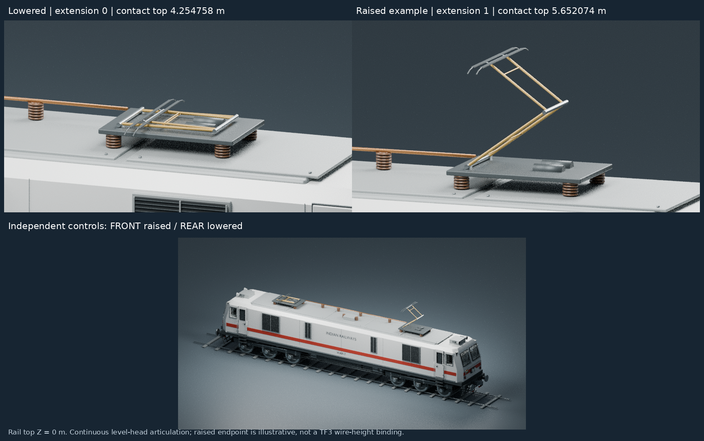
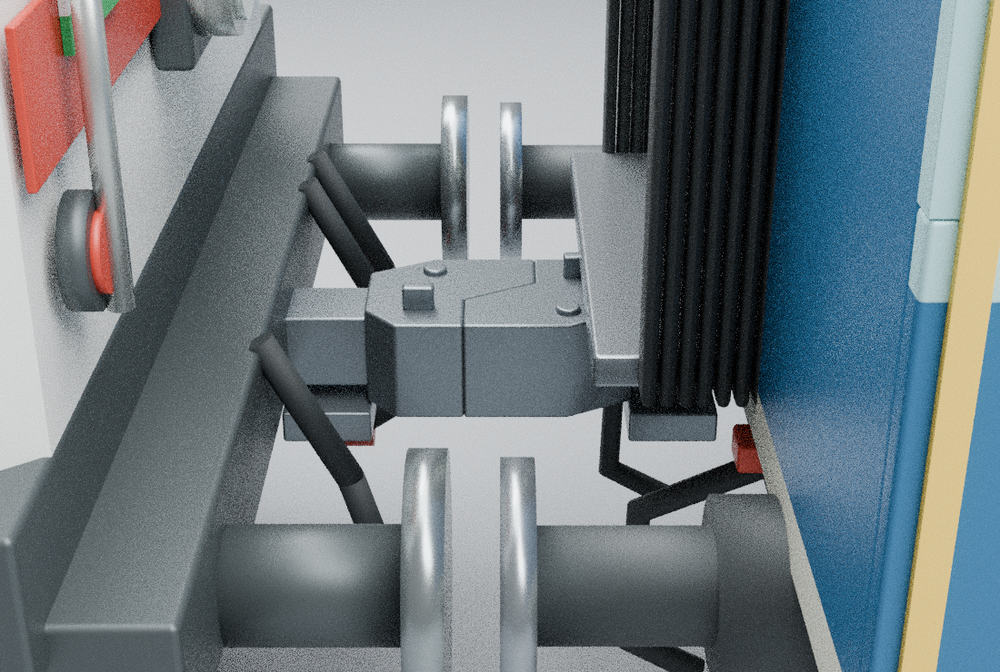
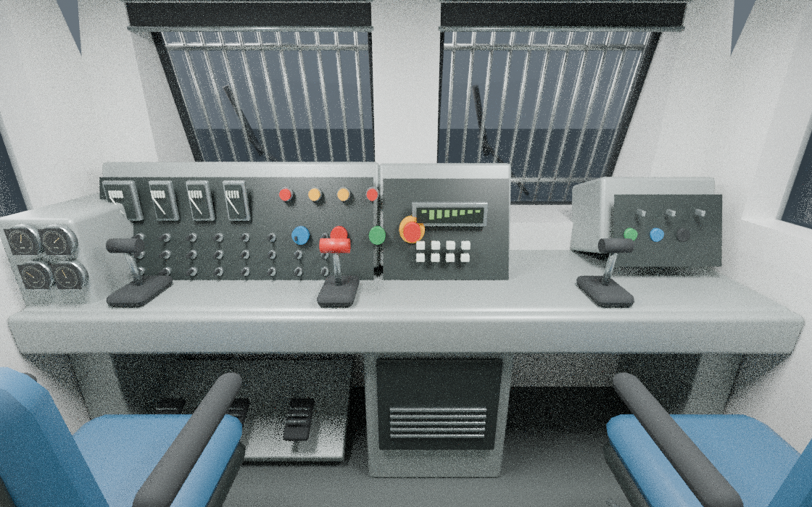
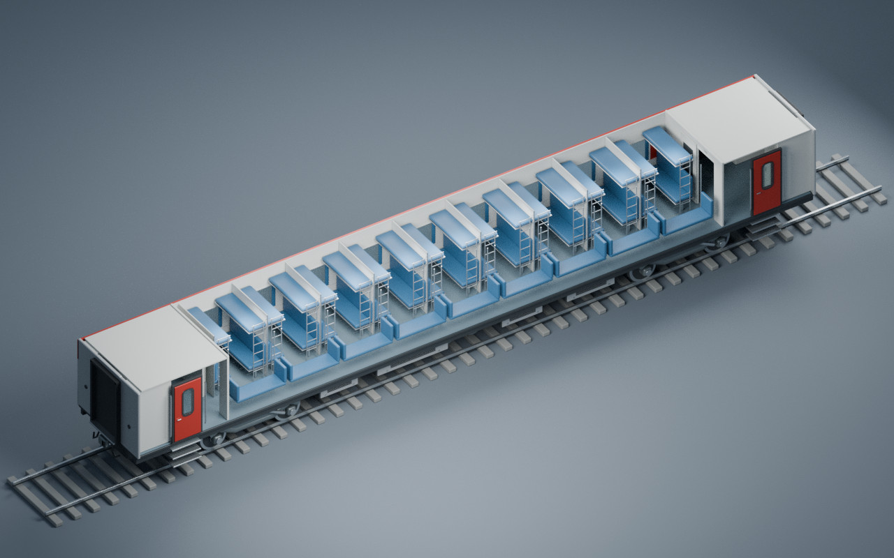
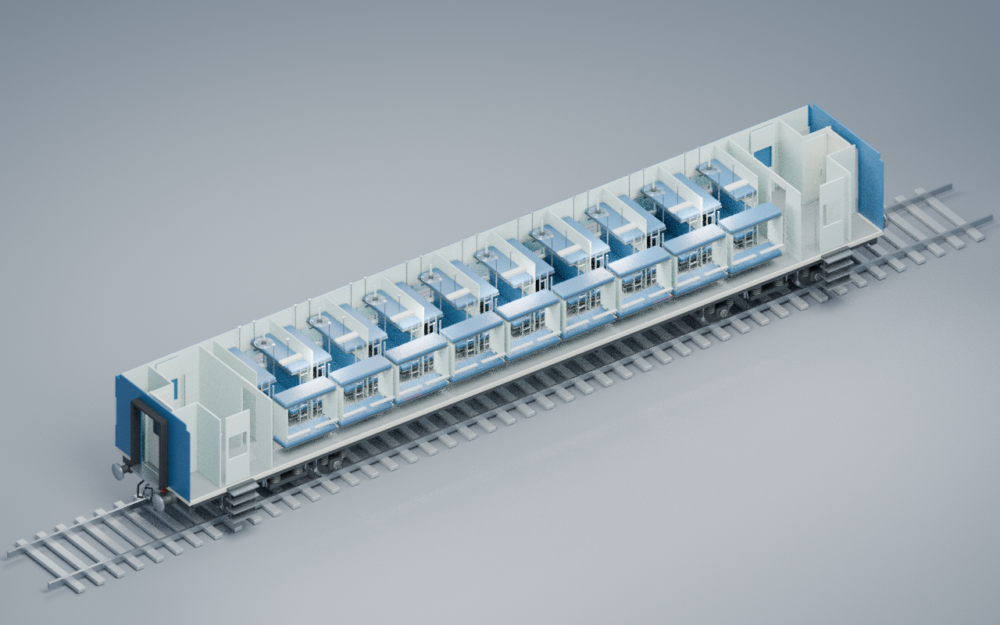
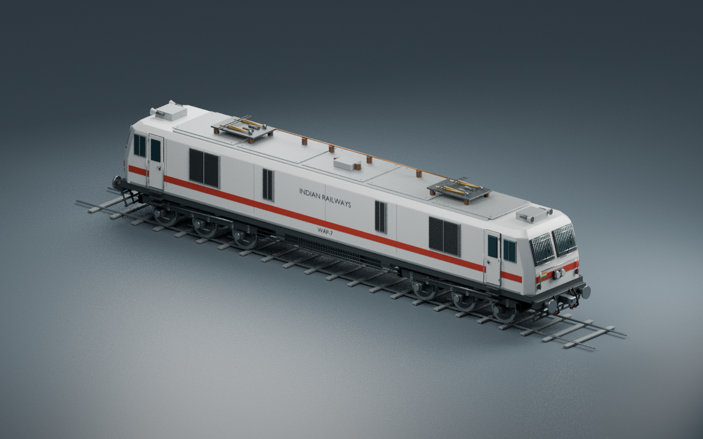
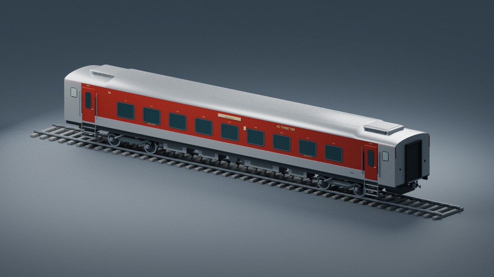
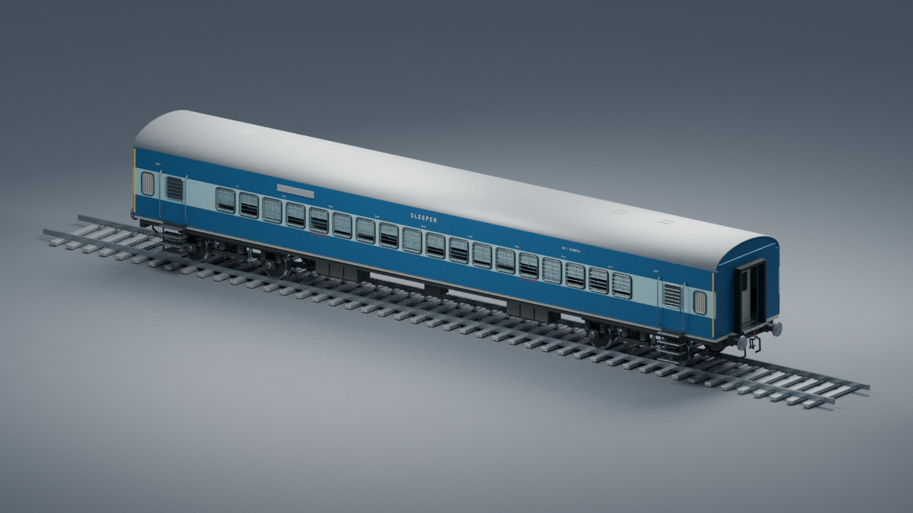

# Indian Rail Prototype Pack v0.4

Editable Blender prototypes for an Indian Railways asset-development project:

- **WAP-7** locomotive in clean white/red
- **LHB AC 3-tier** coach in red/grey
- **Conventional ICF sleeper** coach in blue/cyan

The repository includes dimensioned Blender source prototypes and a playable,
locally converted TF3 pack. The source masters prioritize separated components;
the conversion supplies native game resources, materials, LODs and metadata.

A local TF3 conversion is now installed and play-tested, including updated
interiors, CBC couplings and pantographs. See [installation and play-test notes](TF3-INSTALL.md)
for the current revision, reproducible build steps, fixes and remaining checks.
Download the [playable TF3 pack (revision 4)](dist/Indian-Rail-Prototype-Pack-TF3.zip).
Extract its `gj94_indian_rail_pack` folder into your TF3 `local/mods` folder,
enable **Indian Rail Prototype Pack**, and use year 2000 or later with electrified track.
See also [moddable vehicle features and sounds](TF3-VEHICLE-FEATURES.md).
The original assets and their validation reports below describe the source prototypes.

## Pantograph rig v0.4

[Open the independently articulated WAP-7, poses, animation samples and full control documentation](pantograph_v04).



- `PANTO_FRONT_CTRL` (+X end) and `PANTO_REAR_CTRL` (−X end) each have an independent `extension` property from 0 to 1
- Separate lower arms, upper arms, hinge shafts and contact heads; named LOWER/ELBOW/HEAD_LEVEL pivots keep the heads level through continuous articulation
- Contact-strip top above rail: **4.254758 m lowered**, **4.989397 m at 0.5**, **5.652074 m at the illustrative raised endpoint**
- Live-driver Blender master, baked-motion Blender master, static lowered/raised FBXs and a losslessly zipped baked motion-sample FBX included
- The animated sample is 24 fps; independent front/rear intervals and Blender FBX import-offset handling are documented

This is an adjustable authoring rig. The source README gives a height-to-control
formula, pivot names and how to revise the authoring range. Our TF3 conversion
adds the wire-height binding and extends the illustrative endpoint to 45 degrees;
see [integration details](TF3-INSTALL.md).

All 2,661 protected source objects were checked unchanged, including interiors, origin/metre scale, coupling anchors and bogie/axle hierarchy. Fresh static/animated FBX imports and intermediate-pose/collision checks passed within documented tolerances. The mechanism is a simplified game-oriented approximation, not manufacturer-exact hardware.

## Coupling correction v0.3

[Open the corrected WAP-7 + CBC-retrofit ICF assets and full coordinate documentation](coupling_v03).



This separate ICF variant uses matched simplified CBC heads; the original screw-coupled v0.2 remains unchanged. Both updated models include root-parented **COUPLING_FRONT** and **COUPLING_REAR** empties in Blender and FBX. Metre scale, original origins, interiors and bogie/axle hierarchy are preserved.

| Authoring model | Front anchor XYZ (m) | Rear anchor XYZ (m) | Point-to-point span |
|---|---|---|---|
| WAP-7 | (10.2000, 0, 1.105) | (-10.2000, 0, 1.105) | 20.4000 m |
| ICF CBC-retrofit visual variant | (11.1485, 0, 1.105) | (-11.1485, 0, 1.105) | 22.2970 m |

The common 1.105 m height is a visual alignment convention, including a 15 mm normalization above the cited locomotive nominal height. These are **model mating planes, not nose-tip bounds or certified prototype dimensions**. Retained side-buffer axes are at Y = ±0.978 m. The anchored straight fixture preserves about 1.160 m body clearance and a 90 mm buffer-face gap.

[Top contact view](coupling_v03/paired_connection_top.png) · [Paired overview](coupling_v03/paired_straight_overview.png) · [Validation and sources](coupling_v03/README.md)

Fresh FBX checks cover both anchor frames and preserved mechanical hierarchy. This fix was checked in Blender only; TF3 vehicle spacing plus straight/curve tests remain with the user. No dynamic coupler yaw or compression is implemented.

## Interior pass v0.2

Updated editable masters and FBX exports are in [`interiors_v02`](interiors_v02).
These are source assets; the downloadable converted pack adds TF3 integration.
The original exterior prototypes remain below for comparison.

- WAP-7: both cabs, driving desks, gauges, seats, pedals, window openings and transparent glazing
- LHB 3A: nine daytime berth bays, folded middle backrests, ladders, racks, partitions, AC fittings, clear aisle and vestibule detail
- ICF sleeper: variant-specific berth bays, fans, ladders, racks, shutter/window fittings and entry detail
- Each coach has 72 berth references and 72 seated authoring locators, exported as passenger-seat metadata by our conversion

### WAP-7 cab

[Onboard A](interiors_v02/wap7/WAP7_onboard_A.png) · [Onboard B](interiors_v02/wap7/WAP7_onboard_B.png) · [Cutaway](interiors_v02/wap7/WAP7_cab_cutaway.png) · [Exterior check](interiors_v02/wap7/WAP7_exterior_regression.png) · [Model files and notes](interiors_v02/wap7)

### LHB 3A interior

[Passenger aisle](interiors_v02/lhb/LHB_v02_passenger.png) · [Bay](interiors_v02/lhb/LHB_v02_bay.png) · [Exterior check](interiors_v02/lhb/LHB_v02_exterior.png) · [Model files and notes](interiors_v02/lhb)

### ICF sleeper interior

[Passenger aisle](interiors_v02/icf/passenger_aisle.png) · [Bay](interiors_v02/icf/passenger_bay.png) · [Exterior check](interiors_v02/icf/exterior_regression.png) · [Model files and notes](interiors_v02/icf)

### Verification and limitations

All three FBX exports were re-imported into Blender. Mechanical pivots and exterior envelopes were checked; cab image textures are packed/embedded. Coach placement checks use simplified proxies and do not replace actual passenger-animation testing. See each folder's validation files for the scope and results.

The daytime layout is static: deploying berths and opening doors are not animated. No functional driving cockpit is claimed. Some measurements and hardware remain provisional, and the detailed meshes still need game optimization, LODs, TF3 materials/metadata and editor/runtime testing. Some CPU-rendered interior views retain visible sampling noise. Reference photographs are linked in the notes and are not redistributed.

Rebuild scripts in the v0.2 folders document their baseline input; they are separate from the v0.1 generators below. Back up edits before running either generation.

## Exterior prototypes v0.1

### WAP-7

[Cab detail](wap7/WAP7_prototype/WAP7_cab_detail.png) · [Model notes](wap7/WAP7_prototype/README.md)

### LHB AC 3-tier

[Side view](lhb/LHB_3A_side.png) · [Detail view](lhb/LHB_3A_detail.png) · [Model notes](lhb/README.md)

### ICF sleeper

[Detail view](icf/icf_sleeper/icf_detail.png) · [Model notes](icf/icf_sleeper/README.md)

## Open the assets

Each model folder includes an editable `.blend` master, an asset-only `.fbx`, rendered previews, Python generation/validation scripts and documented measurements and limitations. Open the `.blend` file in Blender 4.3.2, the version used to create and validate these assets. Geometry uses metres, X longitudinal, Y lateral and Z up; check target-importer axis and scale handling independently.

FBX exports exclude the presentation track, studio lights and cameras. Blender-to-Blender FBX re-import checks passed during asset creation. Game/Model Editor import and runtime testing have **not** been performed. Validation reports describe that original geometry validation. Repository preparation removes incidental machine-path metadata without altering geometry or preview pixels; current file hashes are in `SHA256SUMS.txt`.

## Rebuild

Run each command from its model folder with Blender 4.3.2 available:

```sh
blender -b -t 2 --python build_wap7.py
blender -b -t 2 --python build_lhb.py
blender -b -t 2 --python build_icf.py
```

Each script recreates its scene and writes outputs beside itself. Back up edits before rebuilding. CPU Cycles previews are supported; disable denoising if OpenImageDenoise is unavailable.

## Prototype limits and remaining work

- Small details and equipment positions remain approximate; no specific numbered vehicle or exact production revision is represented
- Exact drawing refinement, UV/texture atlases, bilingual markings and weathering remain
- Mesh consolidation, game polygon budgets, LODs, collision meshes and complete animation rigs remain
- Game materials, resources, manifests and actual editor/runtime tests remain
- The ICF screw-coupled and LHB centre-coupled designs do not assert a mechanically compatible mixed rake

These models are for visualization and asset development, not manufacture or safety/clearance engineering. Each model README identifies dimensional sources, photographic references and unverified assumptions. Referenced photographs and third-party manuals are not bundled as assets; geometry and materials are procedural.

No open-source license is granted by this repository.
