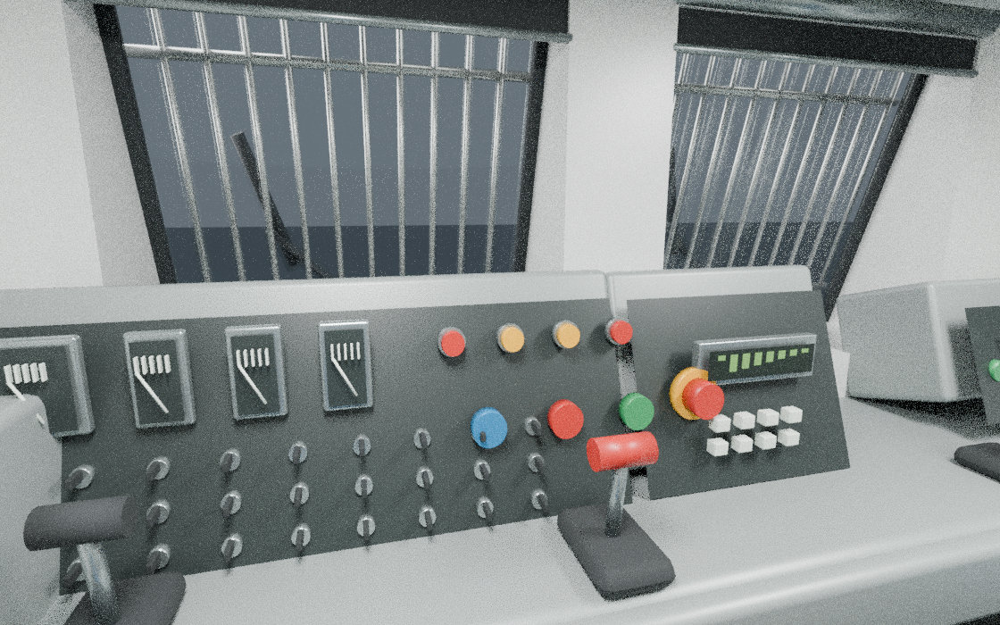
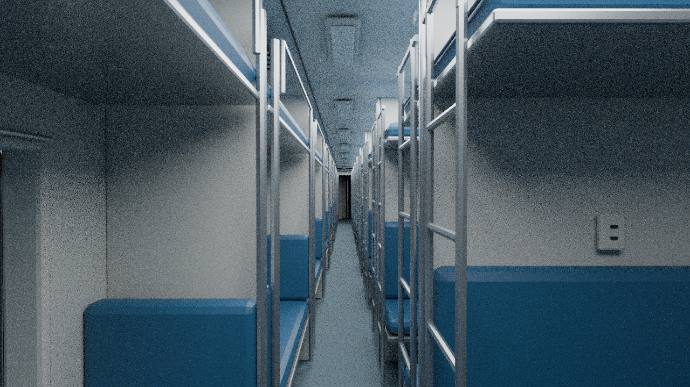
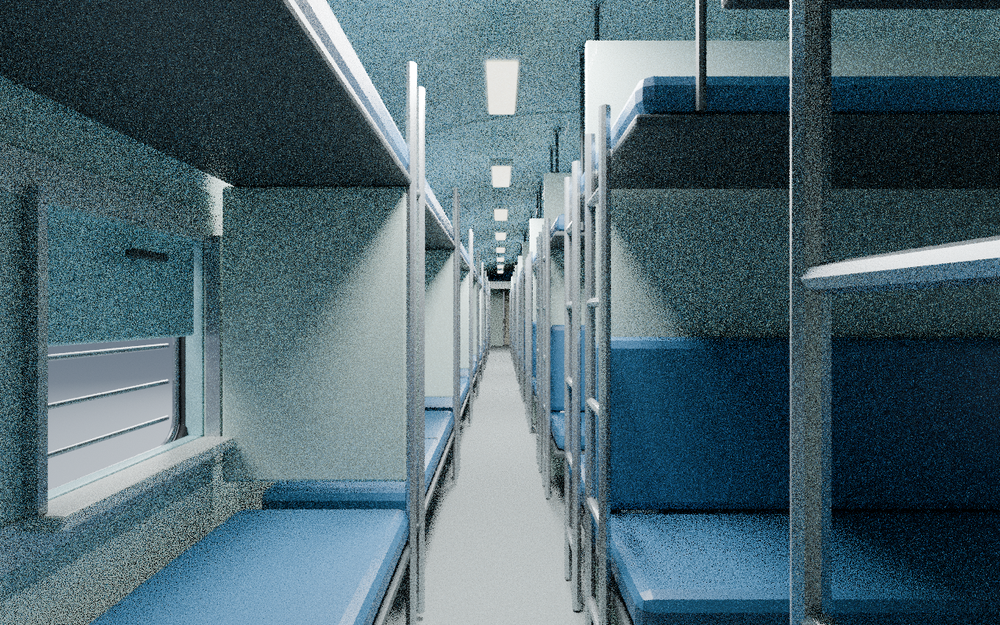

# Indian Rail Prototype Pack v0.1

Editable Blender prototypes for an Indian Railways asset-development project:

- **WAP-7** locomotive in clean white/red
- **LHB AC 3-tier** coach in red/grey
- **Conventional ICF sleeper** coach in blue/cyan

**These are dimensioned visual prototypes, not a working or game-tested Transport Fever 3 mod.** Detailed masters prioritize separated components and reviewable shape; they require optimization and integration before game use.

## Interior pass v0.2 — previews in progress

The interior refinement is in progress. These are actual Blender renders of the updated models, not in-game screenshots. Final source files and validation notes will follow after review. CPU previews retain some sampling noise.

### WAP-7 driving cab


### LHB 3A passenger aisle


### ICF sleeper passenger aisle


## Exterior prototypes v0.1

### WAP-7

[Cab detail](wap7/WAP7_prototype/WAP7_cab_detail.png) · [Model notes](wap7/WAP7_prototype/README.md)

### LHB AC 3-tier

[Side view](lhb/LHB_3A_side.png) · [Detail view](lhb/LHB_3A_detail.png) · [Model notes](lhb/README.md)

### ICF sleeper

[Detail view](icf/icf_sleeper/icf_detail.png) · [Model notes](icf/icf_sleeper/README.md)

## Open the assets

Each model folder includes an editable `.blend` master, an asset-only `.fbx`, rendered previews, Python generation/validation scripts and documented measurements and limitations. Open the `.blend` file in Blender 4.3.2, the version used to create and validate these assets. Geometry uses metres, X longitudinal, Y lateral and Z up; check target-importer axis and scale handling independently.

FBX exports exclude the presentation track, studio lights and cameras. Blender-to-Blender FBX re-import checks passed during asset creation. Game/Model Editor import and runtime testing have **not** been performed. Validation reports describe that original geometry validation. Repository preparation removes incidental machine-path metadata without altering geometry or preview pixels; current file hashes are in `SHA256SUMS.txt`.

## Rebuild

Run each command from its model folder with Blender 4.3.2 available:

```sh
blender -b -t 2 --python build_wap7.py
blender -b -t 2 --python build_lhb.py
blender -b -t 2 --python build_icf.py
```

Each script recreates its scene and writes outputs beside itself. Back up edits before rebuilding. CPU Cycles previews are supported; disable denoising if OpenImageDenoise is unavailable.

## Prototype limits and remaining work

- Small details and equipment positions remain approximate; no specific numbered vehicle or exact production revision is represented
- Exact drawing refinement, UV/texture atlases, bilingual markings and weathering remain
- Mesh consolidation, game polygon budgets, LODs, collision meshes and complete animation rigs remain
- Game materials, resources, manifests and actual editor/runtime tests remain
- The ICF screw-coupled and LHB centre-coupled designs do not assert a mechanically compatible mixed rake

These models are for visualization and asset development, not manufacture or safety/clearance engineering. Each model README identifies dimensional sources, photographic references and unverified assumptions. Referenced photographs and third-party manuals are not bundled as assets; geometry and materials are procedural.

No open-source license is granted by this repository.
