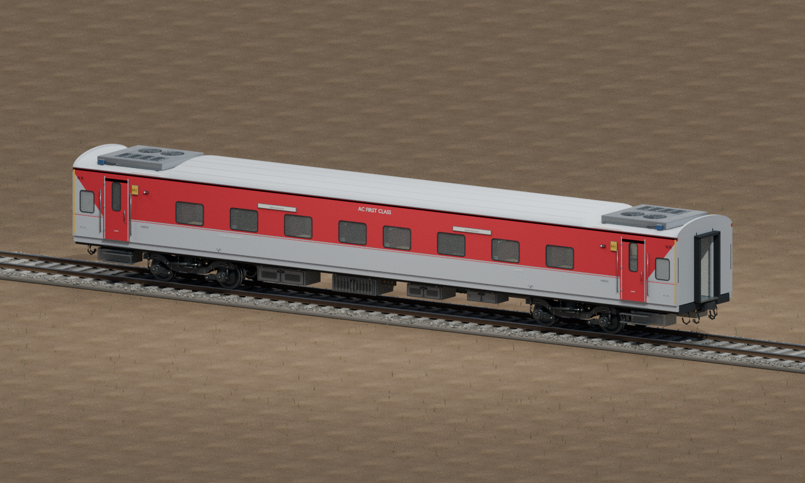
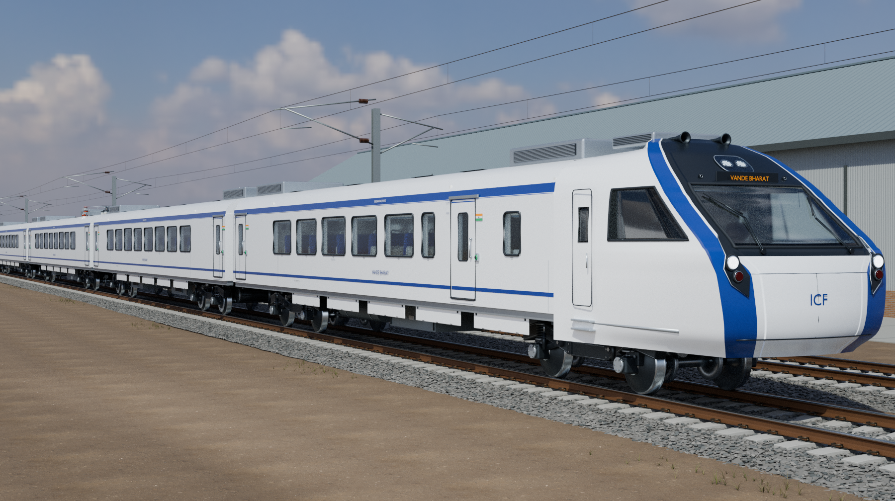
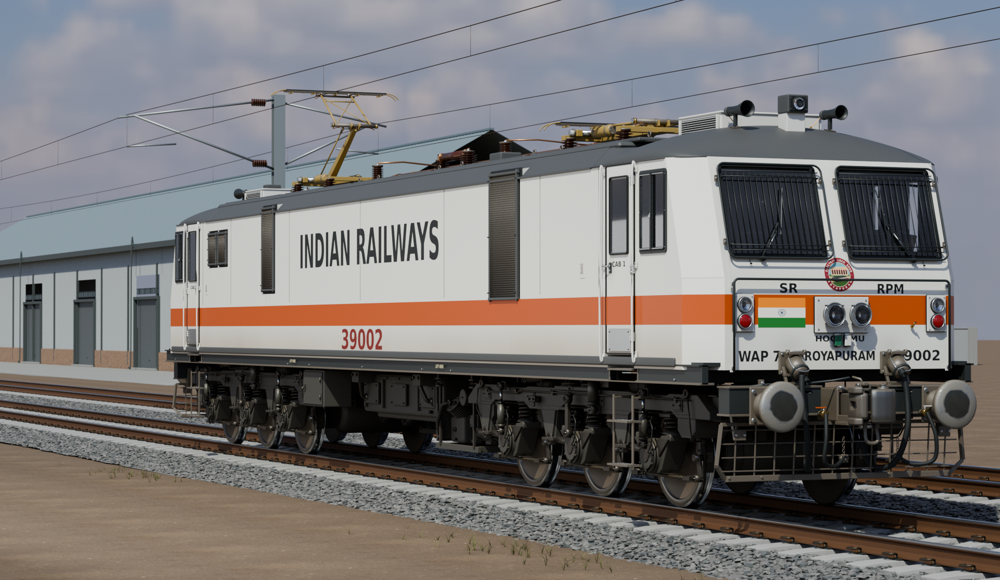
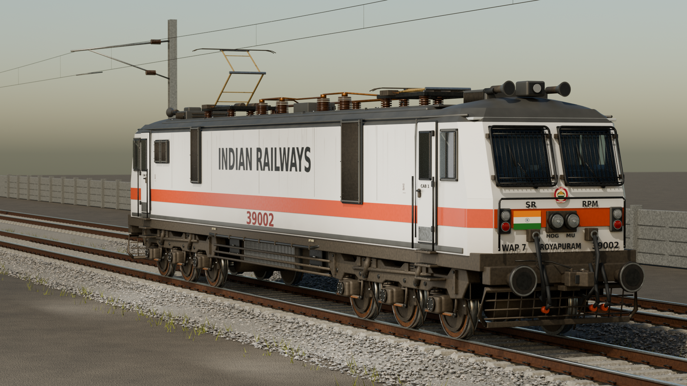
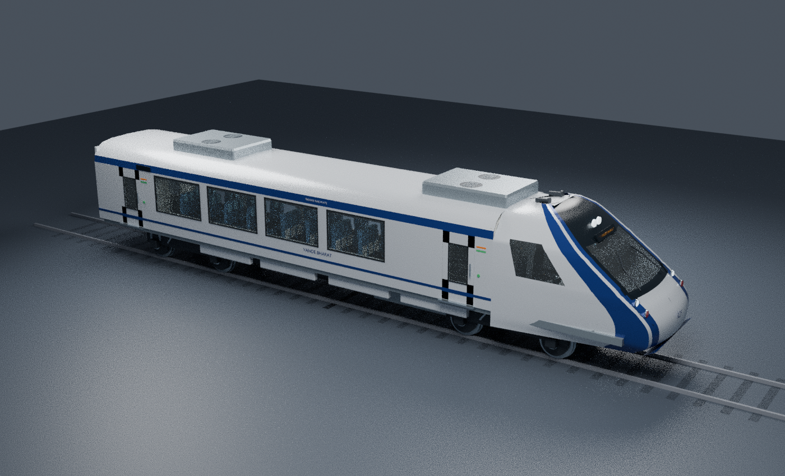

# Indian Rail Prototype Pack v1.0

## ICF and LHB detailed coach sources v0.2


[ICF actual-model gallery](icf_detail_v02/GALLERY.md) · [ICF editable sources and reproducible checks](icf_detail_v02/README.md) · [ICF reference interpretation](icf_detail_v02/FIDELITY.md)



[LHB actual-model gallery](lhb_detail_v02/GALLERY.md) · [LHB editable sources and reproducible checks](lhb_detail_v02/README.md)

Each separate v0.2 family includes seven full-length classes: **1A, 2A, 3A, 2S, CC, SL and GS**. Every class has its own furnished interior, exterior, metre-scale Blender master and FBX export. Rebuild/render scripts, texture dependencies, source and image provenance, railway reference links and validation reports accompany the models. The galleries contain actual Blender Cycles renders of the supplied geometry.

Selected conventional ICF stock uses **screw couplings and side buffers**; LHB uses CBC geometry. Physical accommodation and class layouts are documented separately from gameplay capacity. These are reference-informed authoring models, not manufacturing drawings. Geometry and export checks pass within their documented scope; editable-font tessellation warnings and visual interpretations are disclosed in each family’s reports.

**The completed galleries contain 24 ICF views and 21 LHB views**, accepted with the documented fidelity caveats. All fourteen class exterior/interior preview pairs are available. Every ICF image matches its current master. Twenty LHB images retain their exact accepted pre-WC-repair masters under `revisions/pre_wc_repair_20261008`; the corrected lavatory image matches the latest source. These source revisions are explicitly identified in the gallery and provenance records. The detailed v0.2 families have not been converted, optimized or tested in Transport Fever 3. Character-animation fit, dynamic mechanical clearances and runtime behavior remain unvalidated. Earlier v0.1 sources and the existing downloadable game pack remain unchanged.

## Vande Bharat 2.0 full-size detailed source v0.2



[Open the editable 8-car and 16-car sources and detailed gallery](vande_bharat_detail_v02/README.md).

This white/blue VB2 revision uses **24 m car pitch and 192 / 384 m nominal coupling spans**. The separately measured closed-fairing envelopes are **191.560 / 383.560 m**. Drawing-informed nose/body geometry, running gear, roof electrics, CC/EC passenger interiors, service rooms and the driving cab are included, with **530 / 1,128 physical passenger seats**. Eight-car ordering and finer hardware interpretations are documented.

The gallery is rendered in Blender Cycles from seven reusable car files and linked assemblies. Editable metre-scale sources include procedural materials, rebuild scripts, primary references and geometry/control/clearance checks. **This is a high-detail authoring handoff**; TF3 conversion and runtime testing remain separate. The earlier compact sources and downloadable game pack are unchanged.

[Complete formations and length proof](vande_bharat_detail_v02/previews/formation_length_proof.png) · [Chair-car interior](vande_bharat_detail_v02/previews/cc.png) · [Executive seats](vande_bharat_detail_v02/previews/ec_front.png) · [Driving cab](vande_bharat_detail_v02/previews/cab.png) · [Running gear](vande_bharat_detail_v02/previews/bogie.png) · [Pantograph](vande_bharat_detail_v02/previews/pantograph.png)

## WAP-7 detailed source revision v0.2



[Open the editable WAP-7 v0.2 source and close-up gallery](wap7_photoreal_v02/README.md).

This revision rebuilds the visible body fittings, couplers, roof electrical equipment, running gear, both driving cabs and the machinery compartment. It restores the 3.152 m body-skin width and adds separate glazing, seals, wipers, instrument faces, cast and fabricated hardware, pipework, cables and location-specific service wear. The previews are Cycles renders of the supplied master.

The portable Blender source includes exact relative texture dependencies, reproducible authoring/render scripts, reference notes and independent geometry, rig, material and font checks. Fine hardware and unseen equipment remain documented representative interpretations.

This is a **high-detail authoring source**. It has not been converted, optimized or tested as a TF3 runtime vehicle. The existing downloadable pack and earlier source revisions remain unchanged.

[Cab instruments](wap7_photoreal_v02/previews/cab/panel_A.png) · [CBC and front connections](wap7_photoreal_v02/previews/probe_coupler_top.png) · [Machinery corridor](wap7_photoreal_v02/previews/machinery_gallery/machinery_through_door.png) · [Wheel and axlebox](wap7_photoreal_v02/previews/details/wheel.png) · [Pantograph](wap7_photoreal_v02/previews/probe_pantograph.png) · [Side elevation](wap7_photoreal_v02/previews/probe_side.png)

## WAP-7 visual refinement v0.1



[Open the editable WAP-7 refinement and full preview gallery](wap7_photoreal_v01/README.md).

The white/red locomotive receives a reshaped exterior, recessed cab glazing, finer grilles and roof/underframe detail, bilingual markings, textured paint and restrained weathering. The trackside setting and lighting are procedural; the previews are rendered from the supplied Blender master.

The existing metre-scale origin, coupling anchors, bogie/axle hierarchy, independently controlled pantographs and both cab interiors are preserved. Independent source checks cover all 500 protected objects, including 478 cab-interior objects.

This is a **source-only visual handoff**. It has not been converted into the downloadable TF3 pack or installed in game; the existing native release remains unchanged. The folder includes the editable master, authoring scripts, original texture assets, previews and validation notes.

[Side elevation](wap7_photoreal_v01/previews/02_side_elevation.png) · [Cab detail](wap7_photoreal_v01/previews/03_cab_detail.png) · [Bogie detail](wap7_photoreal_v01/previews/04_bogie_detail.png) · [Roof detail](wap7_photoreal_v01/previews/05_roof_detail.png) · [Front portrait](wap7_photoreal_v01/previews/06_front_portrait.png)

Editable Blender prototypes for an Indian Railways asset-development project:

- **WAP-7** locomotive in clean white/red
- **WAG-9** green/yellow freight locomotive
- **WAG-12B** blue/cyan twin-section freight locomotive
- **Seven LHB classes** in red/grey: 1A, 2A, 3A, 2S, CC, SL and GS
- **Seven conventional ICF classes** in blue/cyan: 1A, 2A, 3A, 2S, CC, SL and GS
- **Vande Bharat Express** compact 8-car and 16-car white/blue trainsets

The repository includes dimensioned Blender source prototypes and an installable
TF3 pack. The source masters prioritize separated components;
the conversion supplies native game resources, materials, LODs and metadata.

A local TF3 conversion is installed. Earlier WAP-7, Vande Bharat and purchase-tab
updates have user-confirmed play tests; the new coach families await the user's
play test. **v1.0 uses TF3 resource revision 14** and preserves the stable mod ID.
The installed revision 13 has the same vehicle content; v1.0 changes only release
metadata and documentation. Installation is deferred while the game is running.
See [installation and play-test notes](TF3-INSTALL.md) for reproducible build steps,
fixes and remaining checks, and [release notes](CHANGELOG.md) for v1.0.
Download the [TF3 pack v1.0](dist/Indian-Rail-Prototype-Pack-TF3.zip).
The rail purchase browser opens on an **Indian Railways** tab containing this
pack's available locomotives, coaches and complete trainsets. The original
Locomotive, Wagon, Multiple Unit and search tabs remain available. This new
interface passes checks against the shipped GUI code, and the user confirmed
its in-game appearance on 30 September 2026.
v1.0 includes all fourteen coach classes. The existing ICF SL and LHB
3A resource IDs receive the new models, so each class appears once. The agreed
capacity scale doubles the former normalized balance: ICF SL carries 40 and
LHB 3A 44 passengers. 1A has the least capacity; 3A and SL both exceed 2A.
All coaches use the normal stock train fare factor and automatic purchase/upkeep.
All vehicle store and construction PNGs are straight side views. Native editor
validation passes for ICF 1A and 2A; all fourteen classes pass resource, seating,
cost and introduction-year filter checks. Further editor checks were stopped at
the user's request so they can test the installed build in game.
See the [class capacity table and validation](TF3-INSTALL.md#icf-and-lhb-coach-families-revision-13).
Revision 11 adds WAG-9 and the complete paired WAG-12B, plus straight side-view
construction icons at stock scale for every vehicle. The new engines still need
their first in-game check. The local customization uses the approved WAP-7 horn
on all three locomotive classes; the user confirmed WAP-7 playback works. Its private
recording and archive are kept outside the tracked release package; see the
installation notes for rebuilding and horn-key behavior.
Extract its `gj94_indian_rail_pack` folder into your TF3 `local/mods` folder,
enable **Indian Rail Prototype Pack v1.0**, and use electrified track (1995+ for WAG-9,
2000+ for WAP-7, 2017+ for WAG-12B and 2019+ for Vande Bharat).
Speeds and years use the user's chosen gameplay overrides: ICF 110 km/h / 1980,
LHB 200 / 2000, WAP-7 180 / 2000, WAG-9 120 / 1995, WAG-12B 120 / 2017
and Vande Bharat 180 / 2019. These mix design speeds and family dates rather
than asserting the exact operating limits/introduction of each modelled variant.
See also [moddable vehicle features and sounds](TF3-VEHICLE-FEATURES.md).

For selectable speed caps on individual track sections, see the separate
[Track Speed Restrictions mod](TRACK-SPEED-RESTRICTIONS.md). Its independent
revision 5 provides the **Speed limit** dropdown and automatic entrance boards;
their appearance and section updates are user-confirmed in game.
The original assets and their validation reports below describe the source prototypes.
Their v0.1–v0.4 folder names identify authoring handoffs and remain unchanged;
they are separate from the pack's v1.0 release version.

## ICF and LHB coach-family modelling handoffs

Fourteen new full-length, class-specific coach sources are available in [ICF family](icf_family_v01/README.md) and [LHB family](lhb_family_v01/README.md). Each includes **1A, 2A, 3A, 2S, CC, SL and GS**, with researched representative layouts, class-specific interiors and matching CBC coupling geometry.

The selected physical accommodation counts are ICF 18/46/64/108/73/72/108 and LHB 24/52/72/102/78/80/100 in the order above. These describe the modelled stock, not configured game capacities. 2S is a service designation; the family documentation explains the selected 2S and GS stock patterns and their possible overlap.

Blender masters, FBXs, source scripts, seated-root and separate berth-reference metadata, previews and validation reports are included. Spacing spans are 22.297 m for ICF and 24.000 m for LHB; complete visual bounds are reported separately. Both use the project's 1.105 m CBC alignment convention, with a checked mixed-family straight connection. Passenger markers use the documented stock seated-root offset rather than cushion or upper-berth locations.

All fourteen sources are **converted in v1.0**, with class-specific interiors, transparent glass, four LODs, seated-root metadata, matched coupling spans and side-on store/construction icons. Source masters remain unchanged. All ICF variants retain 110 km/h / 1980 and all LHB variants retain 200 km/h / 2000. Doors and couplers are static; boarding, curves and passenger anatomy remain runtime checks.

## WAG-9 and WAG-12B

New editable source models, prepared against revision 6 of this repository's modelling/conversion workflow:

- [WAG-9](wag9_v01/README.md): conventional green/yellow Co-Co locomotive, both furnished cabs, 20.562 m coupling-point span
- [WAG-12B](wag12_v01/README.md): blue/cyan twin-section Bo-Bo + Bo-Bo locomotive, independently authored sections, 38.400 m outer coupling-point span

Both packages include Blender masters, static and baked-motion FBX exports, independent level-head pantograph controls, named coupling/driver/light markers, source generators, reference provenance, previews and QA reports. The WAG-9 motion FBX is supplied as a verified lossless ZIP; extract it before import. WAG-12B includes standard-wire and illustrative high-reach poses.

**Converted in revision 11:** buy **Indian Railways WAG-9** or **Indian Railways
WAG-12B (twin section)** and add freight wagons. WAG-12B is one depot choice with
two independently articulated sections and outward cabs, totalling 9,000 kW,
706 kN and 180 t. WAG-9 has 4,500 kW, 460 kN and 123 t. Both have transparent
glass, crew anchors, four LODs and height-sampled pantographs. Prices/upkeep use
the installed game's automatic rules. [Integration details and validation](TF3-INSTALL.md#wag-9-wag-12b-and-construction-icons-revision-11-30-september-2026)
distinguish build checks from the pending game check of wire contact, reversals,
curves, crew/cockpit appearance and shared horn playback.

## Vande Bharat compact modelling handoff

[Open the Vande Bharat 2.0 white-blue chair-car source assets and conversion handoff](vande_bharat_v01).



Seven reusable car types support distinct 8-car and 16-car formations, with no intermediate driving cabs. The bodies/layouts are deliberately shortened for the requested 320 m platform budget while retaining the reference gauge, width, height and wheel diameter. This is a compact visual interpretation, not a 1:1-length replica.

| Formation | Coupling-datum span | Measured visible length | Margin below 320 m |
|---|---:|---:|---:|
| 8 cars | 155.000 m | 155.738 m | 164.262 m |
| 16 cars | 310.000 m | 310.738 m | 9.262 m |

The measured visible envelope includes both noses and all evaluated mesh projections. Internal anchors use 19.375 m pitch. Complete linked rake scenes, exact placements/orientations and length measurements are included in the [formation manifests](vande_bharat_v01/assemblies).

[Same-scale length proof](vande_bharat_v01/renders/formation_length_proof.png) · [Passenger interior](vande_bharat_v01/renders/interior.png) · [Cab view](vande_bharat_v01/renders/cab.png)

The handoff contains seven per-car Blender masters, eleven static/motion FBXs, independent door/bogie/axle/pantograph EMPTY hierarchies, interiors and character-placement guides. Both trailer pantograph rigs have live controls and baked motion samples. All eleven FBXs were freshly re-imported; all 22 inter-car joins align and both rigs passed 101-pose clearance checks. Linked assembly libraries use relative paths: keep the folder tree intact.

**Converted in pack revision 5:** buy **Vande Bharat Express (8 cars)** or
**Vande Bharat Express (16 cars)** on electrified track. Revision 11 sets their
gameplay availability to **2019** and maximum speed to **180 km/h**.
They have 420 / 880 configured passenger places and 155 / 310 m spacing lengths.
The stock gameplay scale gives 105 / 220 passengers in the depot menu.
The seven car types have interiors, transparent glazing, four LODs, passenger and
cab seats, sliding-door tracks and independent wire-height pantograph tracks.
Passenger-character fit, boarding, door triggers and wire contact require a fresh
runtime test. Gameplay capacity and automatic cost per seat were compared with
the installed stock trains; fares and maintenance use normal settings.
See [integration and balance figures](TF3-INSTALL.md#vande-bharat-v01-integration-30-september-2026).

## Pantograph rig v0.4

[Open the independently articulated WAP-7, poses, animation samples and full control documentation](pantograph_v04).


- `PANTO_FRONT_CTRL` (+X end) and `PANTO_REAR_CTRL` (−X end) each have an independent `extension` property from 0 to 1
- Separate lower arms, upper arms, hinge shafts and contact heads; named LOWER/ELBOW/HEAD_LEVEL pivots keep the heads level through continuous articulation
- Contact-strip top above rail: **4.254758 m lowered**, **4.989397 m at 0.5**, **5.652074 m at the illustrative raised endpoint**
- Live-driver Blender master, baked-motion Blender master, static lowered/raised FBXs and a losslessly zipped baked motion-sample FBX included
- The animated sample is 24 fps; independent front/rear intervals and Blender FBX import-offset handling are documented

This is an adjustable authoring rig. The source README gives a height-to-control
formula, pivot names and how to revise the authoring range. Our TF3 conversion
adds the wire-height binding and extends the illustrative endpoint to 45 degrees;
see [integration details](TF3-INSTALL.md).

All 2,661 protected source objects were checked unchanged, including interiors, origin/metre scale, coupling anchors and bogie/axle hierarchy. Fresh static/animated FBX imports and intermediate-pose/collision checks passed within documented tolerances. The mechanism is a simplified game-oriented approximation, not manufacturer-exact hardware.

## Coupling correction v0.3

[Open the corrected WAP-7 + CBC-retrofit ICF assets and full coordinate documentation](coupling_v03).


This separate ICF variant uses matched simplified CBC heads; the original screw-coupled v0.2 remains unchanged. Both updated models include root-parented **COUPLING_FRONT** and **COUPLING_REAR** empties in Blender and FBX. Metre scale, original origins, interiors and bogie/axle hierarchy are preserved.

| Authoring model | Front anchor XYZ (m) | Rear anchor XYZ (m) | Point-to-point span |
|---|---|---|---|
| WAP-7 | (10.2000, 0, 1.105) | (-10.2000, 0, 1.105) | 20.4000 m |
| ICF CBC-retrofit visual variant | (11.1485, 0, 1.105) | (-11.1485, 0, 1.105) | 22.2970 m |

The common 1.105 m height is a visual alignment convention, including a 15 mm normalization above the cited locomotive nominal height. These are **model mating planes, not nose-tip bounds or certified prototype dimensions**. Retained side-buffer axes are at Y = ±0.978 m. The anchored straight fixture preserves about 1.160 m body clearance and a 90 mm buffer-face gap.

[Top contact view](coupling_v03/paired_connection_top.png) · [Paired overview](coupling_v03/paired_straight_overview.png) · [Validation and sources](coupling_v03/README.md)

Fresh FBX checks cover both anchor frames and preserved mechanical hierarchy. This fix was checked in Blender only; TF3 vehicle spacing plus straight/curve tests remain with the user. No dynamic coupler yaw or compression is implemented.

## Interior pass v0.2

Updated editable masters and FBX exports are in [`interiors_v02`](interiors_v02).
These are source assets; the downloadable converted pack adds TF3 integration.
The original exterior prototypes remain below for comparison.

- WAP-7: both cabs, driving desks, gauges, seats, pedals, window openings and transparent glazing
- LHB 3A: nine daytime berth bays, folded middle backrests, ladders, racks, partitions, AC fittings, clear aisle and vestibule detail
- ICF sleeper: variant-specific berth bays, fans, ladders, racks, shutter/window fittings and entry detail
- These older coach sources each have 72 berth references and 72 seated locators; v1.0 uses the class-specific family masters instead

### WAP-7 cab

[Onboard A](interiors_v02/wap7/WAP7_onboard_A.png) · [Onboard B](interiors_v02/wap7/WAP7_onboard_B.png) · [Cutaway](interiors_v02/wap7/WAP7_cab_cutaway.png) · [Exterior check](interiors_v02/wap7/WAP7_exterior_regression.png) · [Model files and notes](interiors_v02/wap7)

### LHB 3A interior

[Passenger aisle](interiors_v02/lhb/LHB_v02_passenger.png) · [Bay](interiors_v02/lhb/LHB_v02_bay.png) · [Exterior check](interiors_v02/lhb/LHB_v02_exterior.png) · [Model files and notes](interiors_v02/lhb)

### ICF sleeper interior

[Passenger aisle](interiors_v02/icf/passenger_aisle.png) · [Bay](interiors_v02/icf/passenger_bay.png) · [Exterior check](interiors_v02/icf/exterior_regression.png) · [Model files and notes](interiors_v02/icf)

### Verification and limitations

All three FBX exports were re-imported into Blender. Mechanical pivots and exterior envelopes were checked; cab image textures are packed/embedded. Coach placement checks use simplified proxies and do not replace actual passenger-animation testing. See each folder's validation files for the scope and results.

The older source layouts are static: deploying berths and opening doors are not animated. The native conversion supplies game resources, LODs, materials and character metadata; complete cab/passenger fit remains a runtime check. Some measurements and hardware remain provisional. Some CPU-rendered interior views retain visible sampling noise. Reference photographs are linked in the notes and are not redistributed.

Rebuild scripts in the v0.2 folders document their baseline input; they are separate from the v0.1 generators below. Back up edits before running either generation.

## Exterior prototypes v0.1

### WAP-7

[Cab detail](wap7/WAP7_prototype/WAP7_cab_detail.png) · [Model notes](wap7/WAP7_prototype/README.md)

### LHB AC 3-tier

[Side view](lhb/LHB_3A_side.png) · [Detail view](lhb/LHB_3A_detail.png) · [Model notes](lhb/README.md)

### ICF sleeper

[Detail view](icf/icf_sleeper/icf_detail.png) · [Model notes](icf/icf_sleeper/README.md)

## Open the assets

Each model folder includes an editable `.blend` master, an asset-only `.fbx`, rendered previews, Python generation/validation scripts and documented measurements and limitations. Open the `.blend` file in Blender 4.3.2, the version used to create and validate these assets. Geometry uses metres, X longitudinal, Y lateral and Z up; check target-importer axis and scale handling independently.

FBX exports exclude the presentation track, studio lights and cameras. Blender-to-Blender FBX re-import checks passed during asset creation. Source validation reports describe that original geometry validation. Subsequent native resource checks and representative Model Editor previews are recorded in [TF3-INSTALL.md](TF3-INSTALL.md); the new coaches await user play testing. Repository preparation removes incidental machine-path metadata without altering geometry or preview pixels; current file hashes are in `SHA256SUMS.txt`.

## Rebuild

Run each command from its model folder with Blender 4.3.2 available:

```sh
blender -b -t 2 --python build_wap7.py
blender -b -t 2 --python build_lhb.py
blender -b -t 2 --python build_icf.py
```

Each script recreates its scene and writes outputs beside itself. Back up edits before rebuilding. CPU Cycles previews are supported; disable denoising if OpenImageDenoise is unavailable.

## Prototype limits and remaining work

- Small details and equipment positions remain approximate; no specific numbered vehicle or exact production revision is represented
- Exact drawing refinement, UV/texture atlases, bilingual markings and weathering remain
- Native mesh consolidation, four LODs, box colliders, materials, resources and metadata are implemented; close-up efficiency and distant silhouettes can improve
- Coach door animation, dynamic couplers, working lights and full runtime passenger/curve checks remain
- The old screw-coupled ICF source remains for reference; the active ICF/LHB families use matching CBC visual datums

These models are for visualization and asset development, not manufacture or safety/clearance engineering. Each model README identifies dimensional sources, photographic references and unverified assumptions. Referenced photographs and third-party manuals are not bundled as assets; geometry and materials are procedural.

No open-source license is granted by this repository.


## South Indian station architectural sources

[Open TVC, NCJ and ERS source models and actual-model galleries](south_indian_stations/README.md).

Three editable historical architectural studies cover **TVC's November 2022 heritage entrance, NCJ's 2010 entrance and ERS's 2017 west frontage**. Dated photographic references inform the identifiable facades; streets, vegetation, platforms and footbridges include explicitly documented modular or inferred context. These are metre-scale Blender authoring sources, with exchange files identified as architecture-only or whole-scene where supplied. They are not surveyed full-yard layouts or current-day reconstructions.

These station assets have not been converted, optimized or tested as Transport Fever 3 native stations. Existing vehicle families and the downloadable game pack are unchanged. Station-folder provenance identifies third-party photo/font rights separately; no new open-source licence is granted for generated assets.
