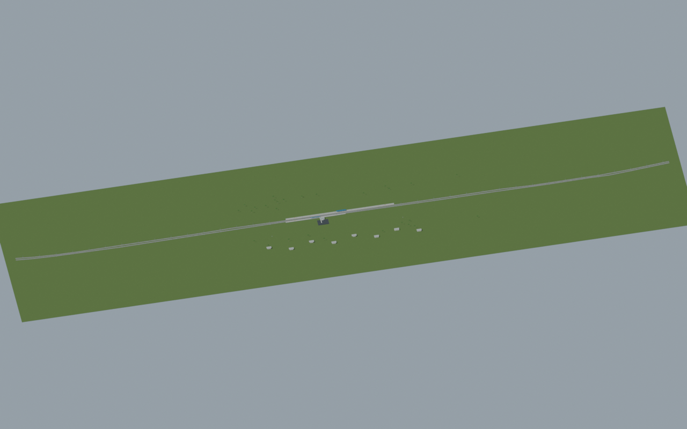
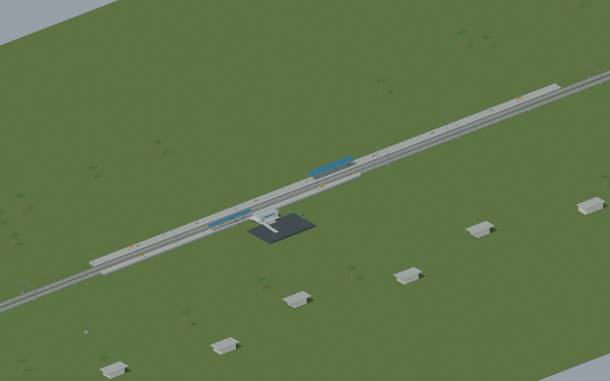
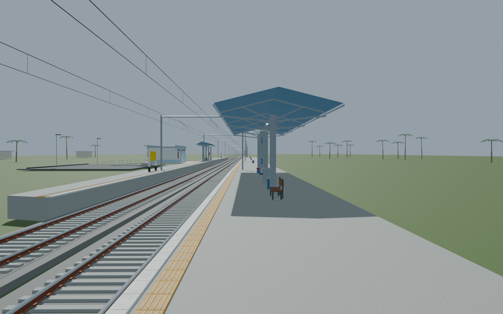
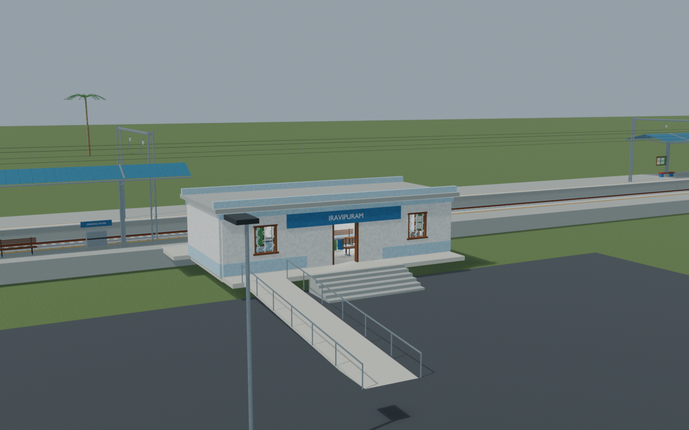
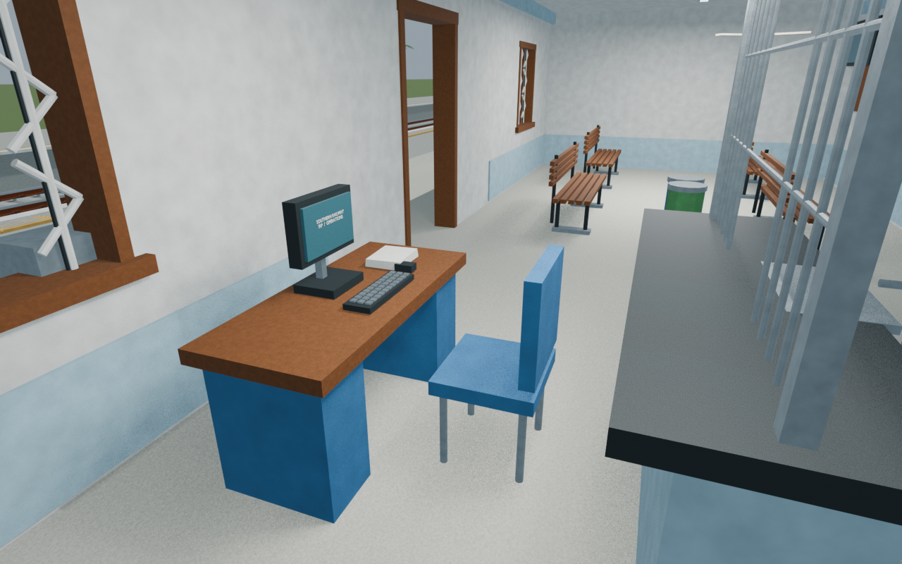

# IRP station gallery

Passed the full independent station gate with five accepted views, fifteen circulation paths and supported ramp/threshold probes. Source evidence and reconstructed details remain explicit.

Actual-model previews with accepted image hashes. Hidden interiors and unsurveyed details are reconstructions; read [sources and limitations](SOURCES_AND_UNCERTAINTIES.md). [Opening the model](README.md).

## Full mapped layout

## Station and platforms

## Platform track details

## Facade and approach

## Ticket interior

Authoritative model Blender SHA256: `9d43c1b2a898bb522116f356630fdd71e0ad1a0a38b9ec9a3da0d94fa0289721`. Review the per-frame provenance records for any retained earlier views and their exact source hashes.
