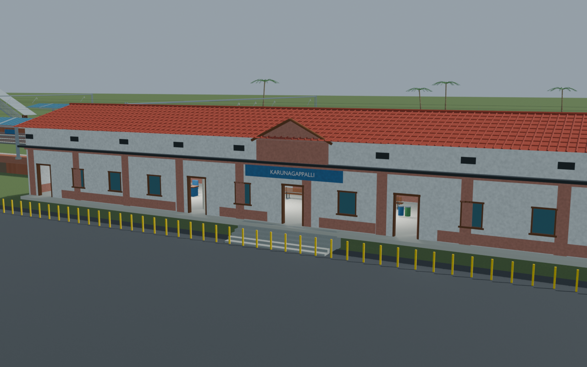
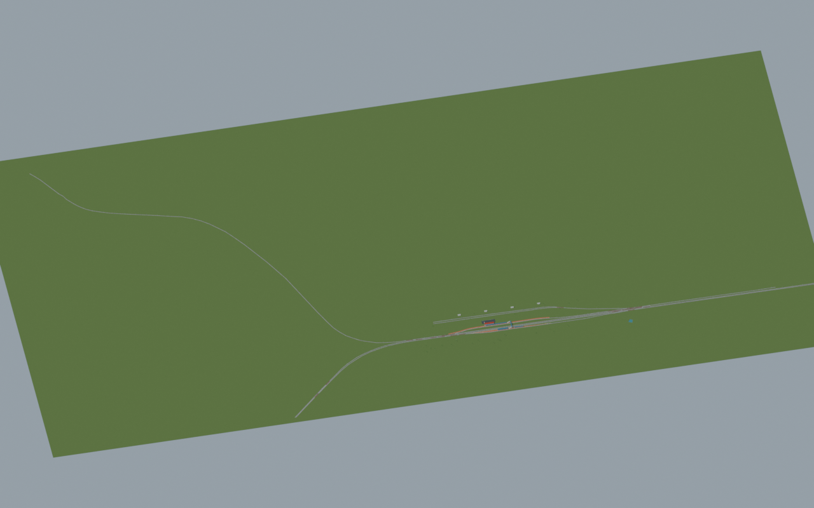
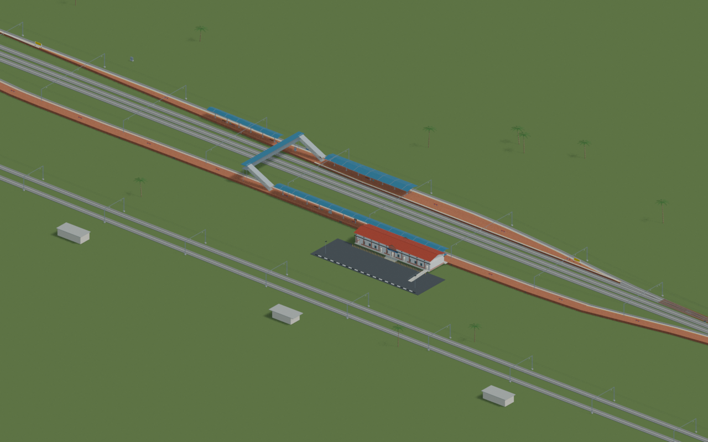
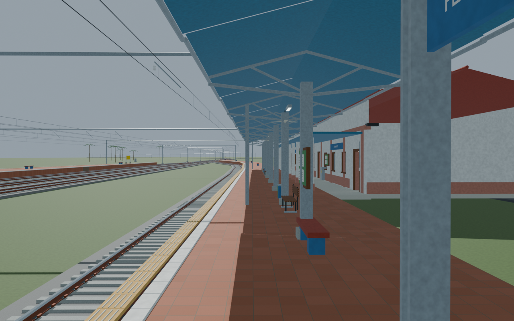
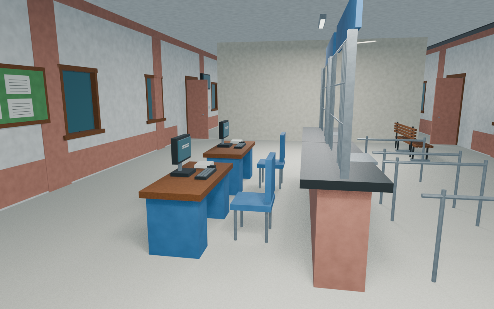

# KPY station gallery

Native scene and selected source-bound images accepted with disclosed reconstruction limits. Use CURRENT_PORTABLE_EXPORT.md for the selected colour-corrected portable export. Source scripts are provenance snapshots, not a tested standalone rebuild.

Actual-model previews with accepted image hashes. Hidden interiors and unsurveyed details are reconstructions; read [sources and limitations](SOURCES_AND_UNCERTAINTIES.md). [Opening the model](README.md).

## Facade and approach

## Full mapped layout

## Station and platforms

## Platform track details

## Ticket interior

Authoritative model Blender SHA256: `36388c2a9e54aa01b6152daa6ae55a69b3d555c361555cf312c28d8a8f1eba71`. Review the per-frame provenance records for any retained earlier views and their exact source hashes.
