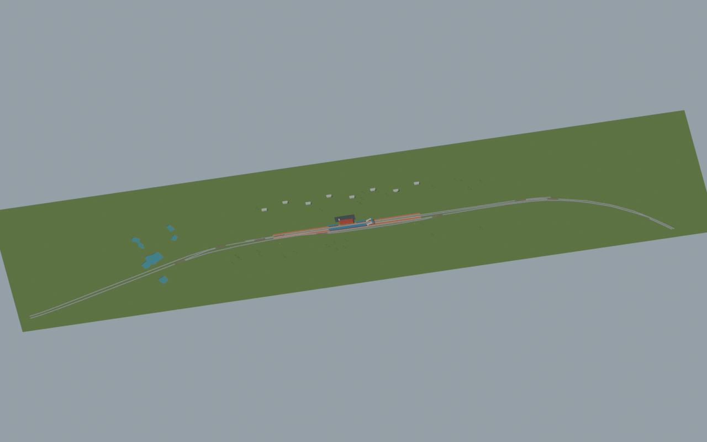
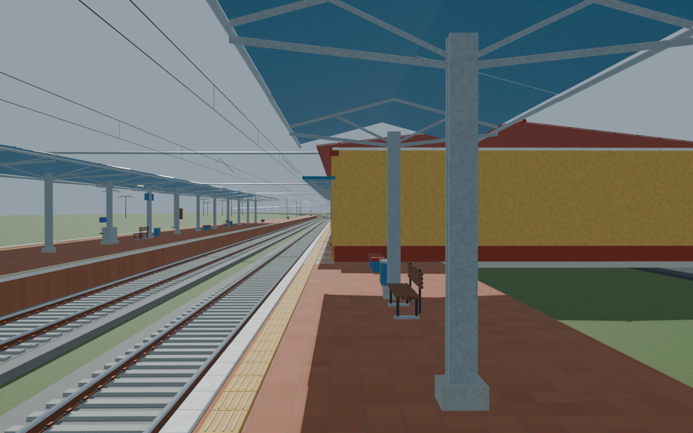
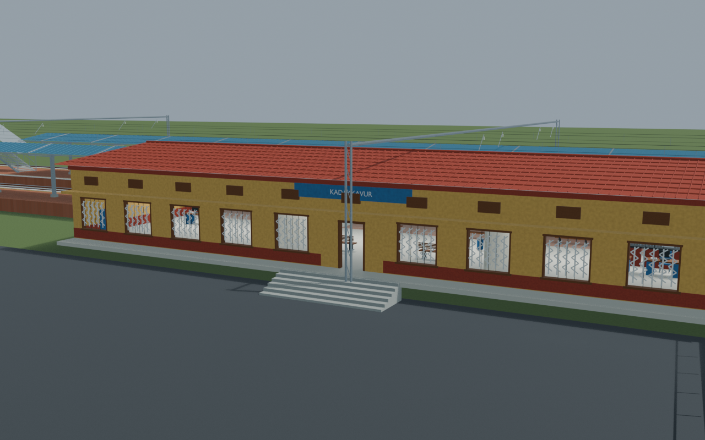
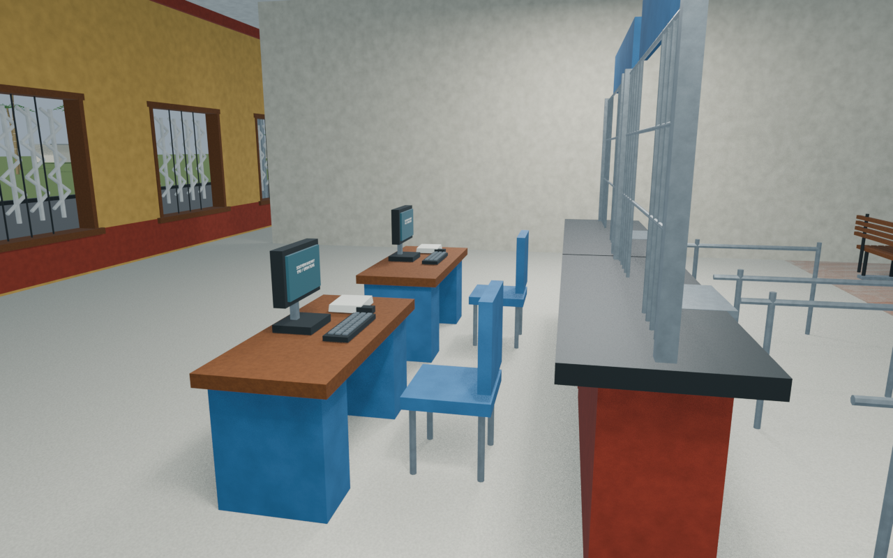

# KVU station gallery

Independently accepted source-backed model with four reviewed views and a verified portable export. The mapped building envelope occupies part of the raised platform body, so nominal body width is not unobstructed walking width. The reconstructed 1.3 m rear veranda uses wall brackets and inward door leaves; no accessibility-compliance claim is made. Unseen interiors and dimensions remain reconstructions.

Actual-model previews with accepted image hashes. Hidden interiors and unsurveyed details are reconstructions; read [sources and limitations](SOURCES_AND_UNCERTAINTIES.md). [Opening the model](README.md).

## Full mapped layout

## Platform track details

## Facade and approach

## Ticket interior

Authoritative model Blender SHA256: `f27bbec440313bd1190cc88cb582ecdc7a6d2d8e8d25aabfd670dccdc80938bd`. Review the per-frame provenance records for any retained earlier views and their exact source hashes.
