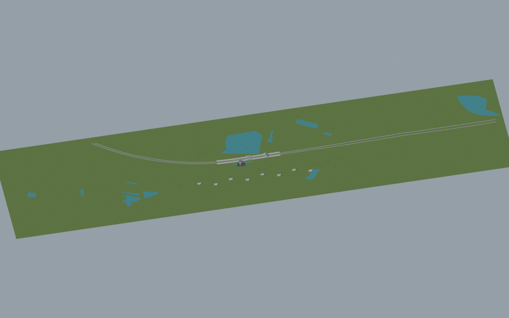
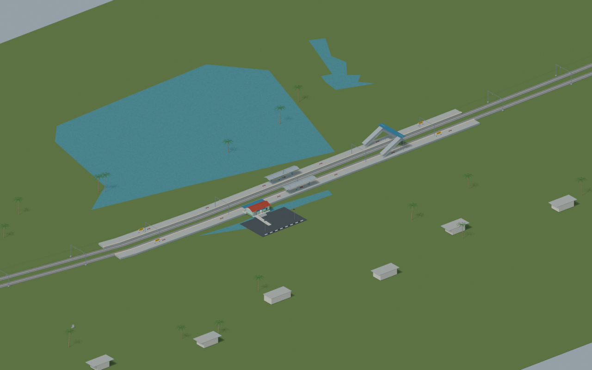
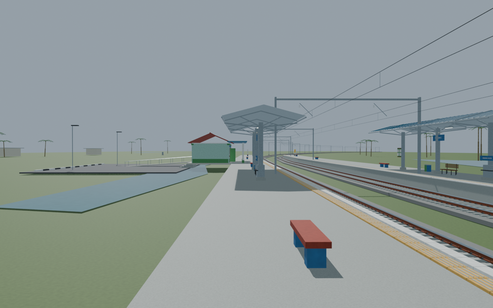
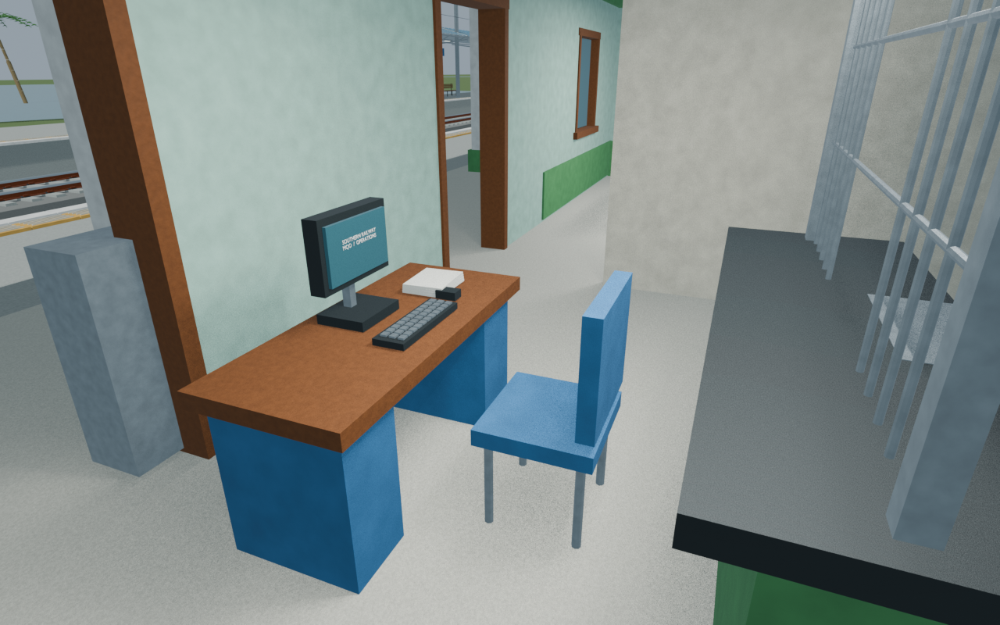

# MQO station gallery

Correction in progress: exact published geometry has an approximately 0.702 m final step from both footbridge stair approaches onto the deck. The earlier independent acceptance has been superseded by a targeted follow-up. The original source/export bytes remain available as a documented checkpoint; a corrected replacement is pending. [Full notice](REVIEW_NOTICE.md).

Actual-model previews with accepted image hashes. Hidden interiors and unsurveyed details are reconstructions; read [sources and limitations](SOURCES_AND_UNCERTAINTIES.md). [Opening the model](README.md).

## Full mapped layout

## Station and platforms

## Platform track details

## Facade and approach

## Ticket interior

Source Blender SHA256: `950cf176f29fc8cb21420a3887f5d782801d77a390be513d24840c4cf4edb4b1`.
