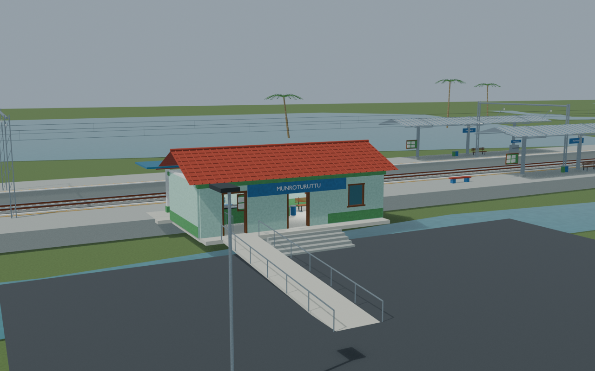
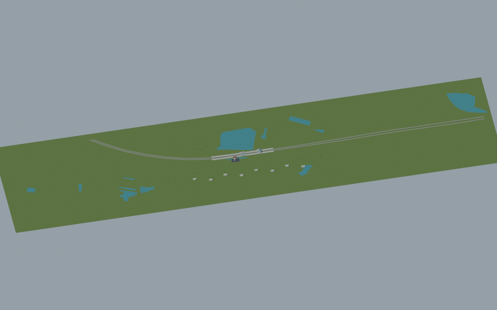
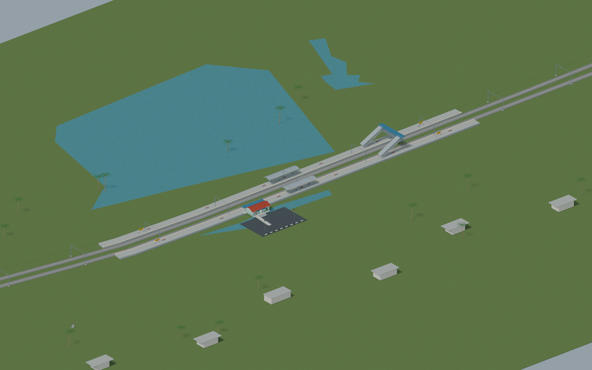
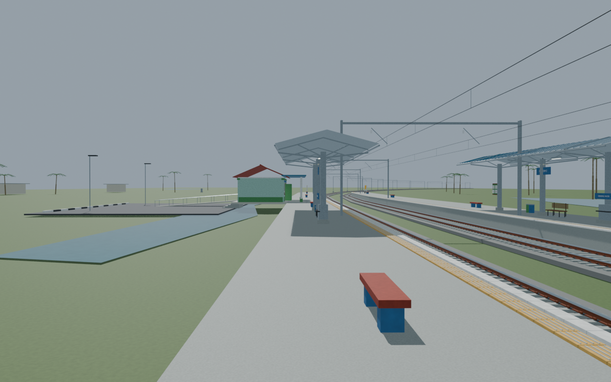

# MQO station gallery

Corrected footbridge revision passed renewed independent review. Source/export match the corrected scene; views 01–03 were refreshed and unchanged-area views 04–05 retain their explicitly documented earlier lineage.

Actual-model previews with accepted image hashes. Hidden interiors and unsurveyed details are reconstructions; read [sources and limitations](SOURCES_AND_UNCERTAINTIES.md). [Opening the model](README.md).

## Facade and approach

## Ticket interior

## Full mapped layout

## Station and platforms

## Platform track details

Authoritative model Blender SHA256: `180d186b075c31a44773fb855b73c4ab43c8b374d7ec7f4b0bb62c159f2ddb4d`. Review the per-frame provenance records for any retained earlier views and their exact source hashes.
