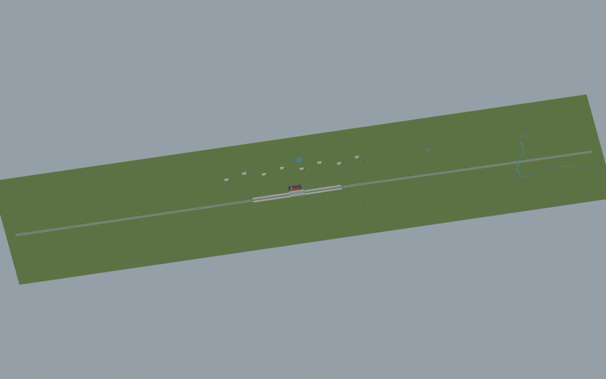
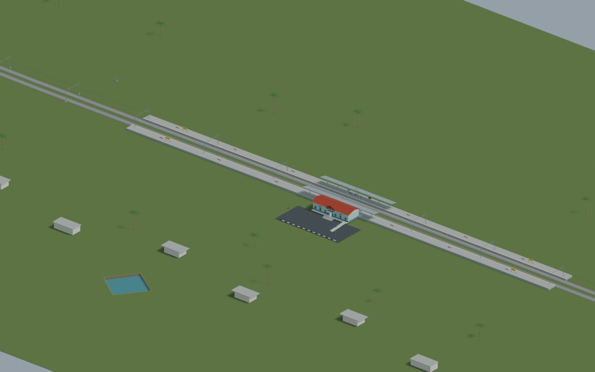
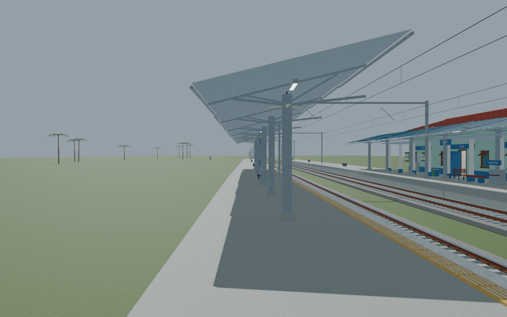
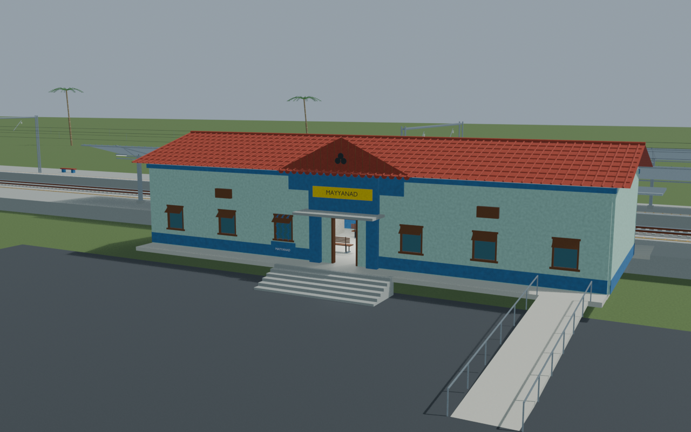
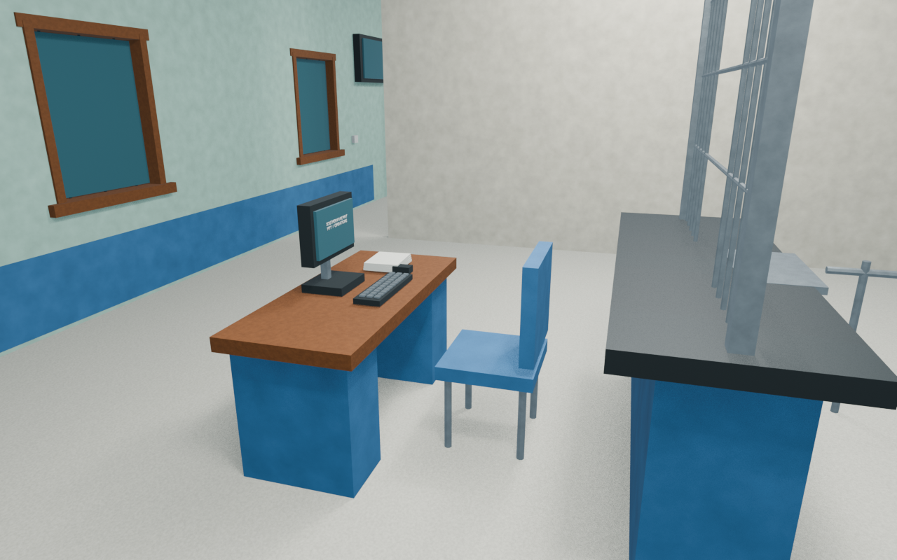

# MYY station gallery

Independently accepted corrected fixture revision. All five reviewed views, packed source resources and the source-bound portable export are checked. Single-portal public access uses the supported lateral ramp and continuous landing. Hidden details and dimensions remain disclosed reconstructions, with explicit current and retained image lineage.

Actual-model previews with accepted image hashes. Hidden interiors and unsurveyed details are reconstructions; read [sources and limitations](SOURCES_AND_UNCERTAINTIES.md). [Opening the model](README.md).

## Full mapped layout

## Station and platforms

## Platform track details

## Facade and approach

## Ticket interior

Authoritative model Blender SHA256: `47ccce54dd6324232869a3ce497b3e89cafc8d93d409d77f0832d059809adb27`. Review the per-frame provenance records for any retained earlier views and their exact source hashes.
