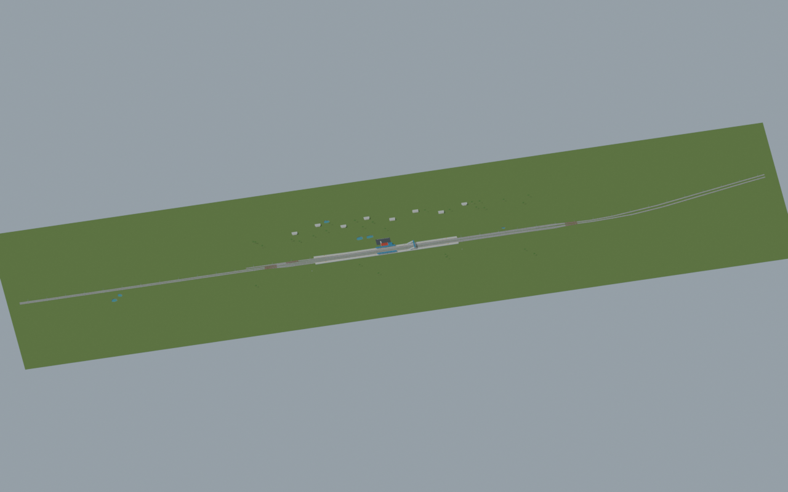
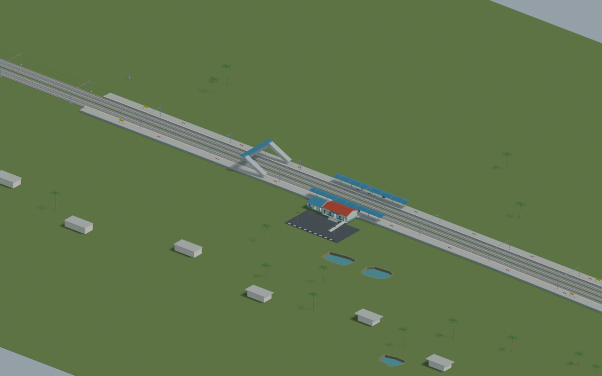
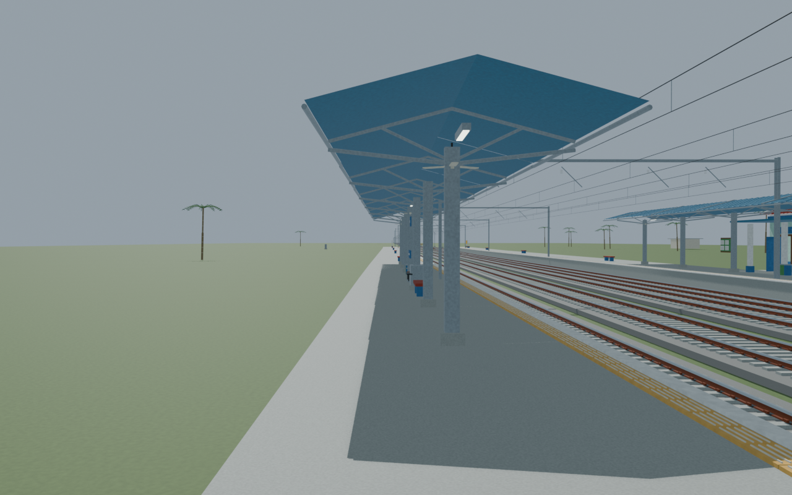
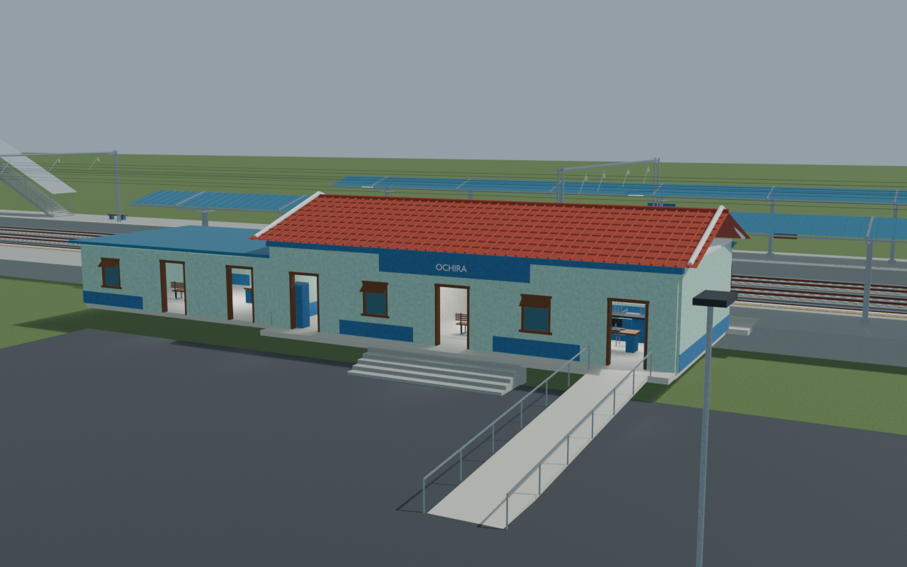
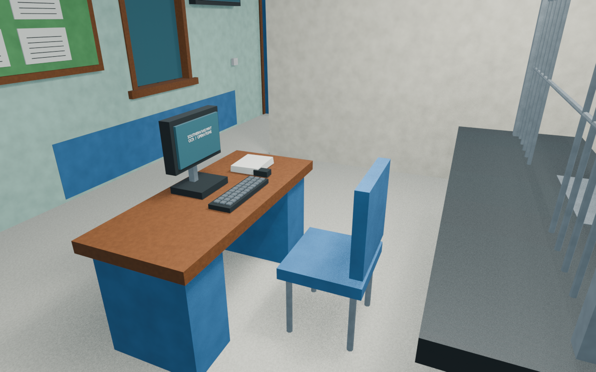

# OCR station gallery

Independently accepted corrected noticeboard revision. All five reviewed views and the source-bound portable export are checked. The waiting-room circulation route goes around its benches. Unseen interiors and unsurveyed dimensions remain reconstructions, with explicit current and retained image lineage.

Actual-model previews with accepted image hashes. Hidden interiors and unsurveyed details are reconstructions; read [sources and limitations](SOURCES_AND_UNCERTAINTIES.md). [Opening the model](README.md).

## Full mapped layout

## Station and platforms

## Platform track details

## Facade and approach

## Ticket interior

Authoritative model Blender SHA256: `c5b94ab4f0143c1e7a6c2e42ef601da933cb26878bb2822aec3ae73eb05a21b9`. Review the per-frame provenance records for any retained earlier views and their exact source hashes.
