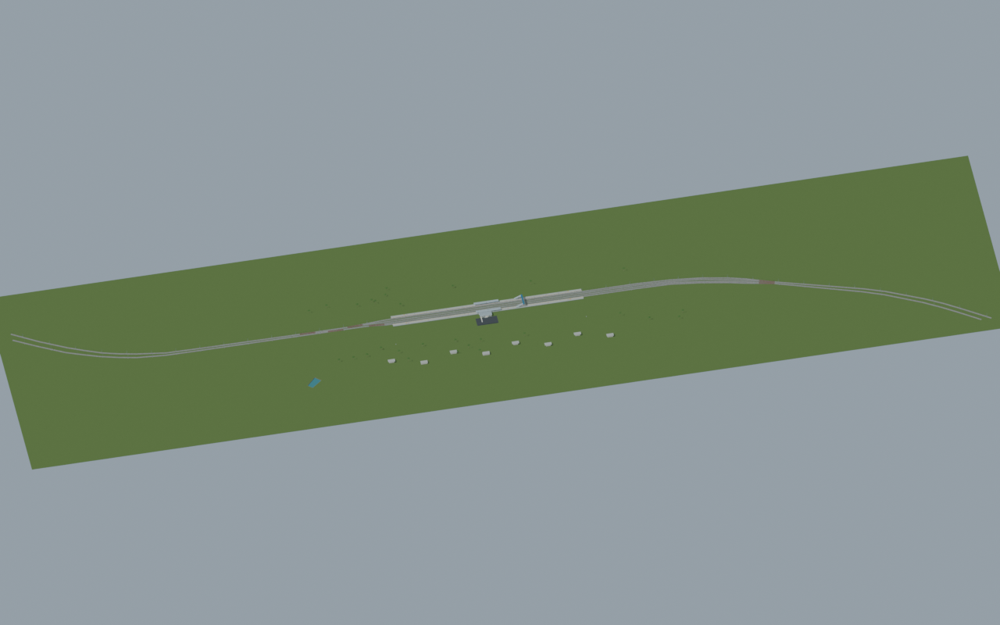
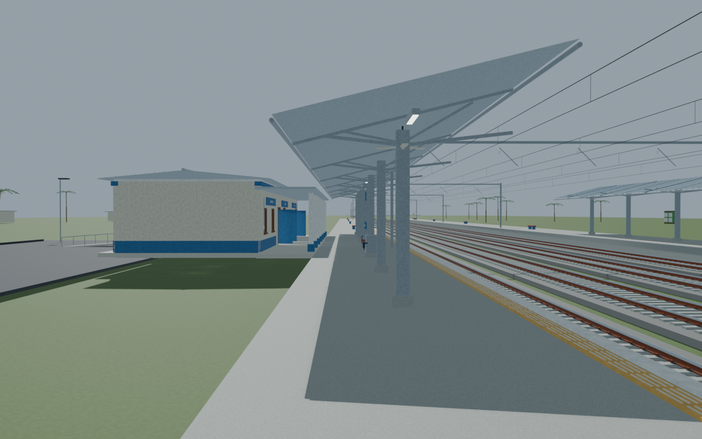
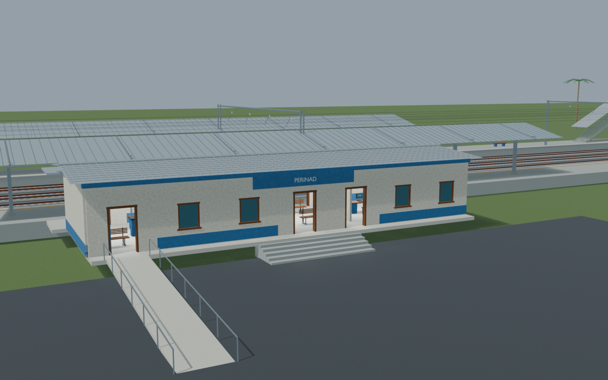
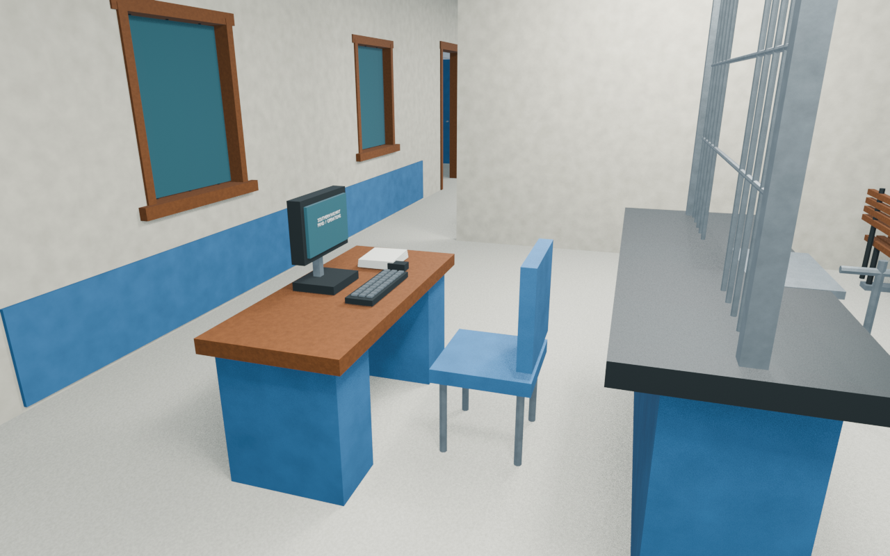

# PRND station gallery

Independently accepted corrected-fixture revision with four reviewed views and a verified portable export. Final public-route checks bind the corrected scene; unchanged bridge and overview lineage are explicitly retained. Hidden interiors, dimensions and service assignments remain reconstructions.

Actual-model previews with accepted image hashes. Hidden interiors and unsurveyed details are reconstructions; read [sources and limitations](SOURCES_AND_UNCERTAINTIES.md). [Opening the model](README.md).

## Full mapped layout

## Platform track details

## Facade and approach

## Ticket interior

Authoritative model Blender SHA256: `402709da4c95a6ee6544c0483458c5b18df2d7c1adccd56e25d26edbbfbaec25`. Review the per-frame provenance records for any retained earlier views and their exact source hashes.
