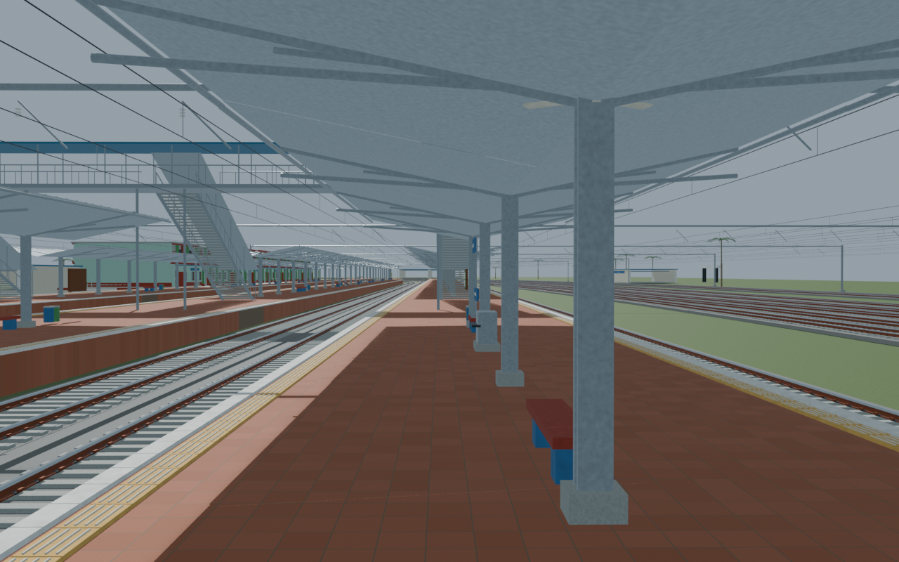
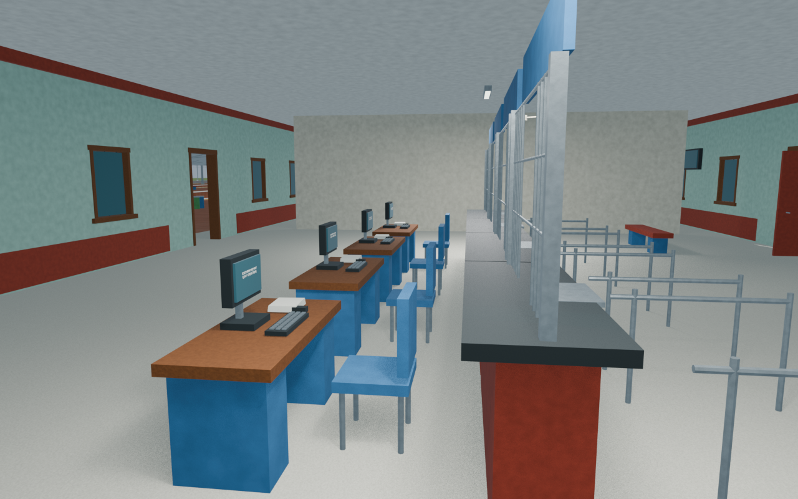
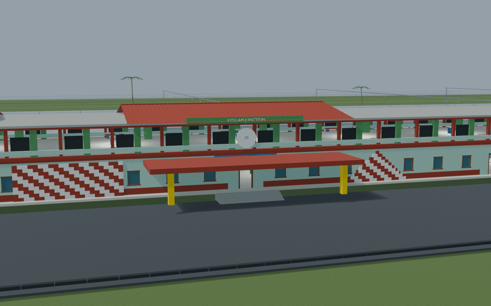
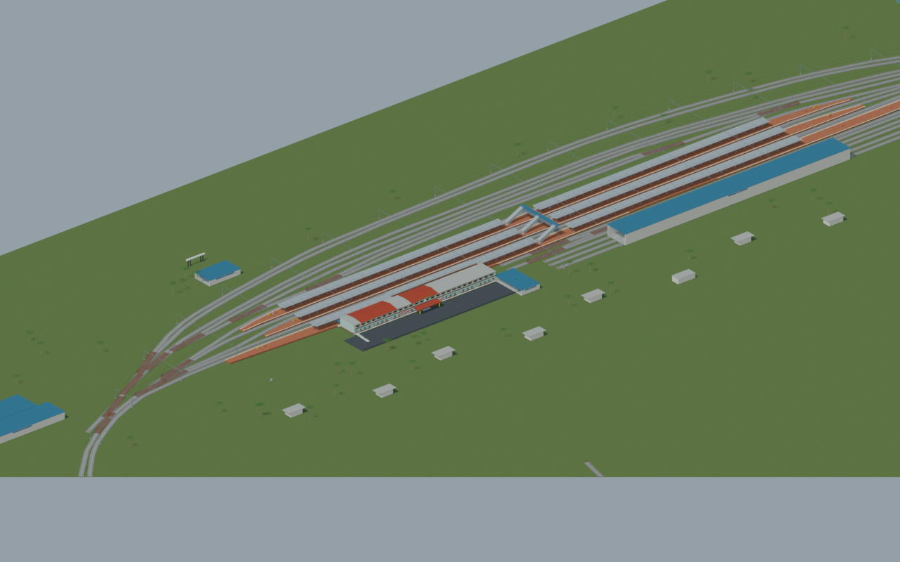
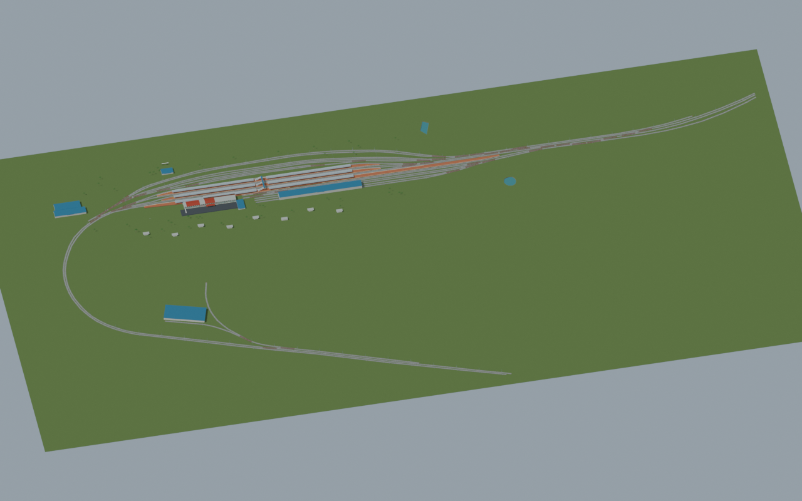

# QLN station gallery

Passed the full independent station gate with final public routes, landing paths and floor probes. Historical facade and current redevelopment remain explicitly distinguished. Source/export and retained or refreshed view lineage are documented.

Actual-model previews with accepted image hashes. Hidden interiors and unsurveyed details are reconstructions; read [sources and limitations](SOURCES_AND_UNCERTAINTIES.md). [Opening the model](README.md).

## Platform track details

## Ticket interior

## Facade and approach

## Station and platforms

## Full mapped layout

Authoritative model Blender SHA256: `db097aa561f2e1bc04a4733819b396192abb3afddd91f93d670e4f7baf8ce234`. Review the per-frame provenance records for any retained earlier views and their exact source hashes.
