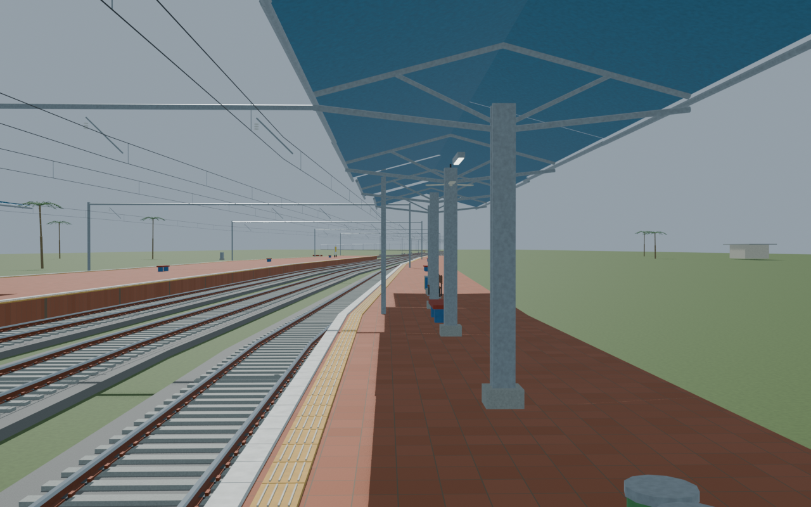
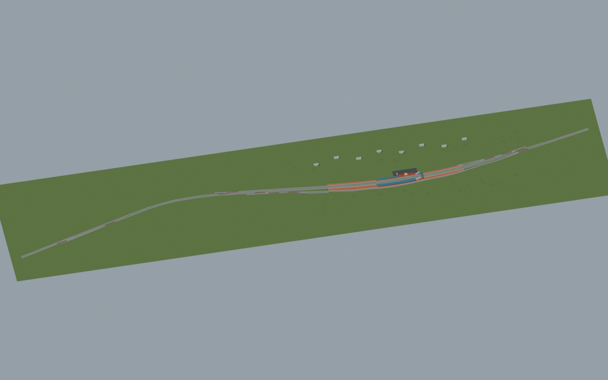
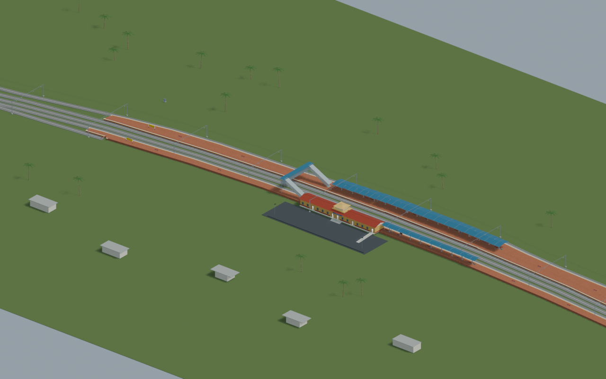
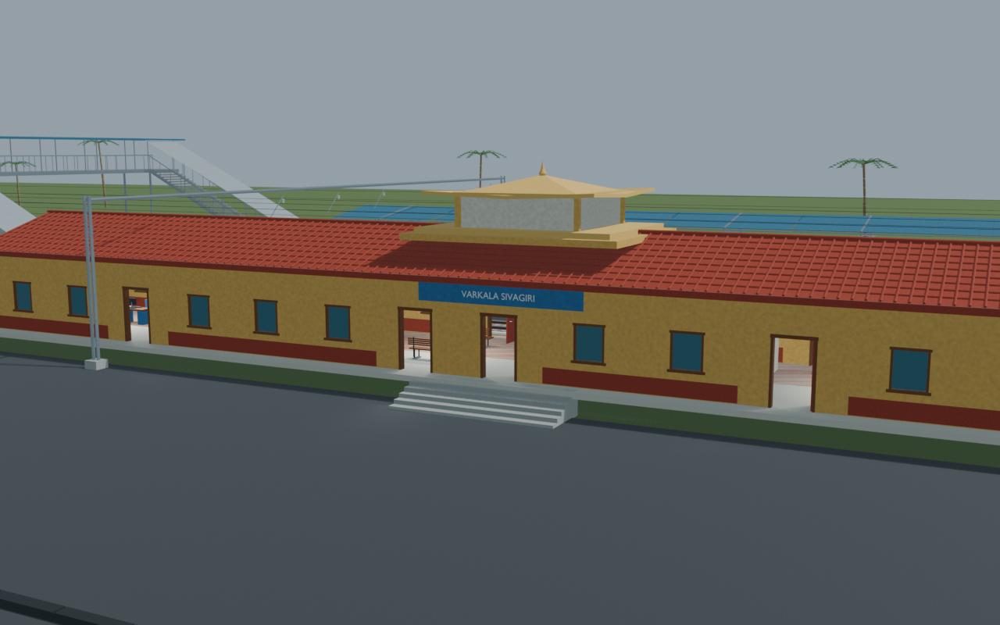
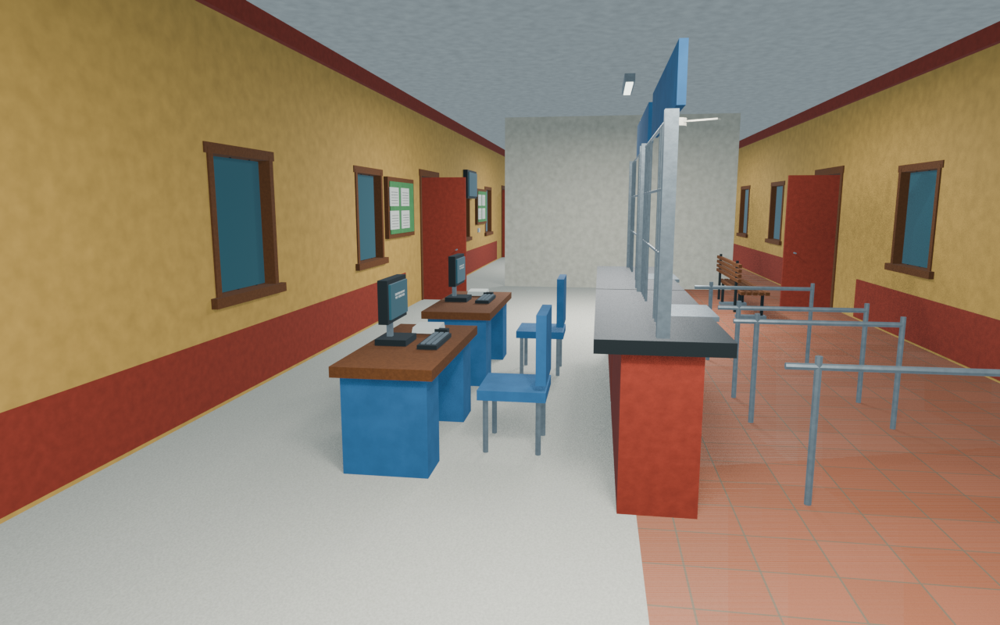

# VAK station gallery

Independently accepted corrected revision03 with five reviewed views and a verified portable export. The narrow station-edge passage and mapped building/platform-body overlap are explicitly disclosed; nominal platform body width is not clear walking width. The localized passage repair and current/retained image lineage are documented. Unsurveyed dimensions and unseen details remain reconstructions, without an accessibility or as-built certification.

Actual-model previews with accepted image hashes. Hidden interiors and unsurveyed details are reconstructions; read [sources and limitations](SOURCES_AND_UNCERTAINTIES.md). [Opening the model](README.md).

## Platform track details

## Full mapped layout

## Station and platforms

## Facade and approach

## Ticket interior

Authoritative model Blender SHA256: `b4acd40a0e6ce721c41738dd04d7b43dc9948c428d6ffd2e4d95699e9cd75121`. Review the per-frame provenance records for any retained earlier views and their exact source hashes.
