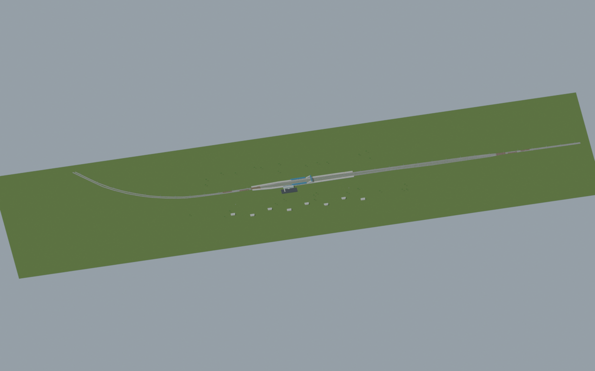
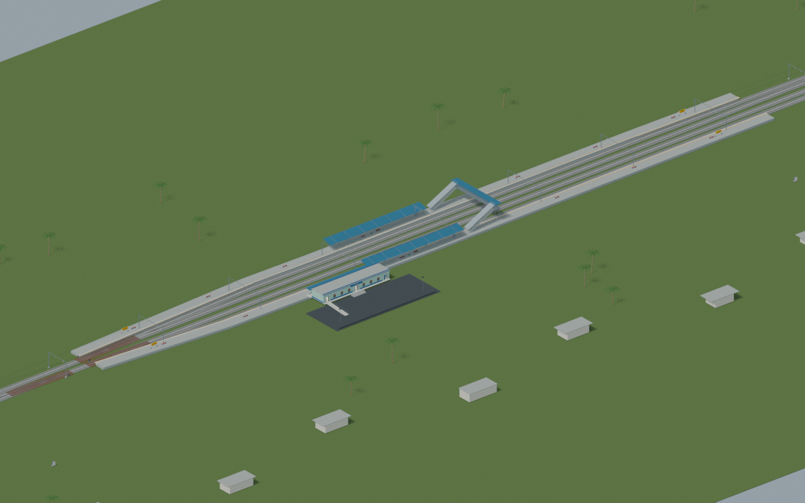
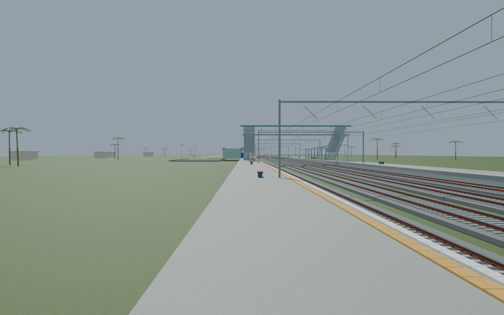
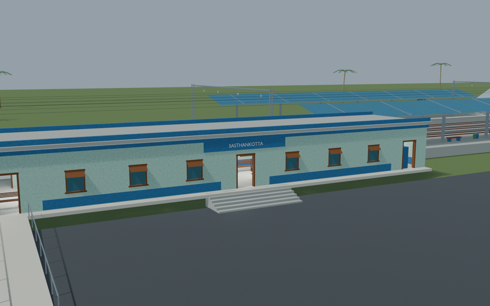
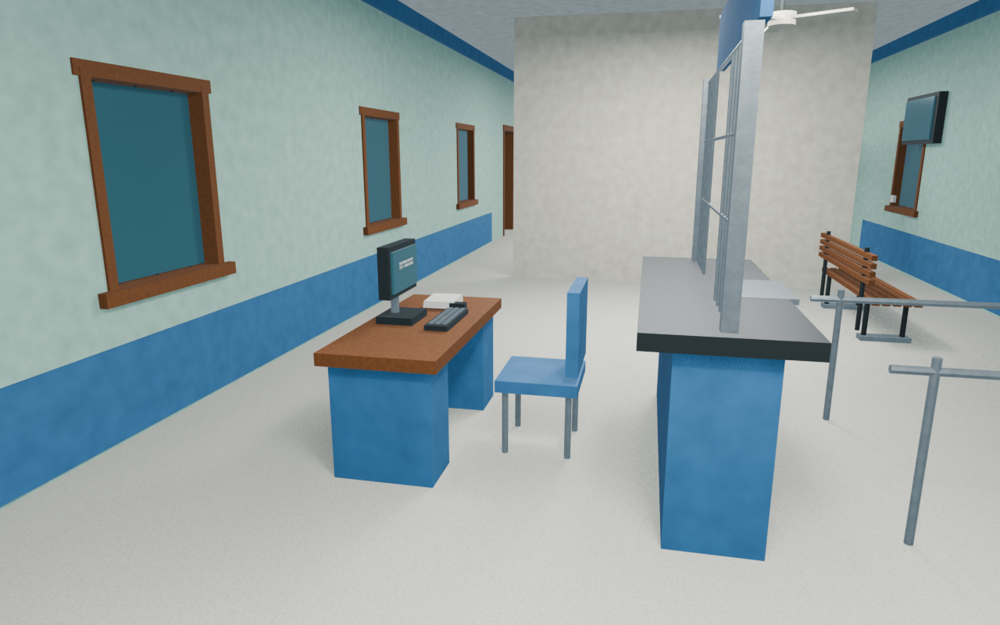

# STKT station gallery

Passed the full independent station gate with five accepted views and exact source/export provenance. Source evidence and reconstructed details remain clearly distinguished.

Actual-model previews with accepted image hashes. Hidden interiors and unsurveyed details are reconstructions; read [sources and limitations](SOURCES_AND_UNCERTAINTIES.md). [Opening the model](README.md).

## Full mapped layout

## Station and platforms

## Platform track details

## Facade and approach

## Ticket interior

Authoritative model Blender SHA256: `41816ff585e087d5419b44c4e59335e4109c51ee09ce5b0ba0b1697dc5b9cbb0`. Review the per-frame provenance records for any retained earlier views and their exact source hashes.
