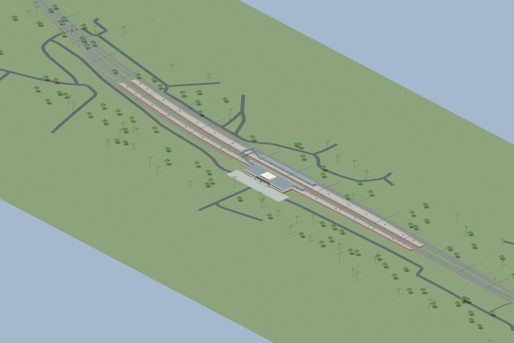
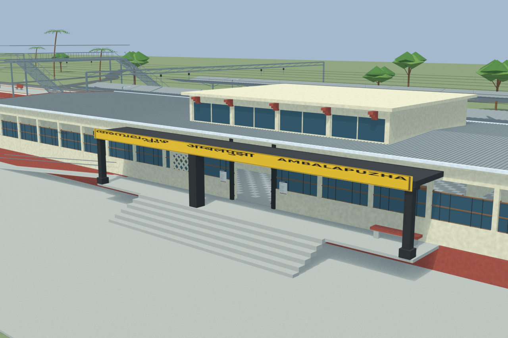
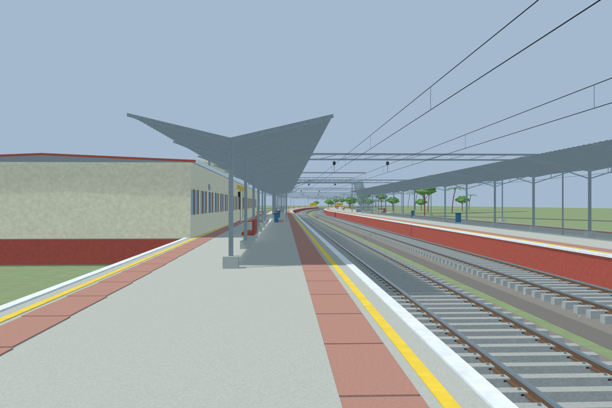
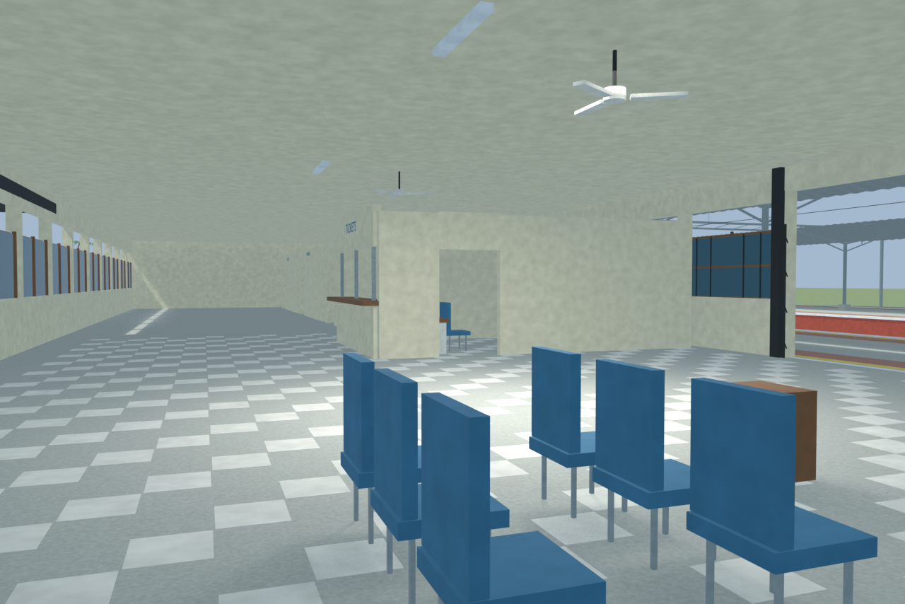
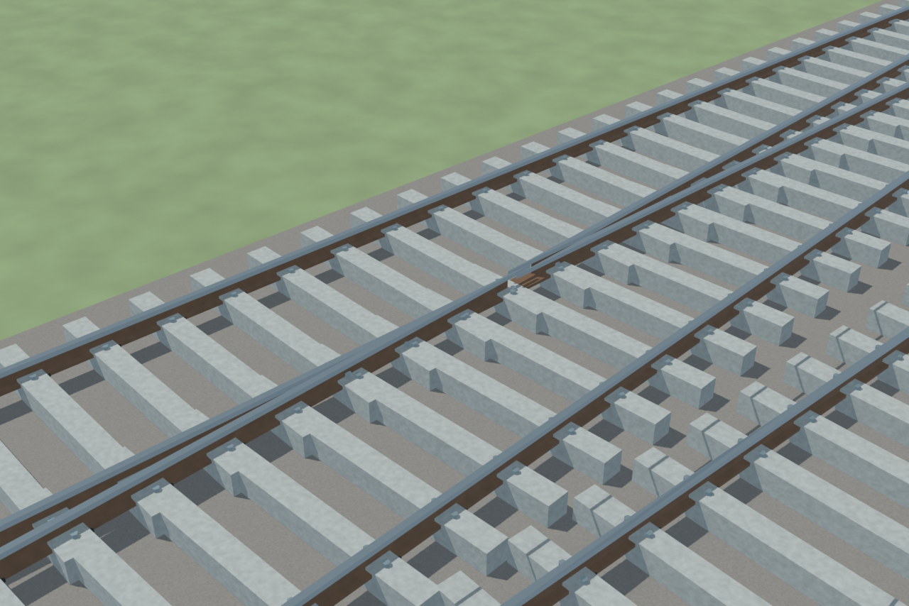

# AMPA station gallery

Passed the full independent station gate. Fresh and explicitly retained unchanged-area views preserve exact per-frame lineage. Packed Blender materials remain authoritative; GLB transport compression is byte-lossless for the exported GLB.

Actual-model previews with accepted image hashes. Hidden interiors and unsurveyed details are reconstructions; read [sources and limitations](SOURCES_AND_UNCERTAINTIES.md). [Opening the model](README.md).

## Overall station

## Entrance architecture

## Platform and tracks

## Reconstructed interior

## Mapped turnout detail

Authoritative model Blender SHA256: `2488fcfc05a7d9870d64300b62d7e067247560e2d47418be72960b36a68ae4a7`. Review the per-frame provenance records for any retained earlier views and their exact source hashes.
