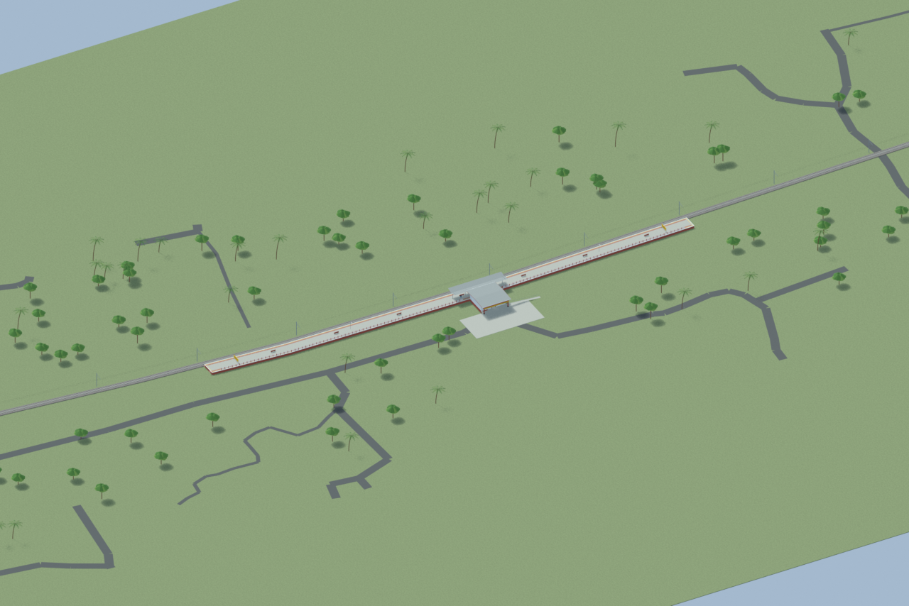
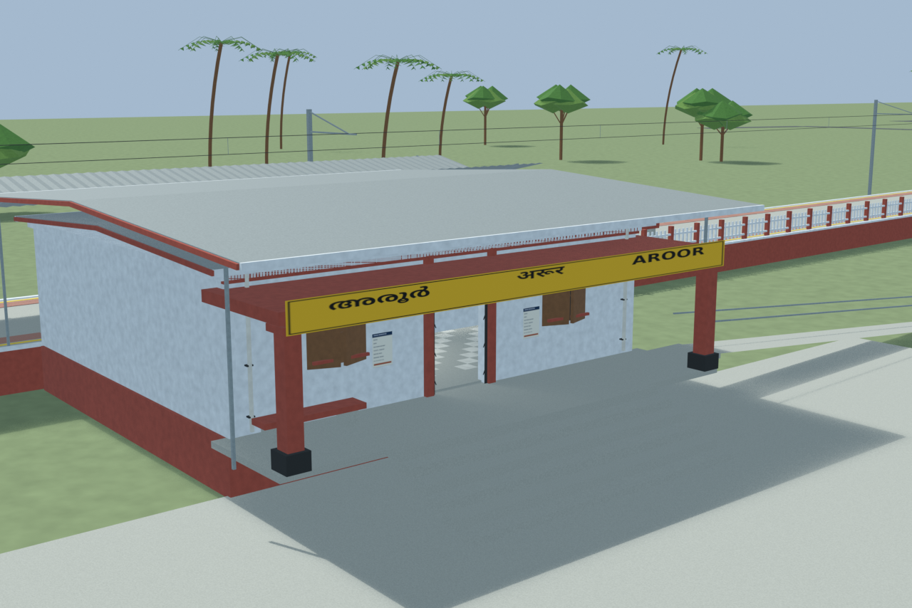
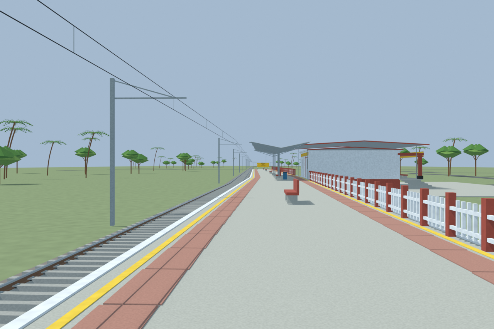
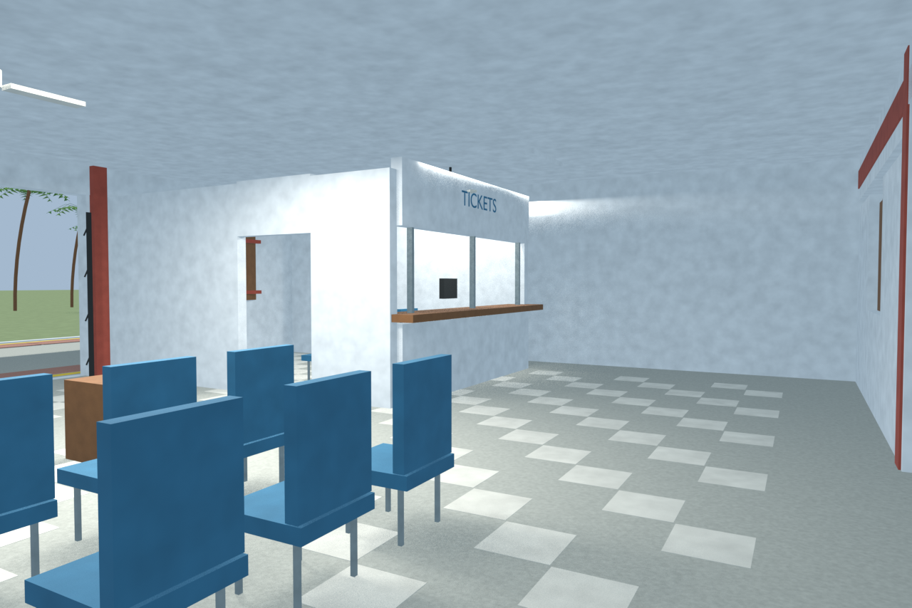

# AROR station gallery

Passed the full independent station gate with four accepted useful views and sixteen circulation/floor probes. Corrected shutter details and reconstruction limits are preserved.

Actual-model previews with accepted image hashes. Hidden interiors and unsurveyed details are reconstructions; read [sources and limitations](SOURCES_AND_UNCERTAINTIES.md). [Opening the model](README.md).

## Overall station

## Entrance architecture

## Platform and tracks

## Reconstructed interior

Authoritative model Blender SHA256: `6b11dfd33f27ba8adc8fb5e6dfef3561ad205b26bc62be0af69dd79a525b1fdb`. Review the per-frame provenance records for any retained earlier views and their exact source hashes.
