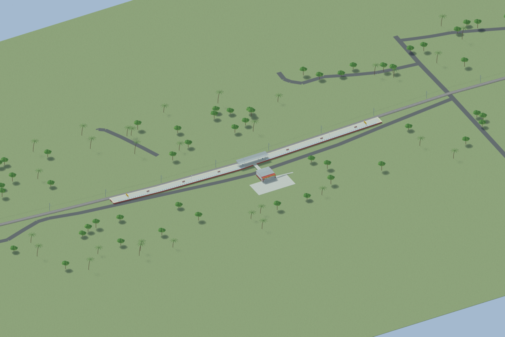
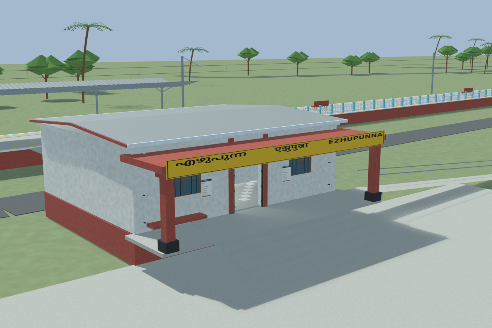
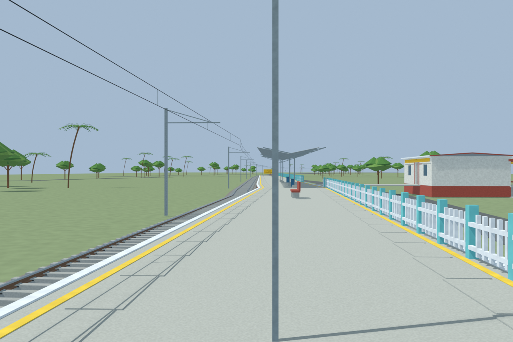
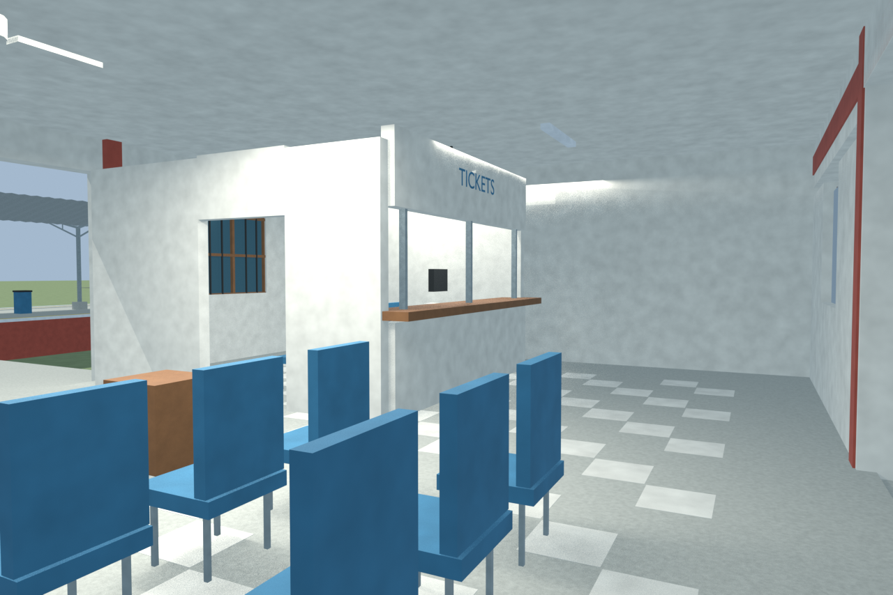

# EZP station gallery

Passed the full independent station gate with four accepted useful views and sixteen circulation/floor probes. The modest hut is explicitly unverified and reconstructed; only the platform/fence reference was established.

Actual-model previews with accepted image hashes. Hidden interiors and unsurveyed details are reconstructions; read [sources and limitations](SOURCES_AND_UNCERTAINTIES.md). [Opening the model](README.md).

## Overall station

## Entrance architecture

## Platform and tracks

## Reconstructed interior

Authoritative model Blender SHA256: `88d042da72d9a4cb6a31b6c53143622d462075c64e6bee5b109a3408348c164e`. Review the per-frame provenance records for any retained earlier views and their exact source hashes.
