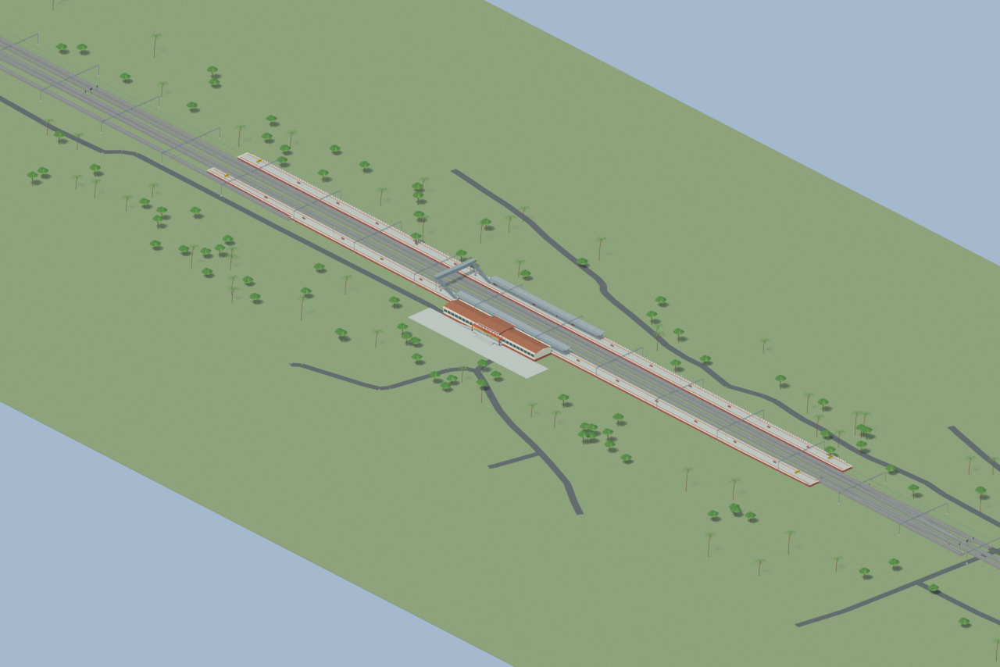
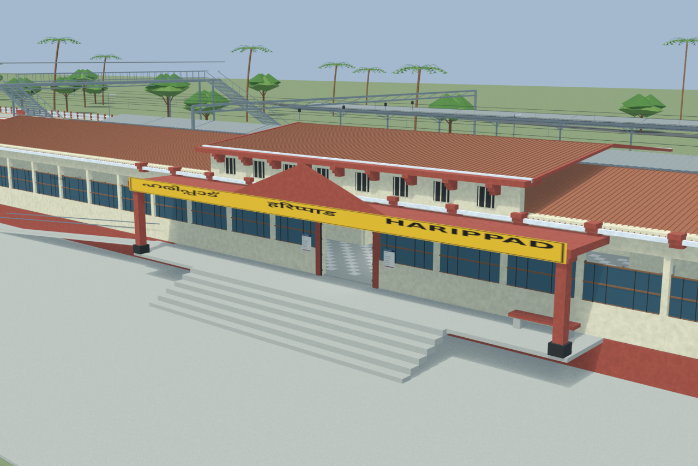
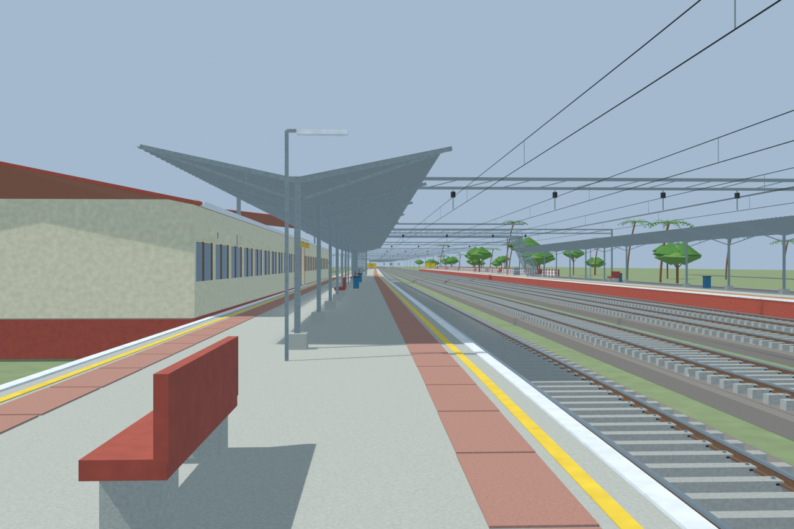
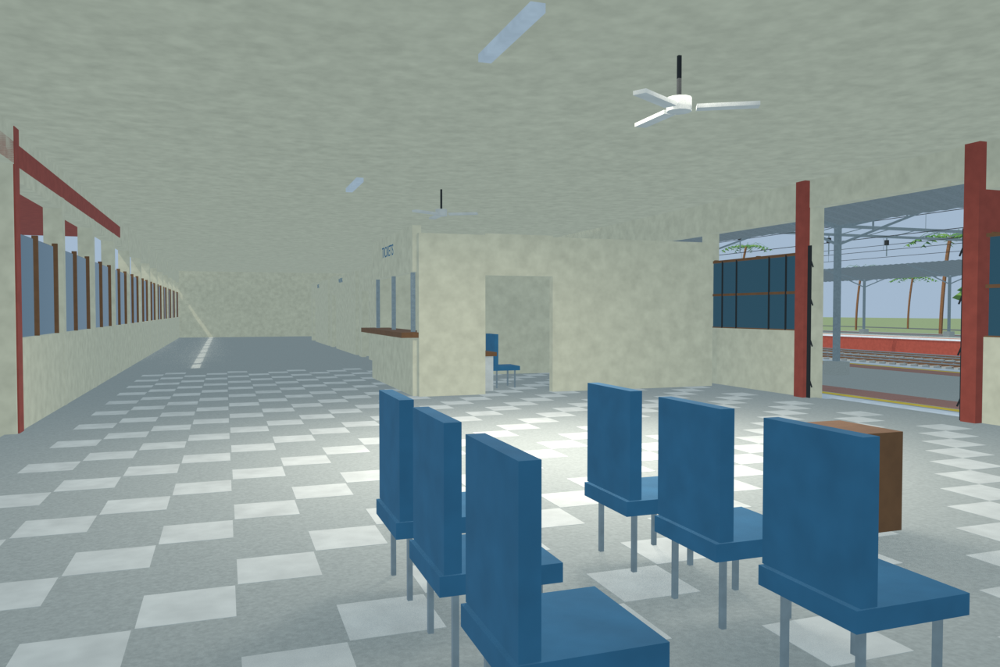
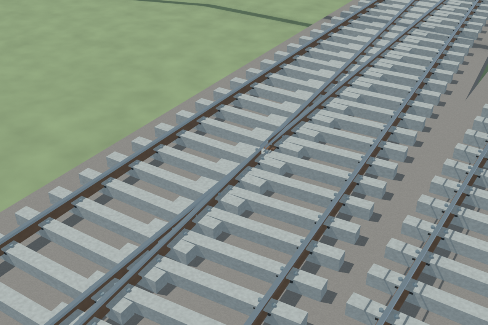

# HAD station gallery

Independently accepted final source-backed model with five reviewed views and verified portable export. The terminal-cutout exception is explicit: short centerline distance, while checked rail-head and platform surfaces are clear and the reconstructed bufferstop is retreated. Raised vent tier and facade corbels follow cited evidence. Hidden details and unsurveyed dimensions remain reconstructions; retained remote-turnout image lineage is disclosed.

Actual-model previews with accepted image hashes. Hidden interiors and unsurveyed details are reconstructions; read [sources and limitations](SOURCES_AND_UNCERTAINTIES.md). [Opening the model](README.md).

## Overall station

## Entrance architecture

## Platform and tracks

## Reconstructed interior

## Mapped turnout detail

Authoritative model Blender SHA256: `02bf4867d46bad7c584dc3b207bc1b54f0f5b9d683f9da056cf79f1edd033aa8`. Review the per-frame provenance records for any retained earlier views and their exact source hashes.
