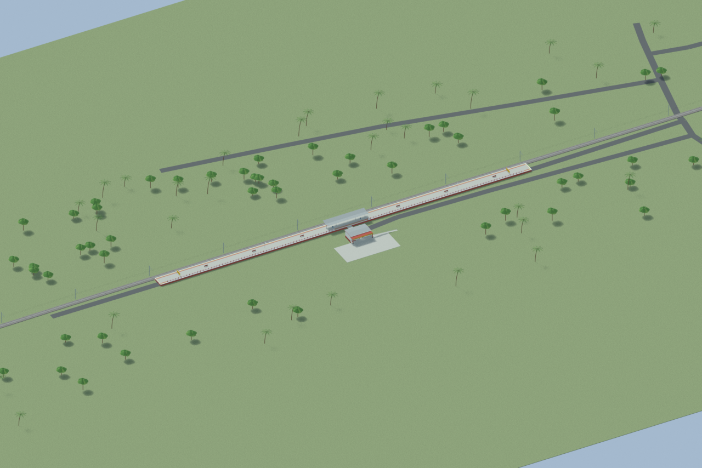
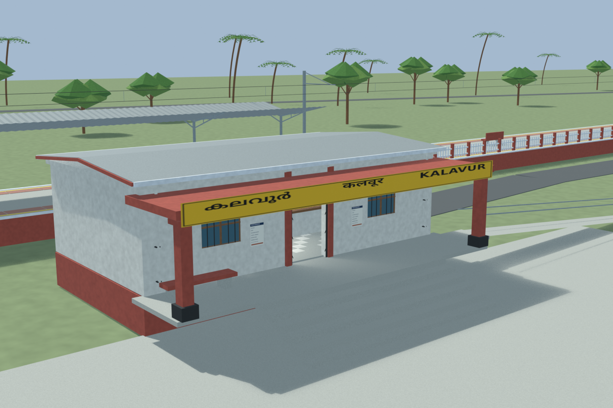
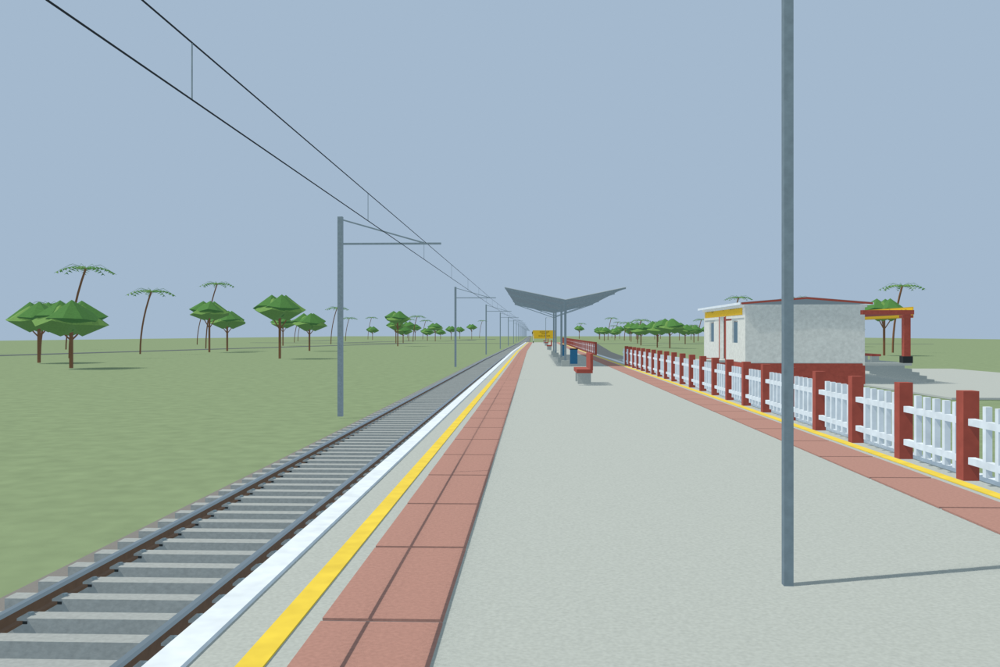
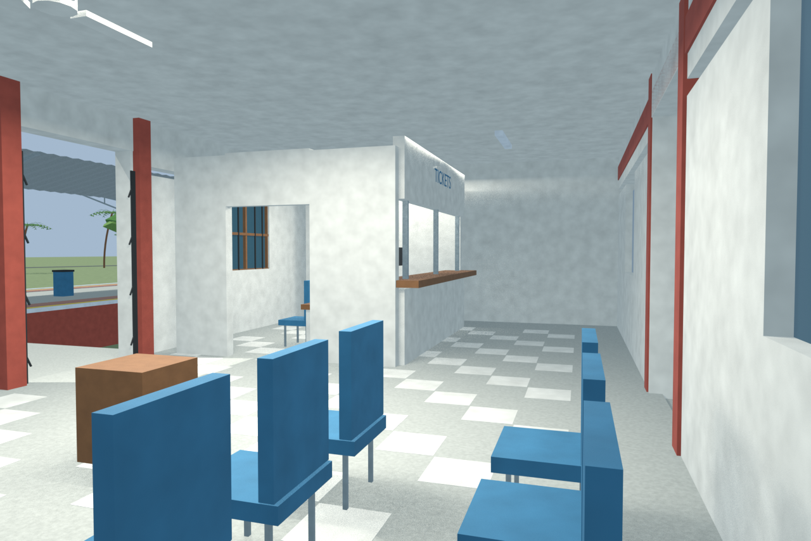

# KAVR station gallery

Independently accepted final source-backed model with four reviewed views. Modest hut and hidden interior details are disclosed reconstructions; platform and rail layout follow the adopted evidence. Corrected Kalavur source citation is preserved. No as-built survey or game-native runtime claim.

Actual-model previews with accepted image hashes. Hidden interiors and unsurveyed details are reconstructions; read [sources and limitations](SOURCES_AND_UNCERTAINTIES.md). [Opening the model](README.md).

## Overall station

## Entrance architecture

## Platform and tracks

## Reconstructed interior

Authoritative model Blender SHA256: `4976f53590e74b67003c6c95cffda6c4e1db9e57880e4aae804b300d279e4830`. Review the per-frame provenance records for any retained earlier views and their exact source hashes.
