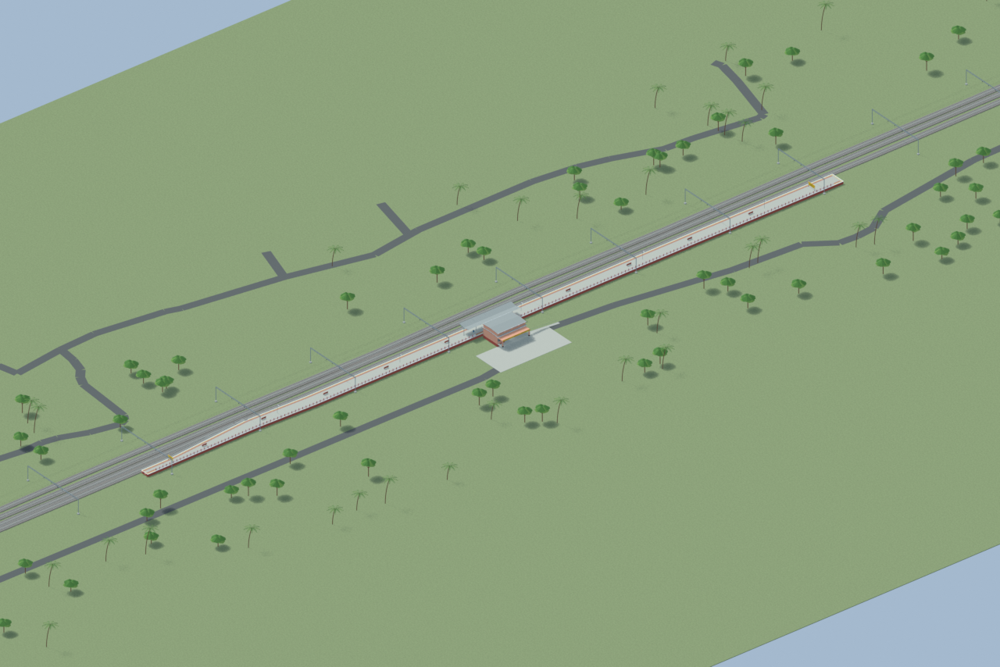
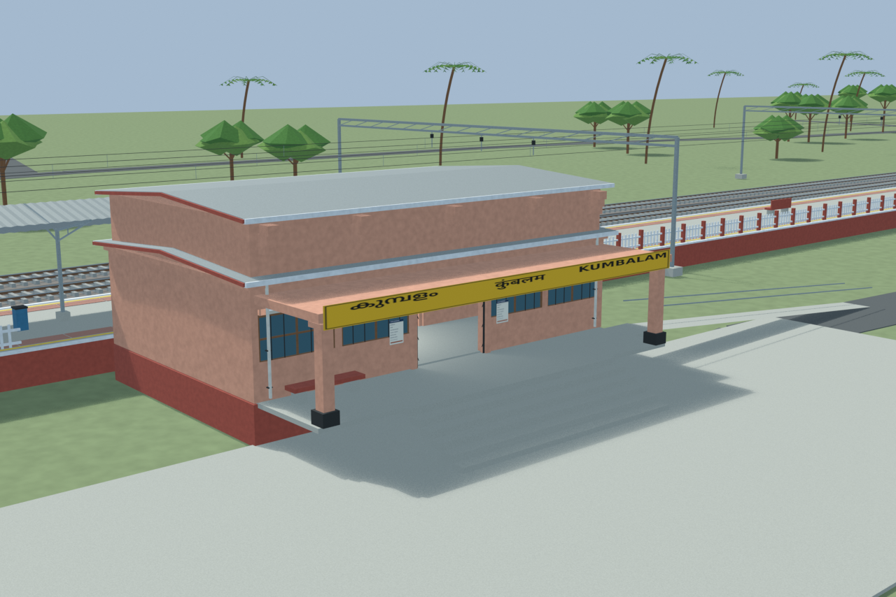
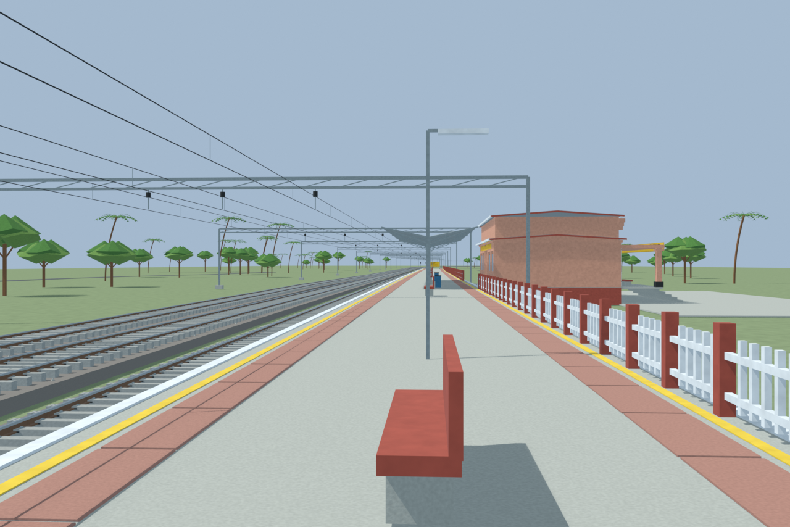
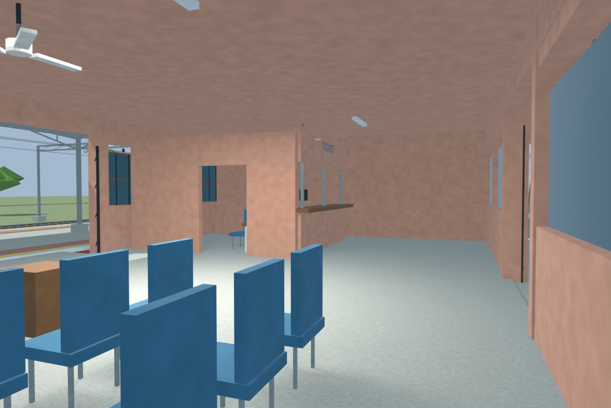

# Kumbalam model previews

Four independently reviewed model images from the same frozen Blender source. Final pointwork proof review is still pending. Hidden interiors and unsurveyed details are explicitly reconstructed. [Station evidence and limitations](SOURCES_AND_UNCERTAINTIES.md) · [Model files](README.md) · [Portable export instructions](OPEN_EXPORT.md)

## Overall station and full mapped approaches

## Station entrance

## Platform and tracks

## Reconstructed furnished interior

Source Blender SHA256: `3e588d59941b1c1978a139f5ba18b89bf3eb481099a566d796419d70704a1adf`. Each image has an adjacent provenance JSON. Frame 05 is not part of this reviewed gallery.
