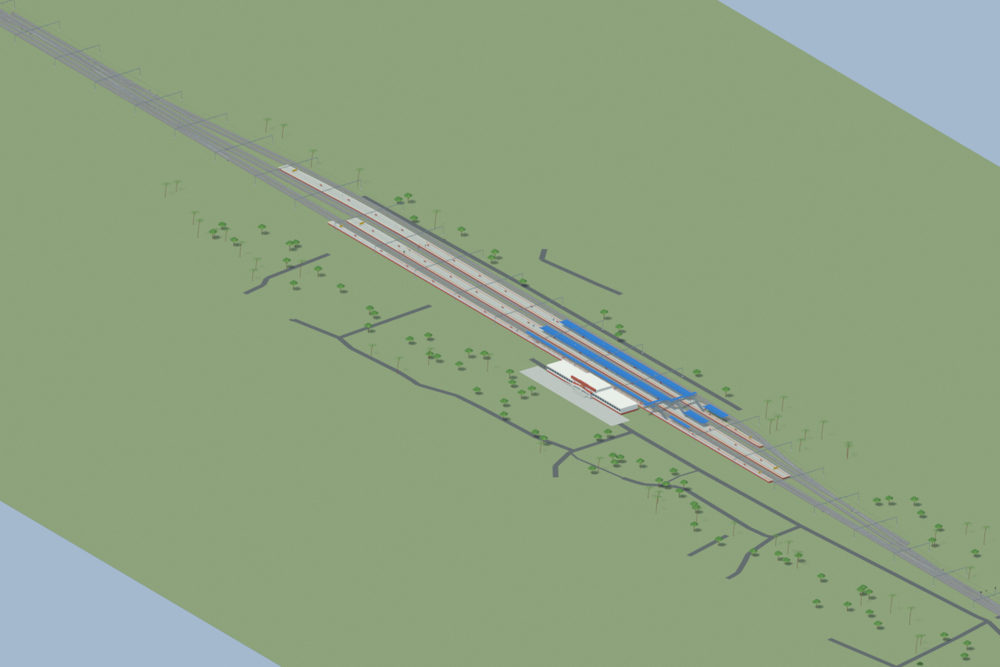
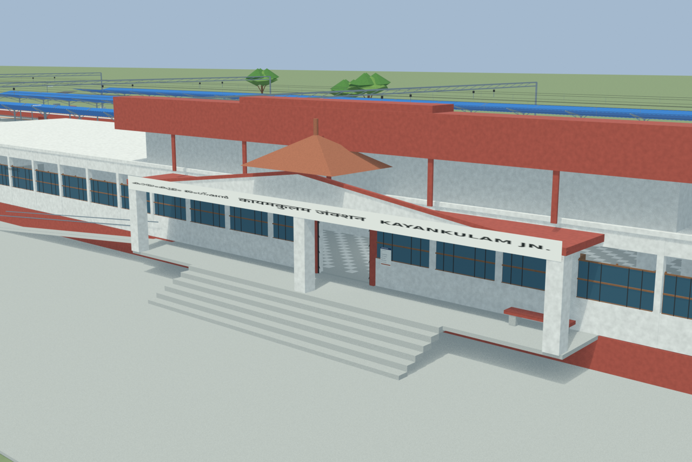
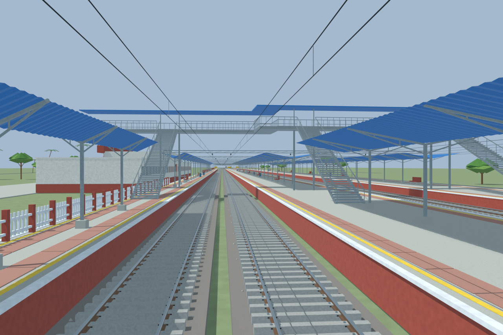
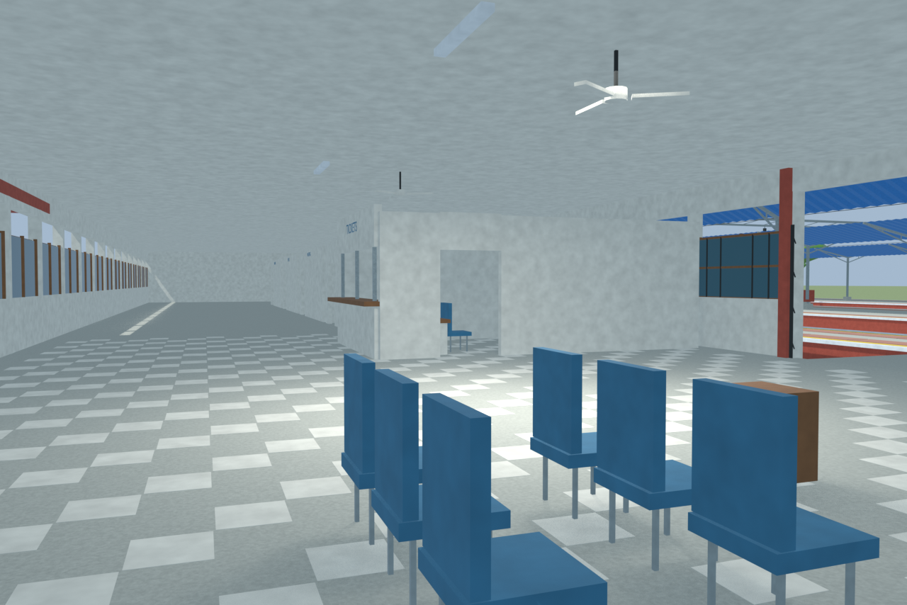
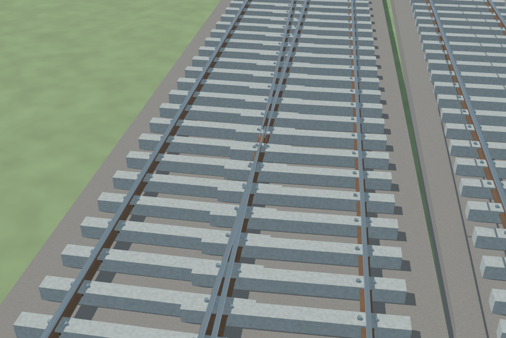

# KYJ accepted model views

[Current portable export](CURRENT_PORTABLE_EXPORT.md) · [Original source instructions](README.md) · [Sources and limitations](SOURCES_AND_UNCERTAINTIES.md)

Independently accepted native scene and views, with disclosed reconstruction limits.

## Overall station

## Entrance architecture

## Platform and tracks

## Reconstructed interior

## Mapped turnout detail

- Visual reconstruction, not a surveyed current operating inventory or engineering certification.
- Hidden interiors, approximate dimensions and station services remain disclosed reconstructions.
- Targeted scene/export checks are not exhaustive pairwise collision certification.
- Portable materials include base-colour fallbacks for procedural Blender effects.
