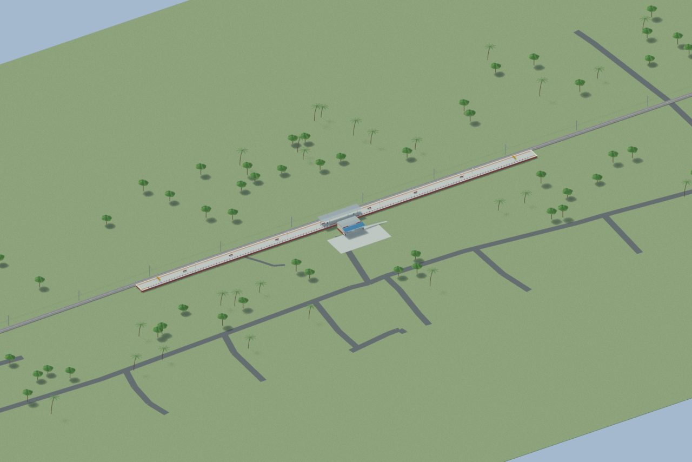
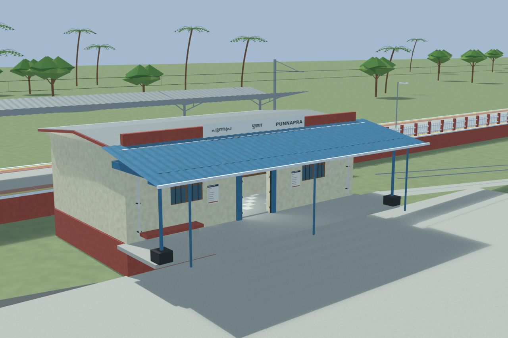
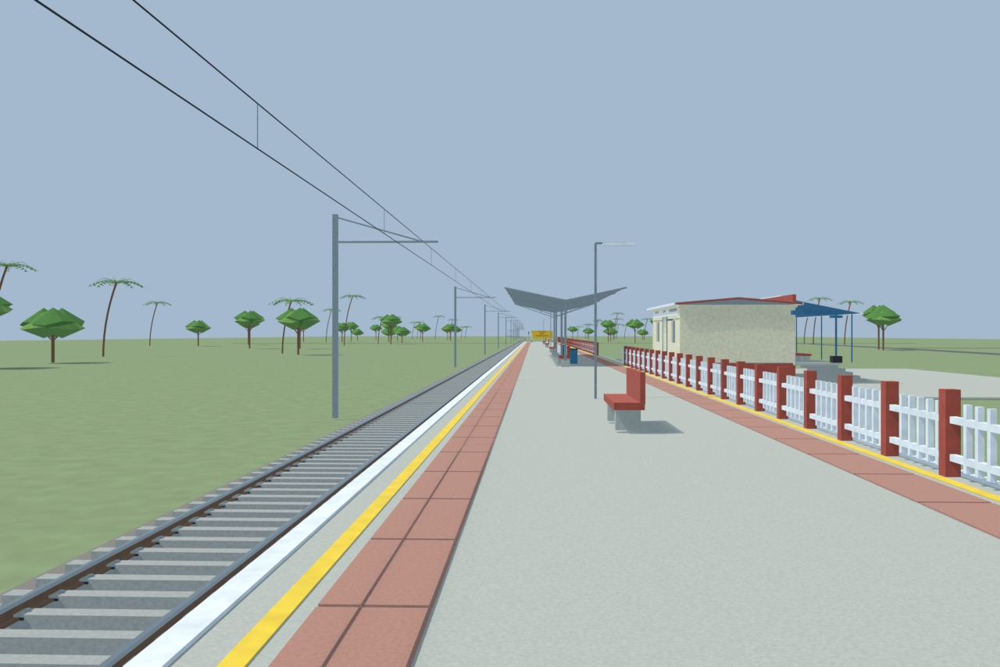
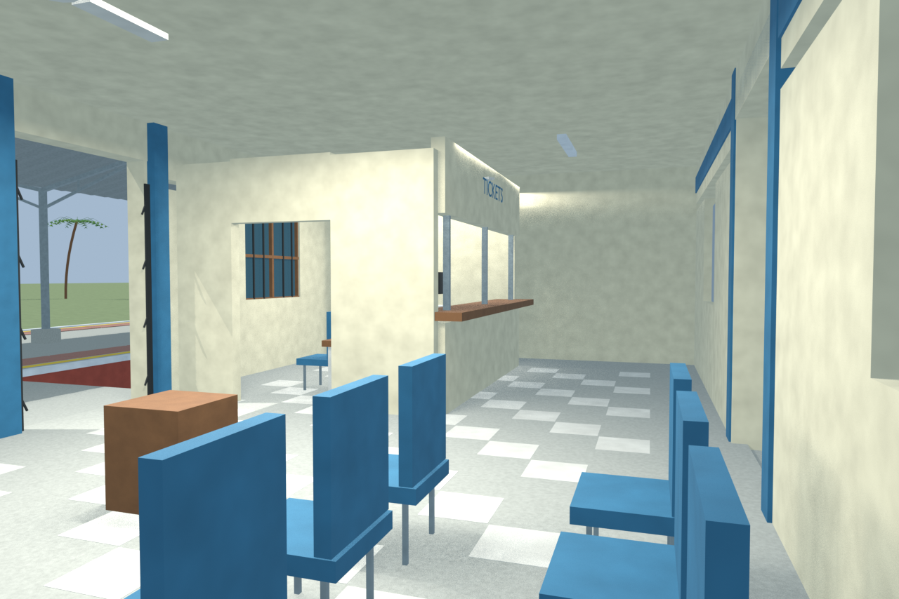

# PNPR station gallery

Independently accepted final source-backed model with four current-source reviewed views, a verified portable export and checked public, ramp and floor-support routes. The photographed veranda post retains its verified public bypass route. Hidden interiors and unsurveyed dimensions remain disclosed reconstructions.

Actual-model previews with accepted image hashes. Hidden interiors and unsurveyed details are reconstructions; read [sources and limitations](SOURCES_AND_UNCERTAINTIES.md). [Opening the model](README.md).

## Overall station

## Entrance architecture

## Platform and tracks

## Reconstructed interior

Authoritative model Blender SHA256: `ad4677ebf936fd27ae3552954ed887c05e76659707e8af275e9a19320800576b`. Review the per-frame provenance records for any retained earlier views and their exact source hashes.
