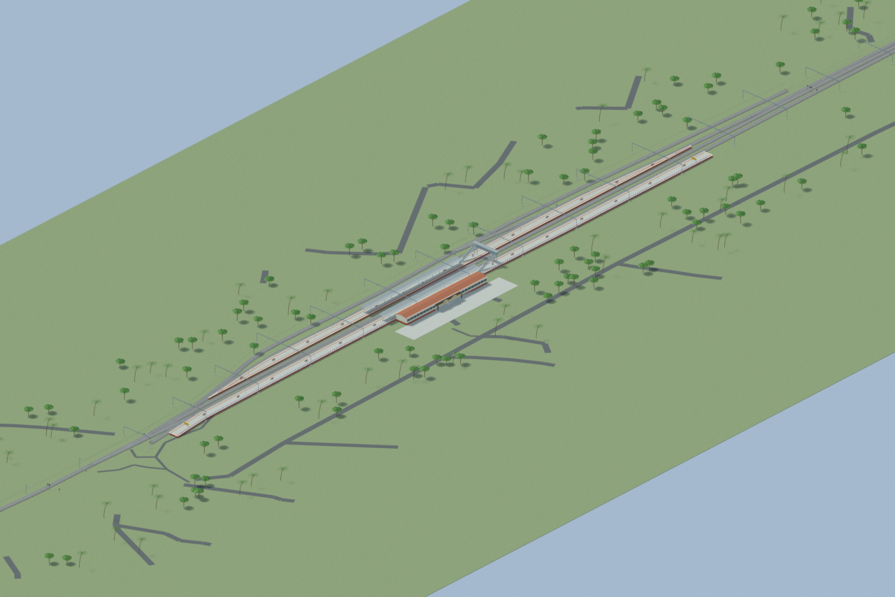
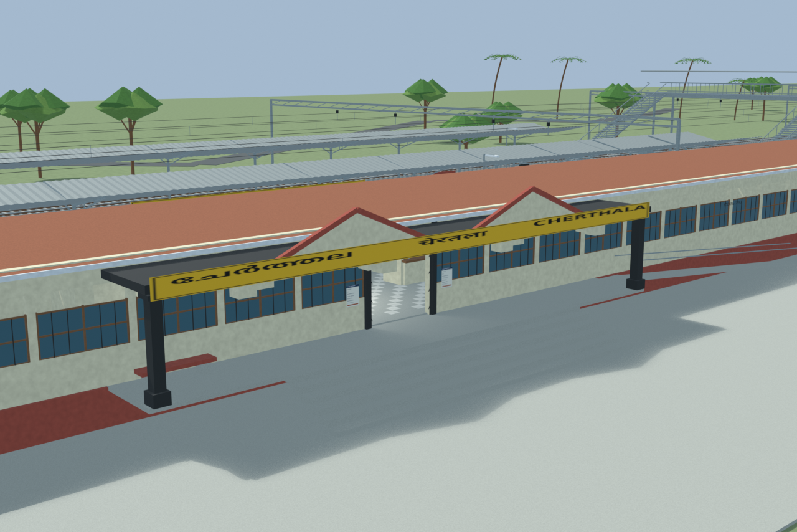
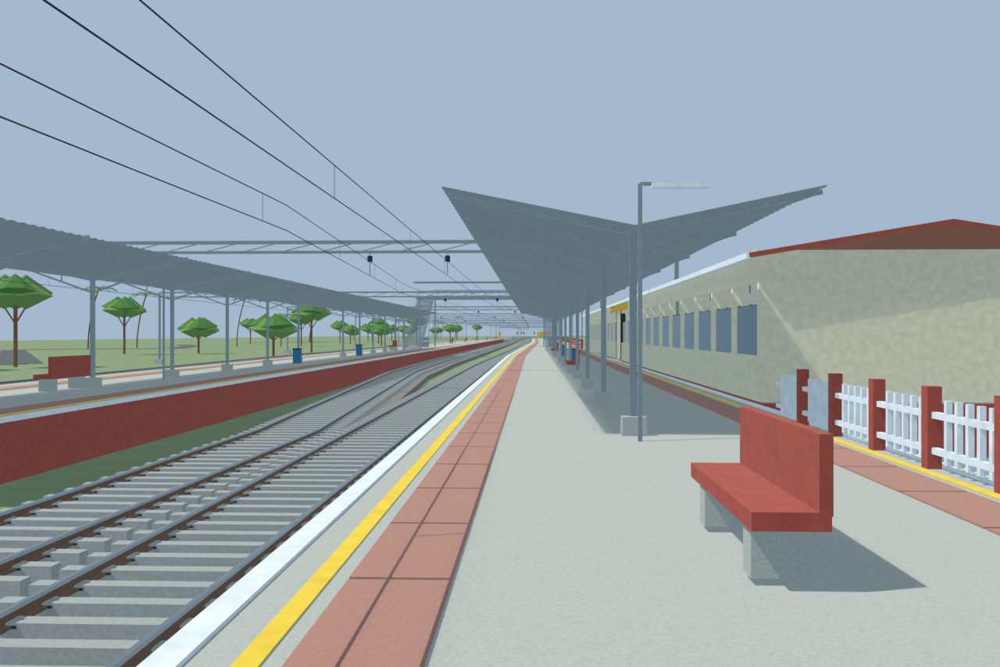
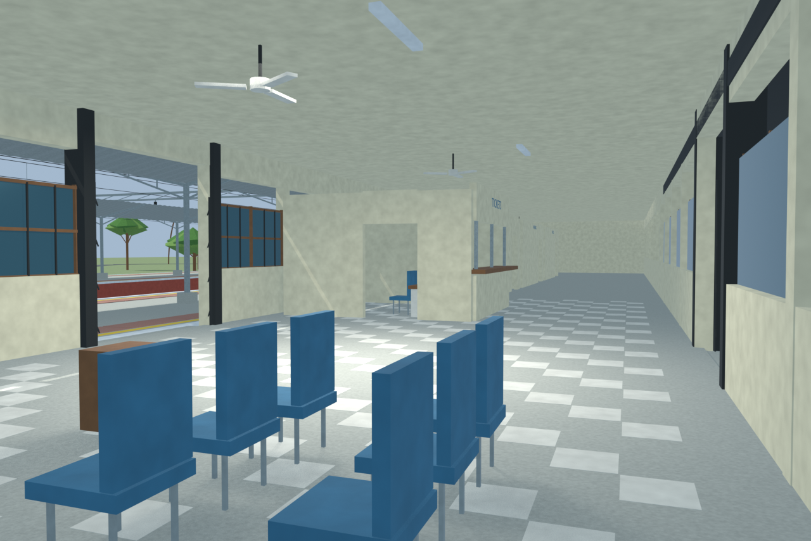
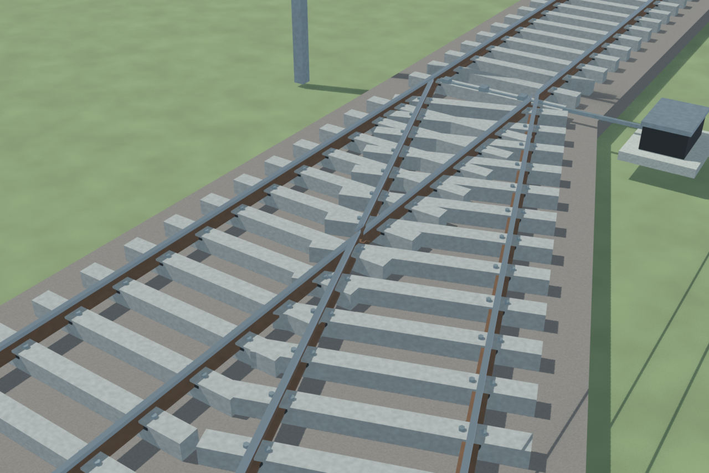

# SRTL station gallery

Independently accepted final source-backed model. Corrected bridge landings and photo-supported cream facade corbels are checked; reconstructed interior and retained unaffected image lineage are disclosed. Source fidelity is limited to cited evidence, with no as-built survey or game-native runtime claim.

Actual-model previews with accepted image hashes. Hidden interiors and unsurveyed details are reconstructions; read [sources and limitations](SOURCES_AND_UNCERTAINTIES.md). [Opening the model](README.md).

## Overall station

## Entrance architecture

## Platform and tracks

## Reconstructed interior

## Mapped turnout detail

Authoritative model Blender SHA256: `3a50782868dceb00a82be62eb874e377c34da75bf56f5e658ef59ce51b551b68`. Review the per-frame provenance records for any retained earlier views and their exact source hashes.
