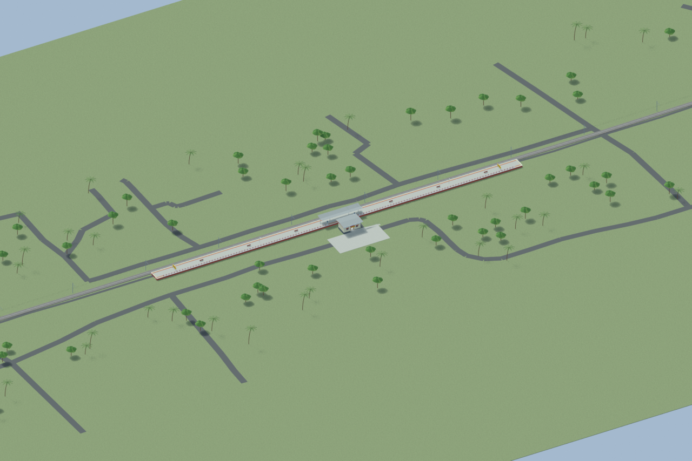
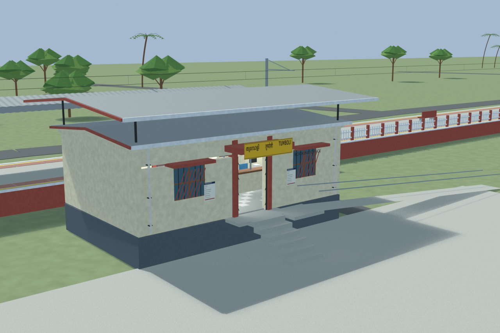
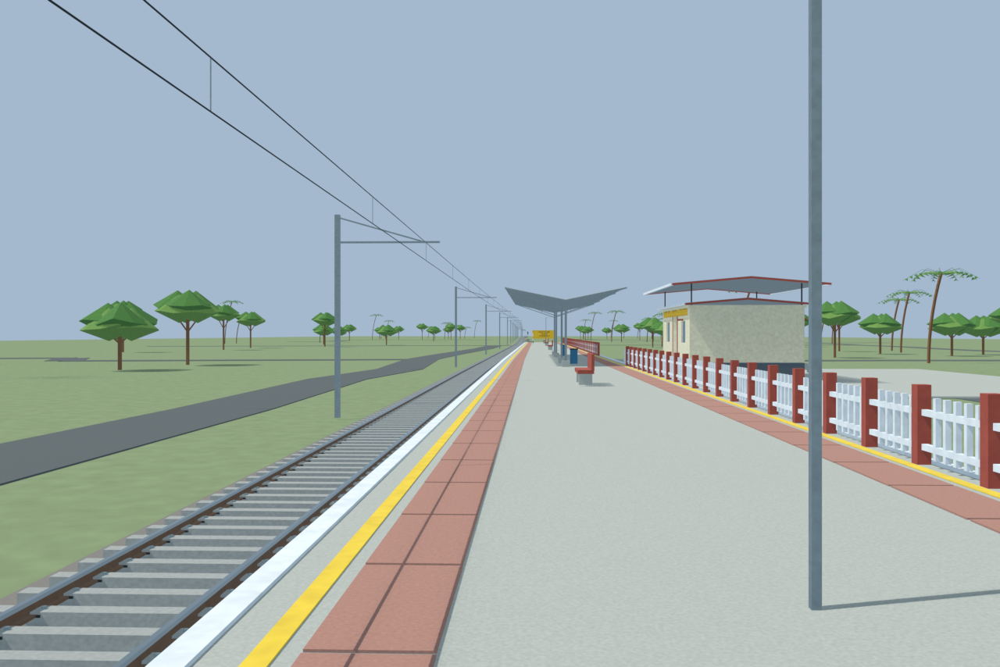
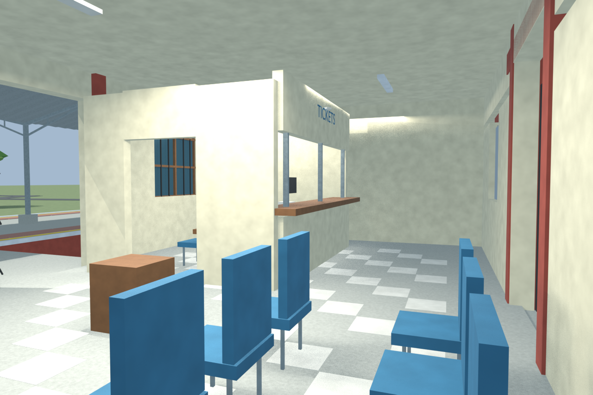

# TMPY station gallery

Independently accepted final source-backed model with four current-source reviewed views, verified portable export and checked public/ramp/floor support routes. Hidden interiors and unsurveyed dimensions remain disclosed reconstructions. The corrected small porch and custom access ramp are included.

Actual-model previews with accepted image hashes. Hidden interiors and unsurveyed details are reconstructions; read [sources and limitations](SOURCES_AND_UNCERTAINTIES.md). [Opening the model](README.md).

## Overall station

## Entrance architecture

## Platform and tracks

## Reconstructed interior

Authoritative model Blender SHA256: `f716300925f0b828388d225d94e3808d1cb8ae9e5fcb9fc950c0f084024f6561`. Review the per-frame provenance records for any retained earlier views and their exact source hashes.
