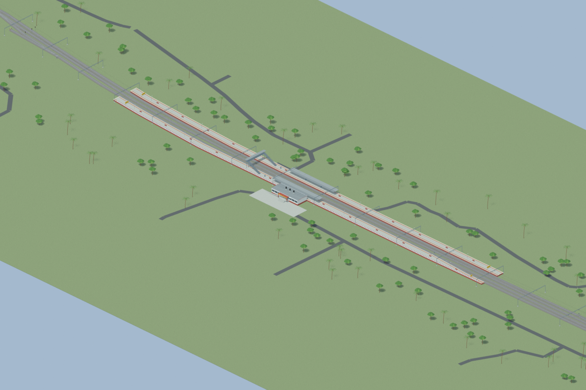
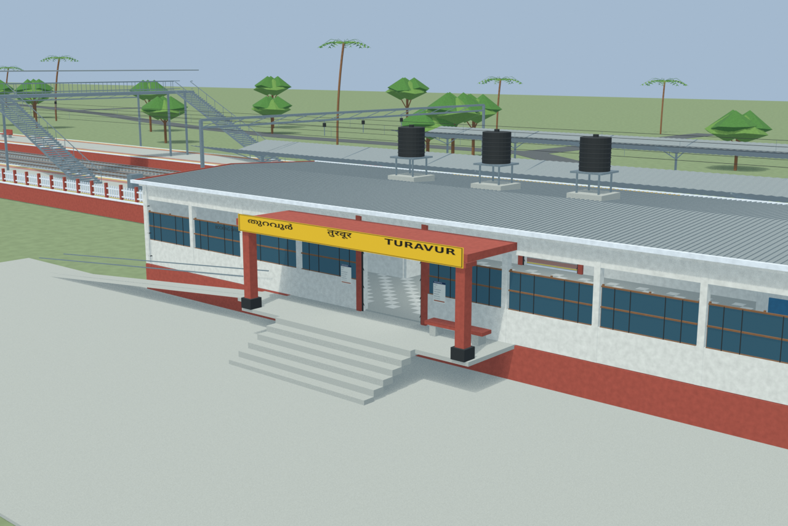
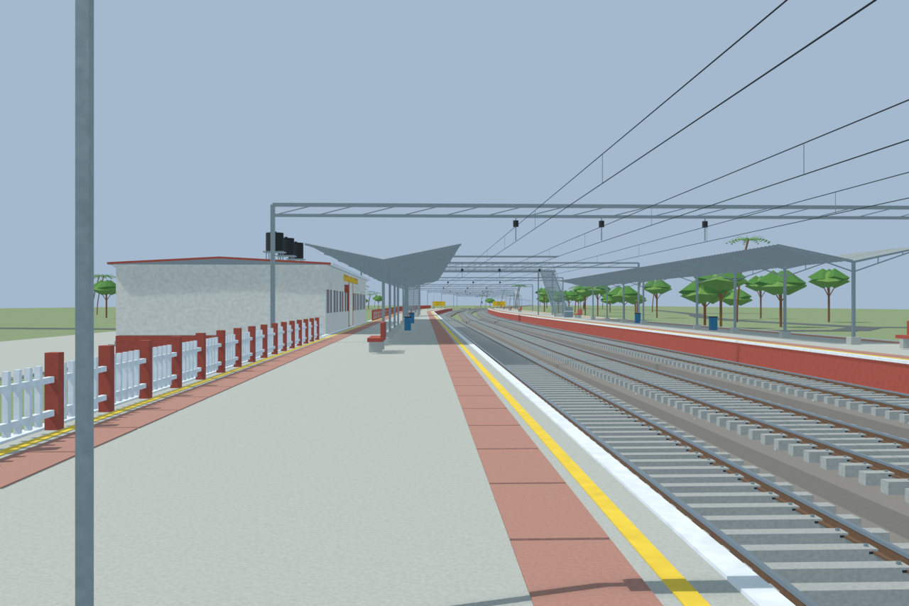
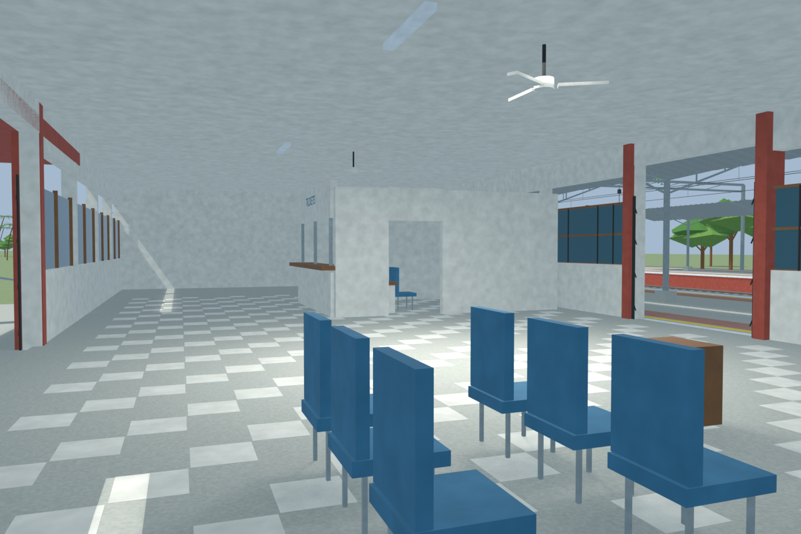
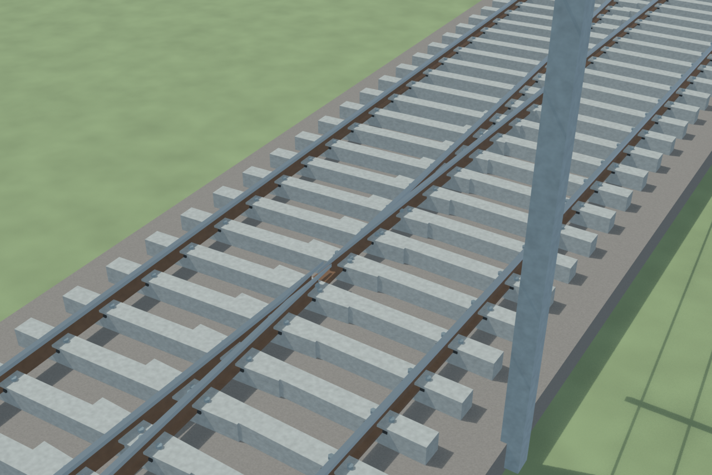

# TUVR station gallery

Final v03 passed independent station review with disclosed reconstruction limits. All five accepted previews preserve their documented per-frame source lineage, including retained unchanged-area views.

Actual-model previews with accepted image hashes. Hidden interiors and unsurveyed details are reconstructions; read [sources and limitations](SOURCES_AND_UNCERTAINTIES.md). [Opening the model](README.md).

## Overall station

## Entrance architecture

## Platform and tracks

## Reconstructed interior

## Mapped turnout detail

Authoritative model Blender SHA256: `75a95a356652de29882fbe75b9b1bde56d92584d3004a393f88284ef64ef15e6`. Review the per-frame provenance records for any retained earlier views and their exact source hashes.
