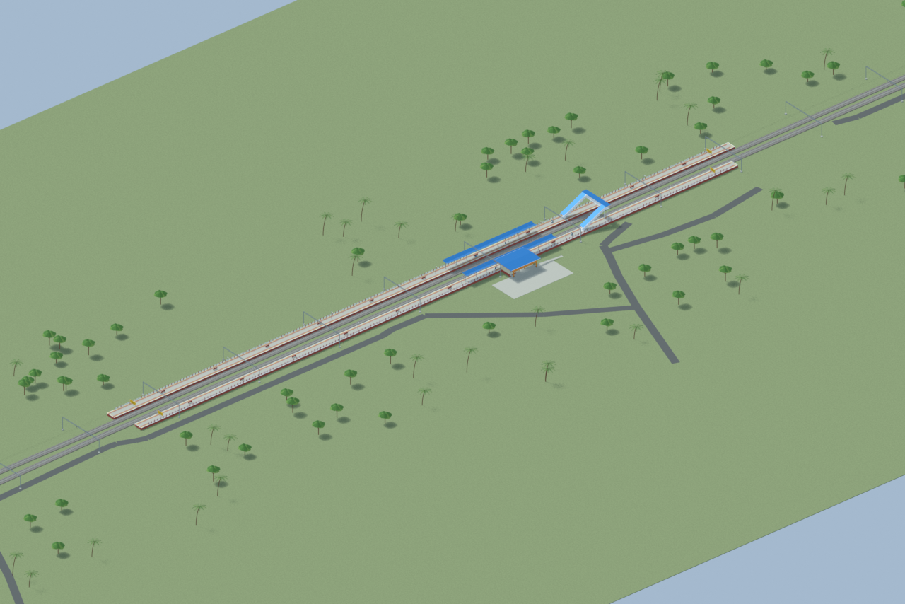
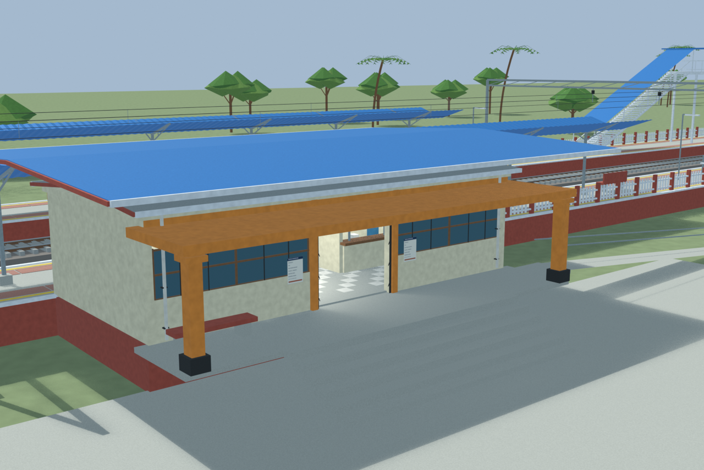
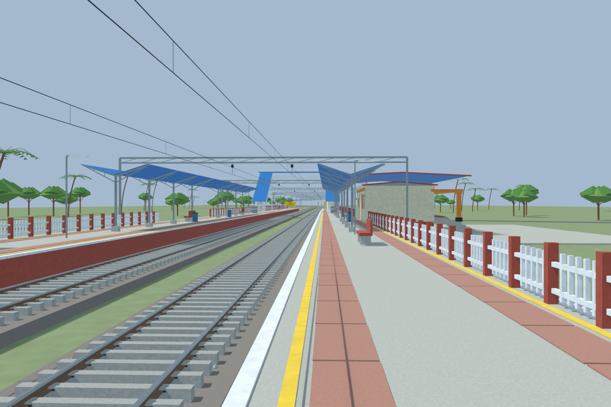
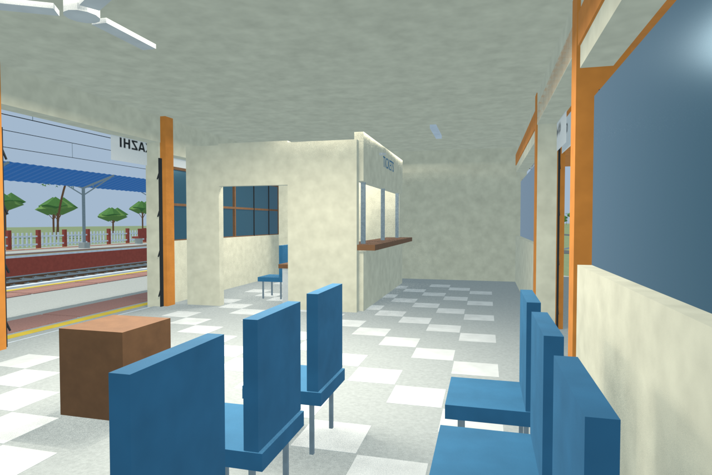

# TZH station gallery

Independently accepted final source-backed model with four reviewed views and a verified portable export. The two-platform layout and covered stairs retain their exact geometry and floor-support checks. The compact cream/orange hut and blue overroof follow dated evidence; hidden rooms and unsurveyed dimensions remain reconstructions.

Actual-model previews with accepted image hashes. Hidden interiors and unsurveyed details are reconstructions; read [sources and limitations](SOURCES_AND_UNCERTAINTIES.md). [Opening the model](README.md).

## Overall station

## Entrance architecture

## Platform and tracks

## Reconstructed interior

Authoritative model Blender SHA256: `eef7ece3096da1fa2d762244945c84888224641c30869b4c63588a7dc2829d4d`. Review the per-frame provenance records for any retained earlier views and their exact source hashes.
