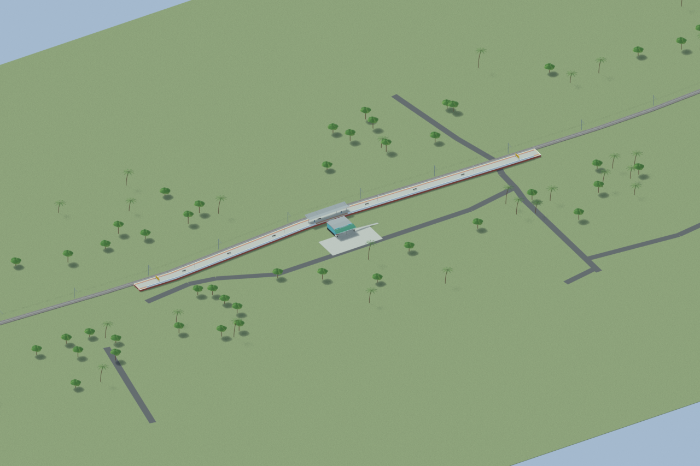
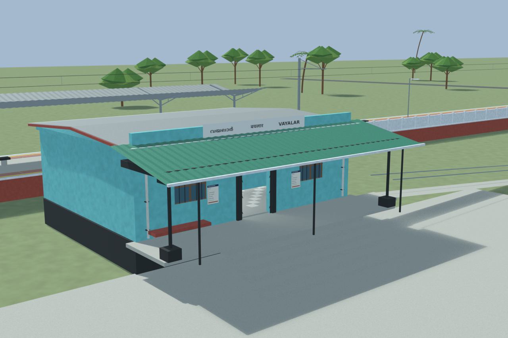
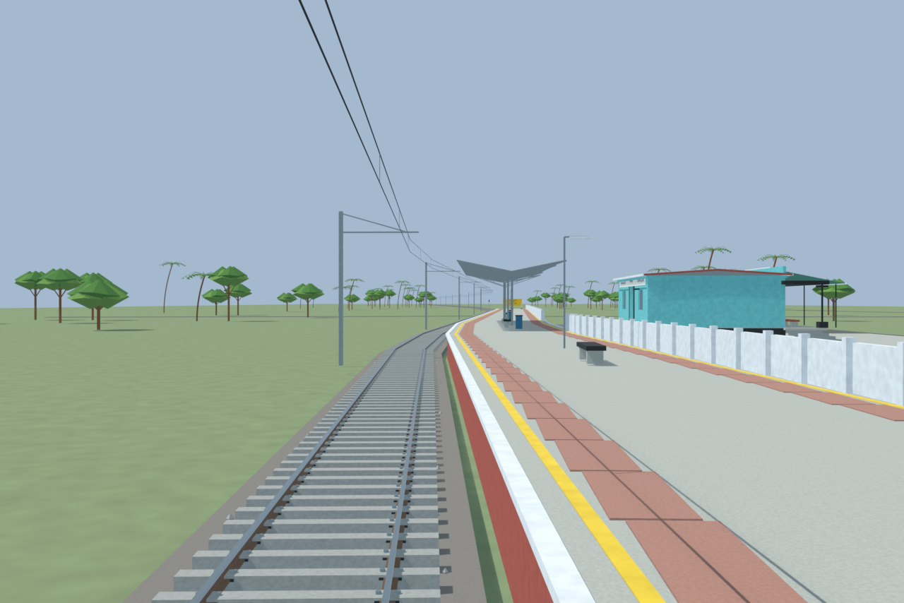
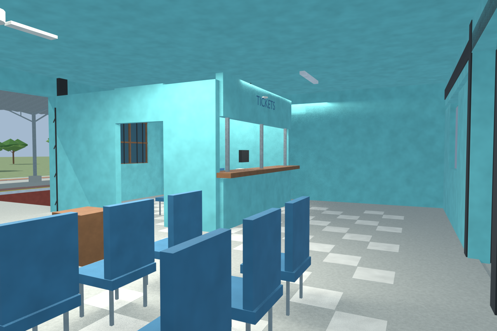

# VAY station gallery

Independently accepted final source-backed model. Photographed turquoise facade, green awning and porch post are distinguished from the reconstructed hidden interior. Checked public access bends around that post, with supported ramp and floor thresholds. No as-built survey or game-native runtime claim.

Actual-model previews with accepted image hashes. Hidden interiors and unsurveyed details are reconstructions; read [sources and limitations](SOURCES_AND_UNCERTAINTIES.md). [Opening the model](README.md).

## Overall station

## Entrance architecture

## Platform and tracks

## Reconstructed interior

Authoritative model Blender SHA256: `5bcc99d830a01f14954ce02f4058703f08b9c4703fbc22d18594961f5ab3cbd8`. Review the per-frame provenance records for any retained earlier views and their exact source hashes.
