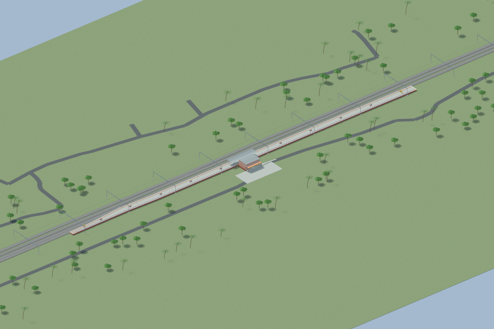
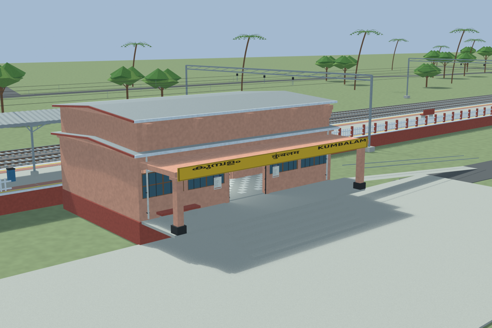
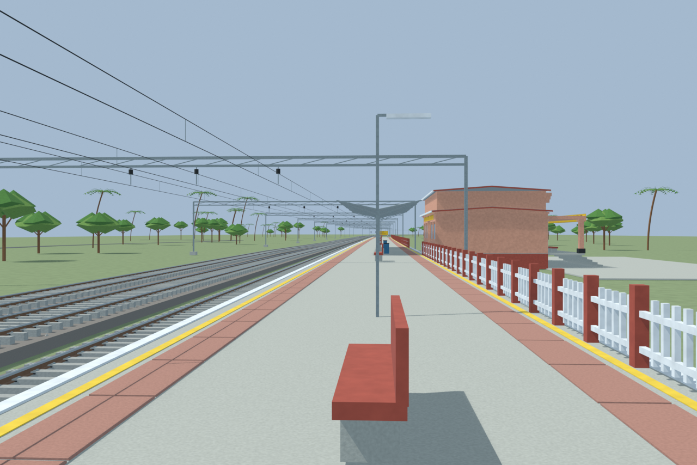
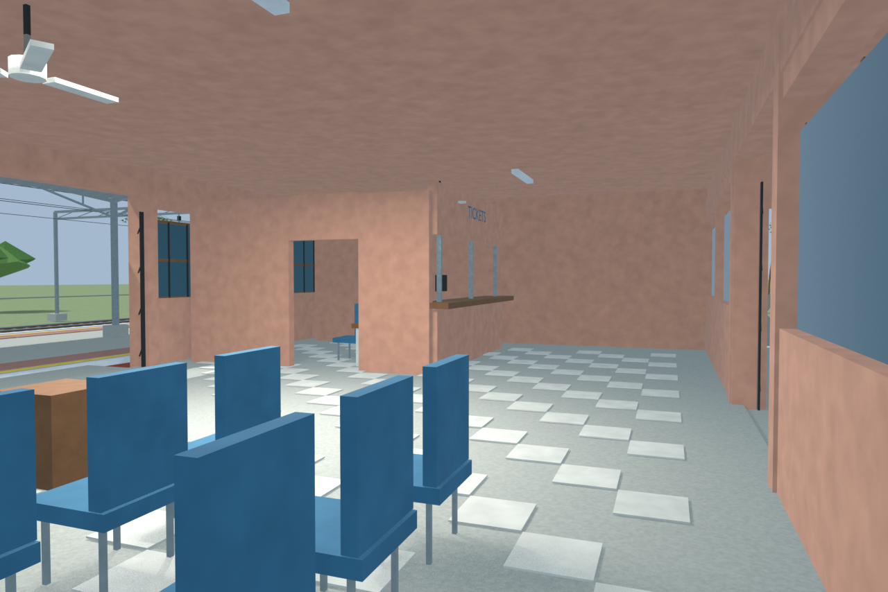
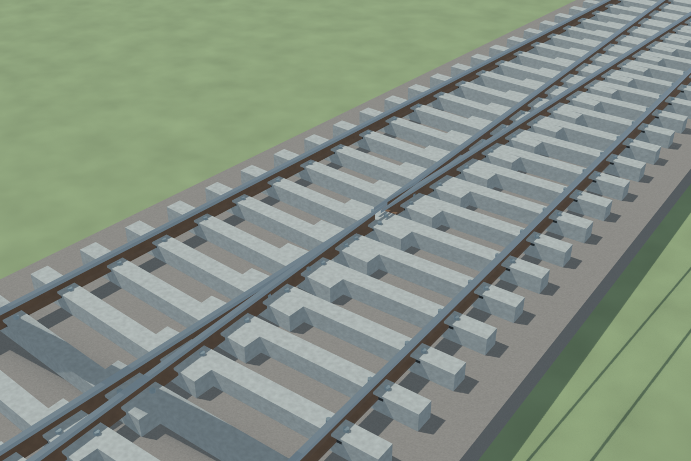

# KUMM station gallery

Passed independent station review with disclosed reconstruction limits. Full source, export and five final previews are synchronized.

Actual-model previews with accepted image hashes. Hidden interiors and unsurveyed details are reconstructions; read [sources and limitations](SOURCES_AND_UNCERTAINTIES.md). [Opening the model](README.md).

## Overall station

## Entrance architecture

## Platform and tracks

## Reconstructed interior

## Rail flange detail

Source Blender SHA256: `8489168b583adf58e5438bf620432014cc8c7b84a5a23c8110e6ca3634581a90`.
