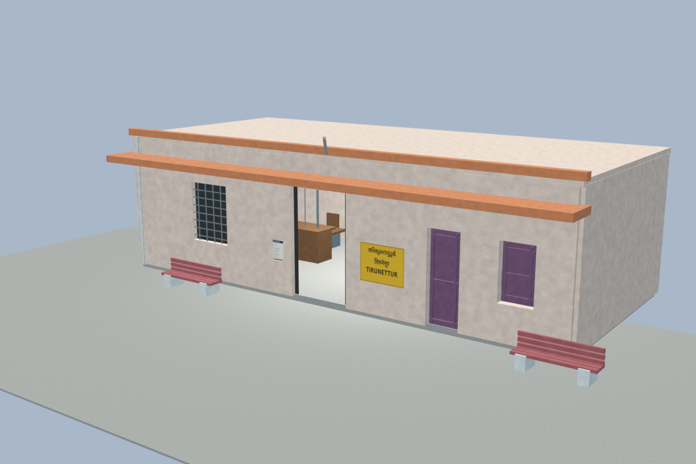
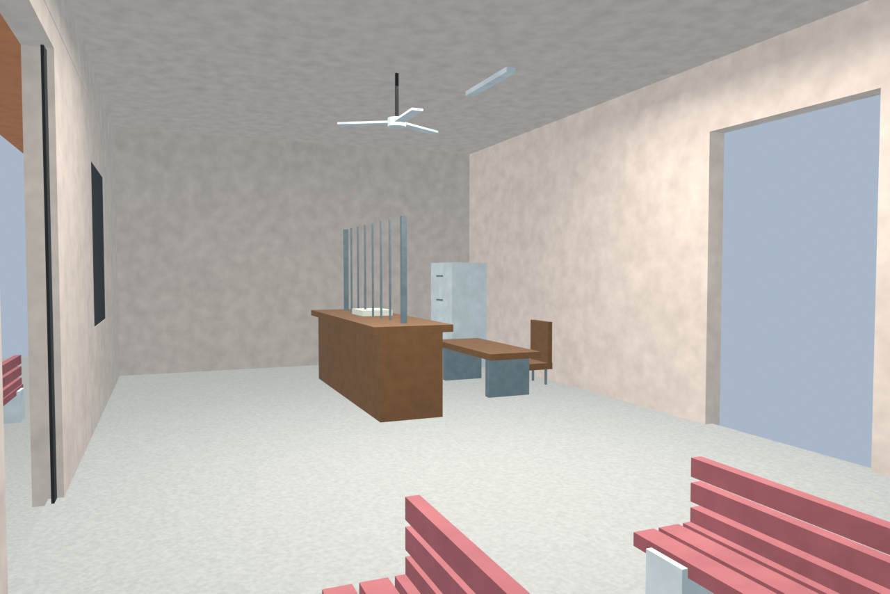
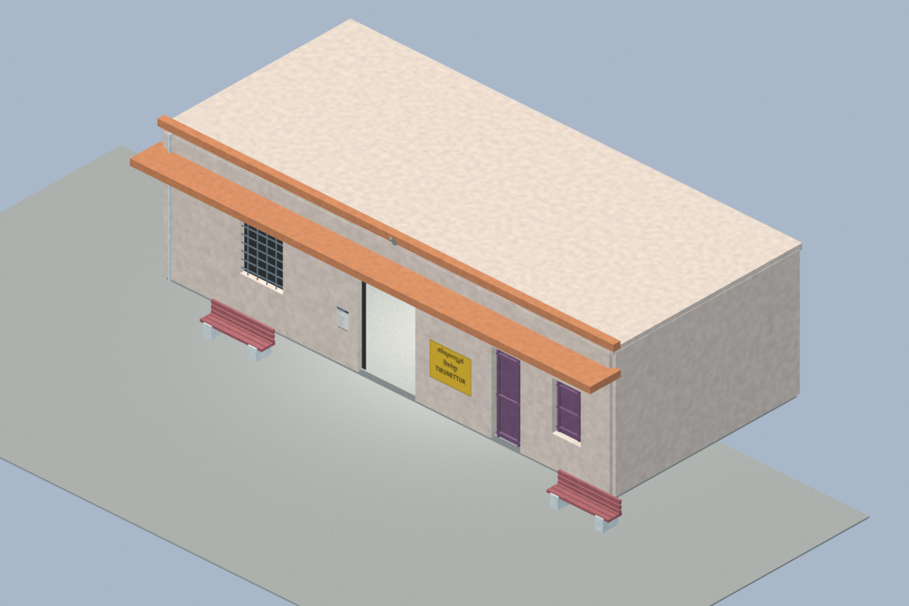
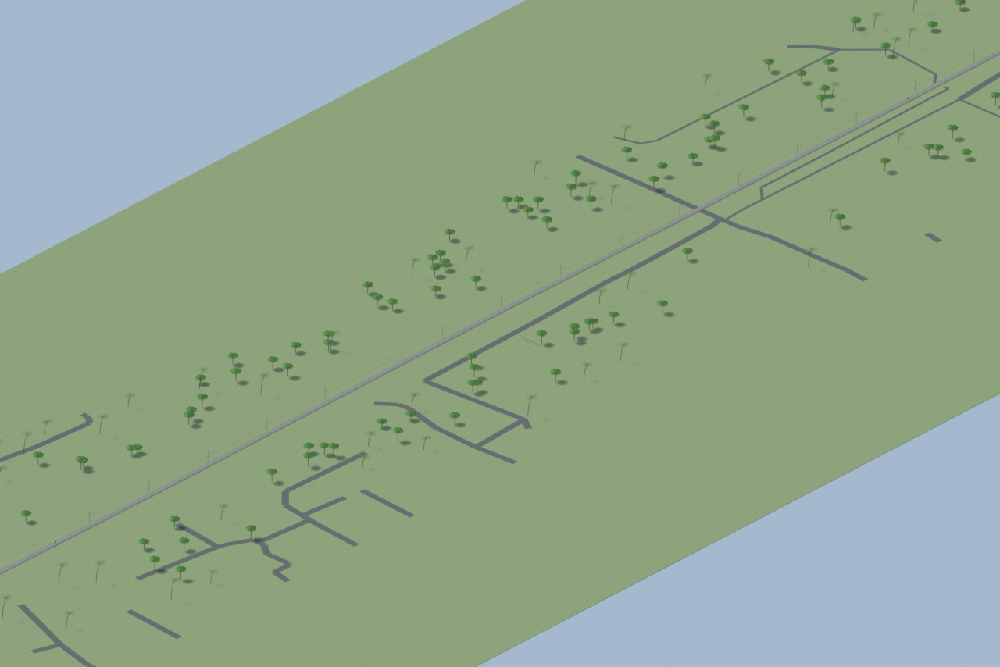
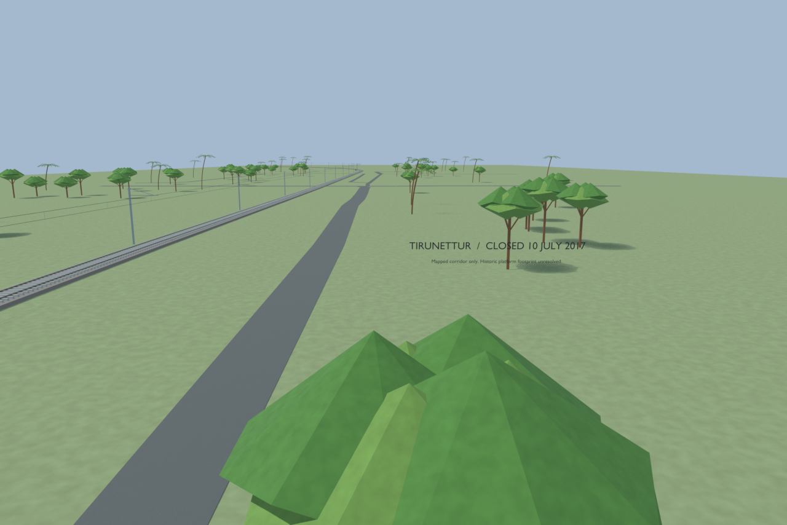

# TNU station gallery

Accepted historical treatment of the halt closed in 2017. The unplaced 2016 building and mapped corridor remain separate scenes, with two independently verified isolated GLB exports. No current passenger operation or invented historical placement is claimed.

Actual-model previews with accepted image hashes. Hidden interiors and unsurveyed details are reconstructions; read [sources and limitations](SOURCES_AND_UNCERTAINTIES.md). [Opening the model](README.md).

## Historical 2016 facade

## Historical interior

## Historical building overview

## Mapped corridor record

## Closed site context

Authoritative model Blender SHA256: `a76fb0e6821c2ff9ef4635c84a7032b1e61ec439c9257e78ed98f41ca2d3efad`. Review the per-frame provenance records for any retained earlier views and their exact source hashes.
