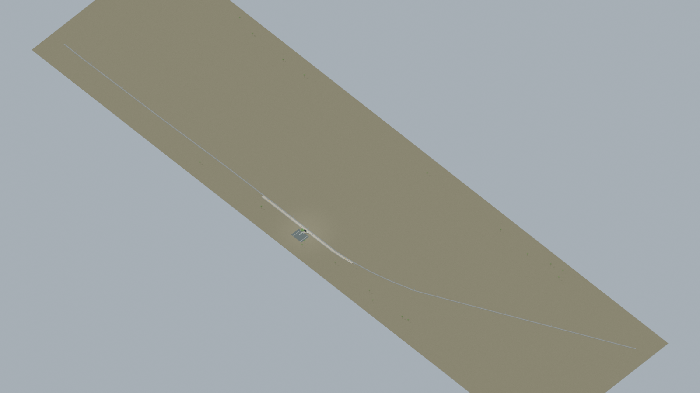
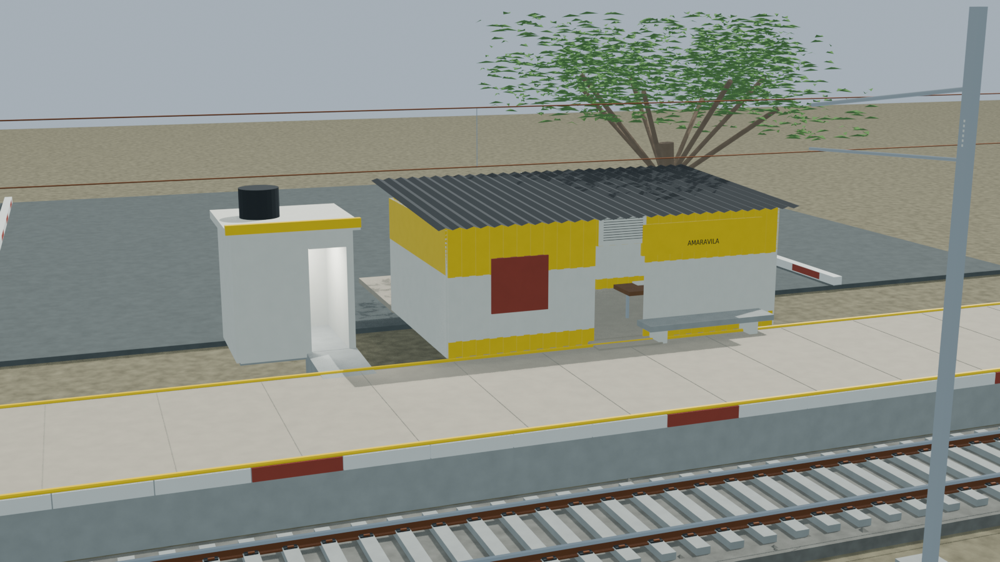
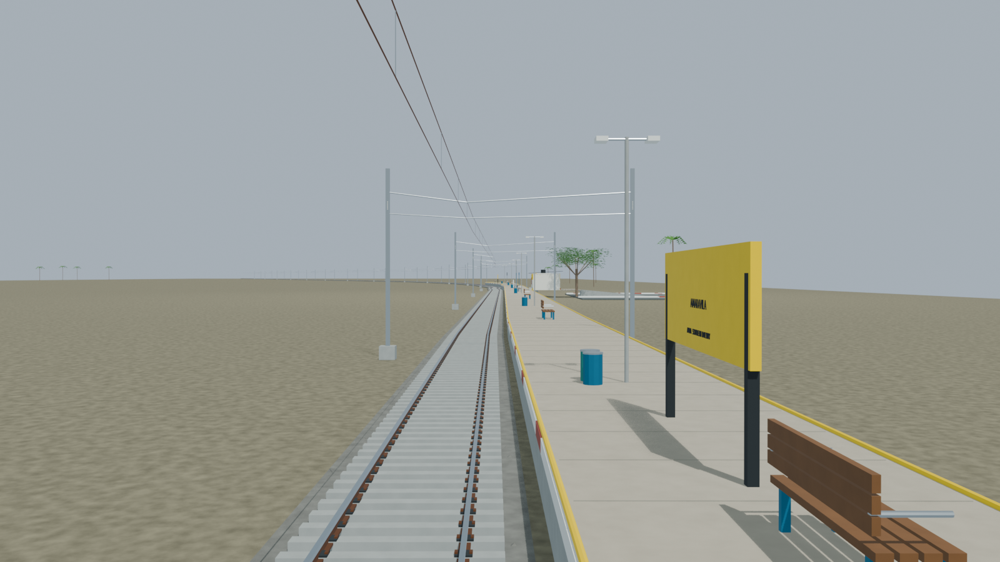
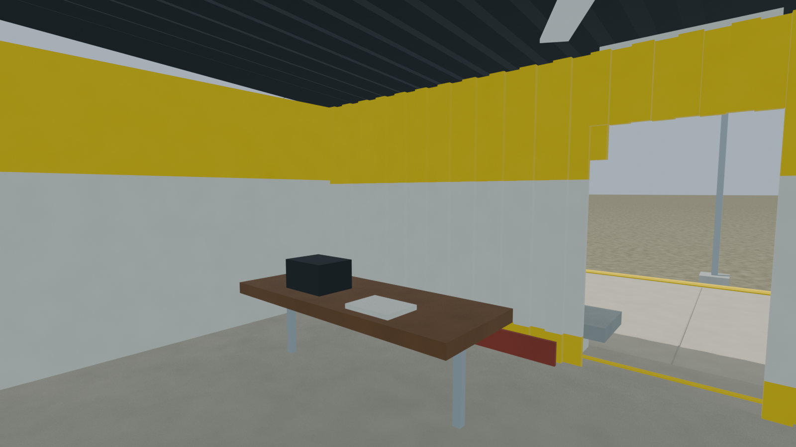
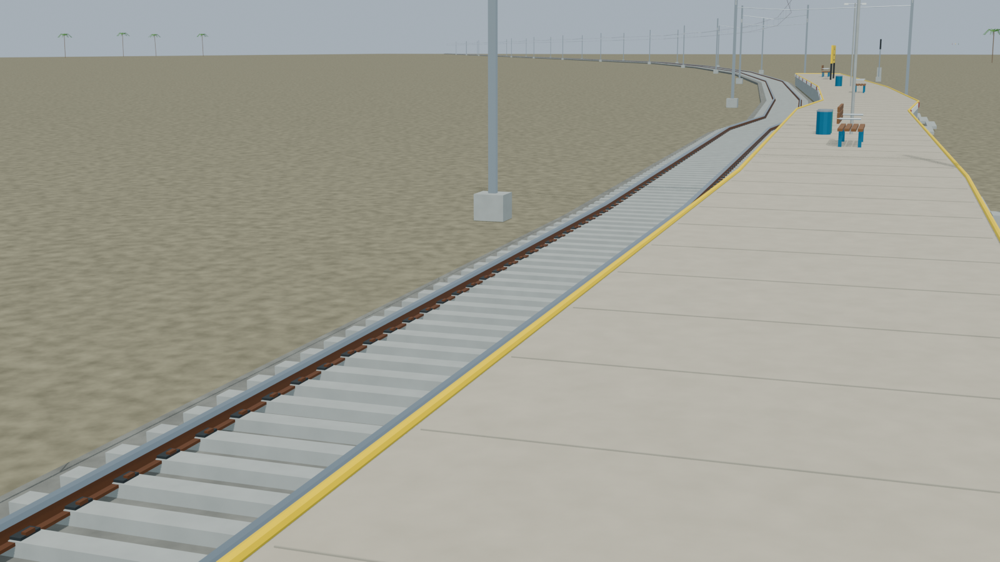

# AMVA station gallery

Passed the full independent station gate, including the continuous reconstructed WC approach and transformed-export body paths. All five previews retain their exact declared source lineage.

Actual-model previews with accepted image hashes. Hidden interiors and unsurveyed details are reconstructions; read [sources and limitations](README.md). [Opening the model](README.md).

## Full station network

## Station architecture

## Platform and tracks

## Furnished interior

## Track and platform detail

Authoritative model Blender SHA256: `d0fe50f13992587299c8495054f091d37a0ef3e8cb9e9fb2f71a364d496cbdce`. Review the per-frame provenance records for any retained earlier views and their exact source hashes.
