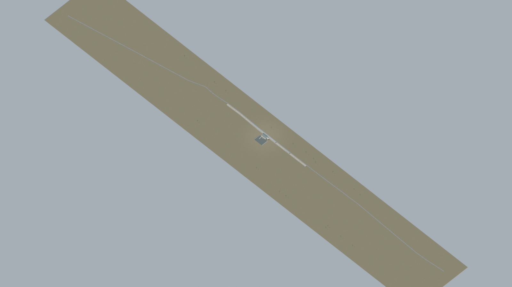
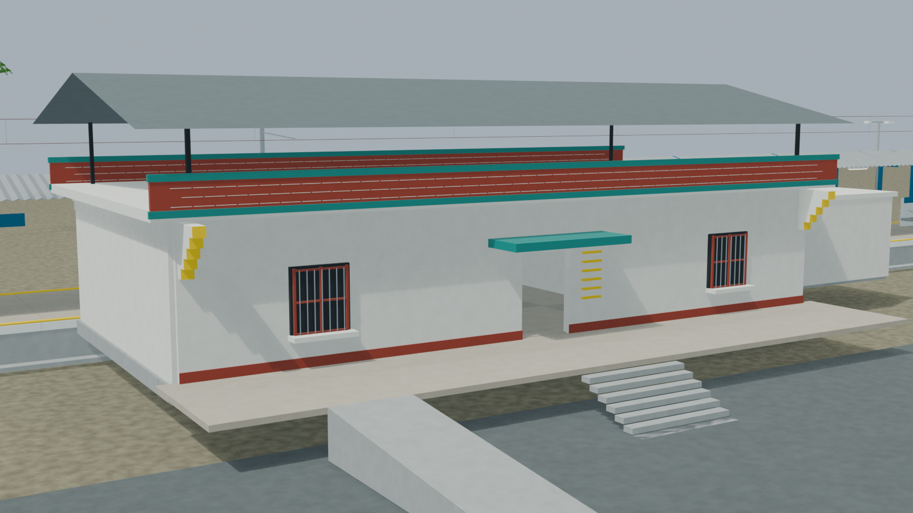
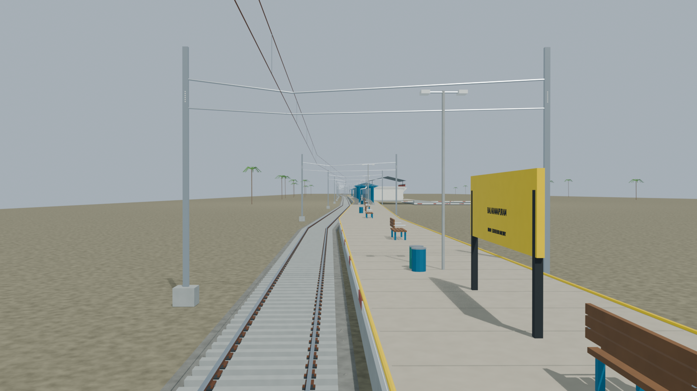
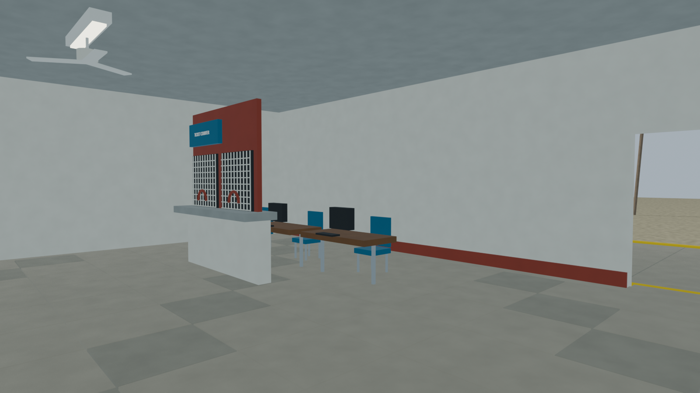
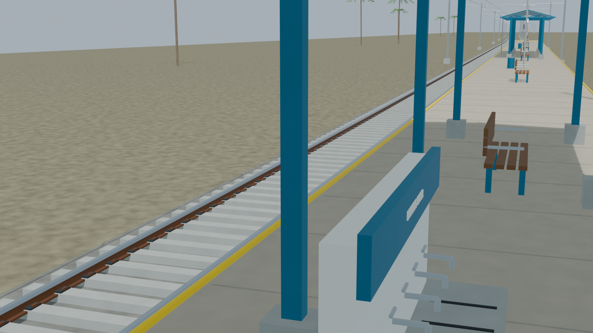

**Current portable model:** [Use the colour-corrected export revision](../portable_colour_revision_02/BRAM/README.md). The immutable original builder export record is superseded as described in [the selection note](CURRENT_PORTABLE_EXPORT.md).

# BRAM station gallery

Independently accepted native source, five reviewed views and geometric checks. The current portable model is the separately audited colour-corrected revision; the original builder export archive is a preserved historical checkpoint. Source-specific platform/body and hidden-detail limitations remain explicit.

Actual-model previews with accepted image hashes. Hidden interiors and unsurveyed details are reconstructions; read [sources and limitations](README.md). [Opening the model](README.md).

## Full station network

## Station architecture

## Platform and tracks

## Furnished interior

## Track and platform detail

Authoritative model Blender SHA256: `9ac91b4cb118099afe7e70a76c46d731f966b0055287d978b283f924476b7a79`. Review the per-frame provenance records for any retained earlier views and their exact source hashes.
