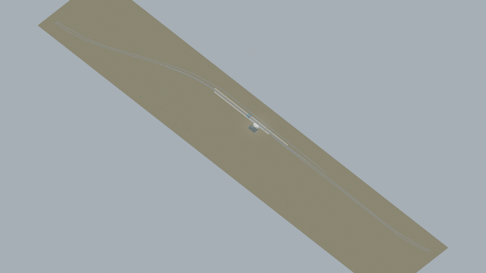
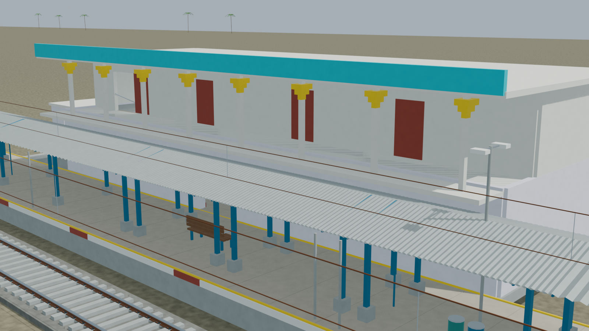
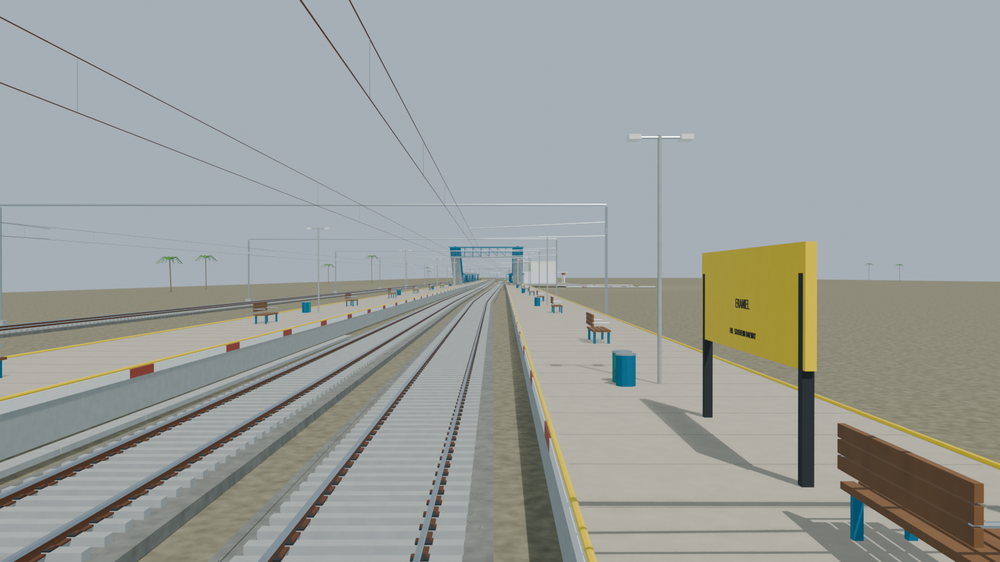
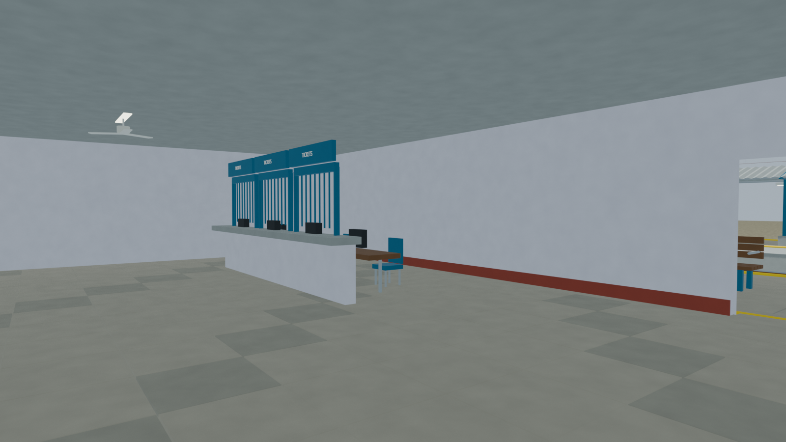
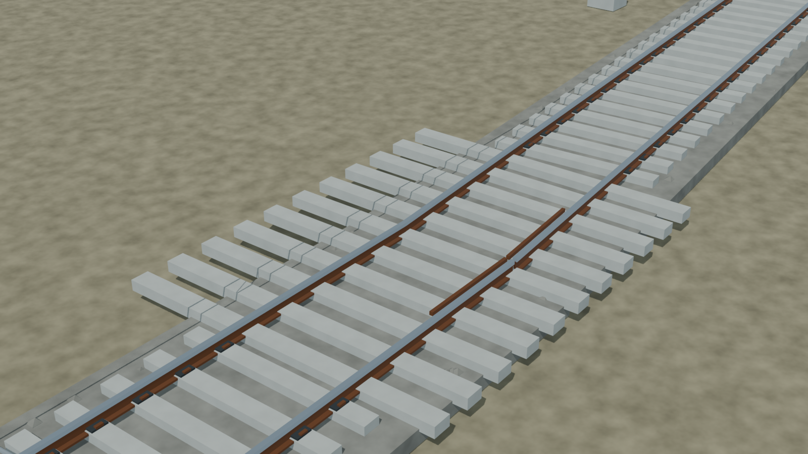

# ERL station gallery

Independently accepted final source-backed model with five reviewed views, verified source-bound portable export, and checked public, stair and sanitary approach routes. Hidden details and unsurveyed dimensions remain disclosed reconstructions; retained image lineage is explicit.

Actual-model previews with accepted image hashes. Hidden interiors and unsurveyed details are reconstructions; read [sources and limitations](README.md). [Opening the model](README.md).

## Full station network

## Station architecture

## Platform and tracks

## Furnished interior

## Physical pointwork

Authoritative model Blender SHA256: `5d6878500729b4090469a8bd04abd6c5684bd09066cae012f0148aa5f39e6f32`. Review the per-frame provenance records for any retained earlier views and their exact source hashes.
