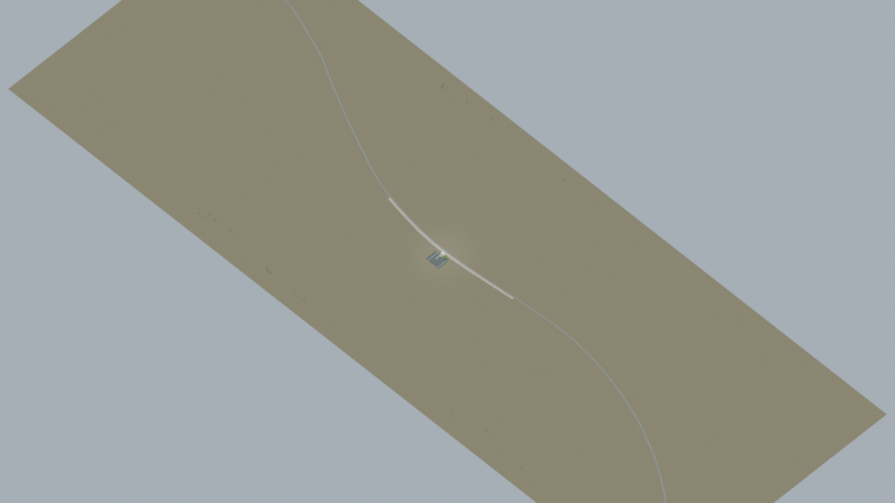
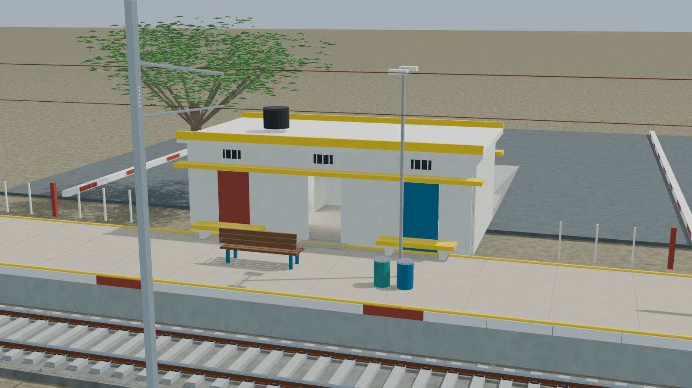
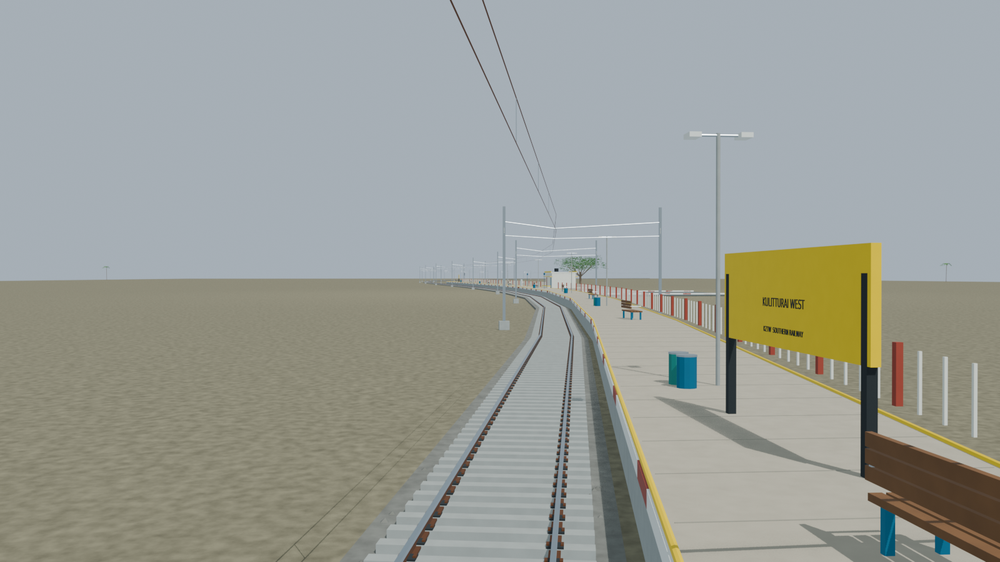
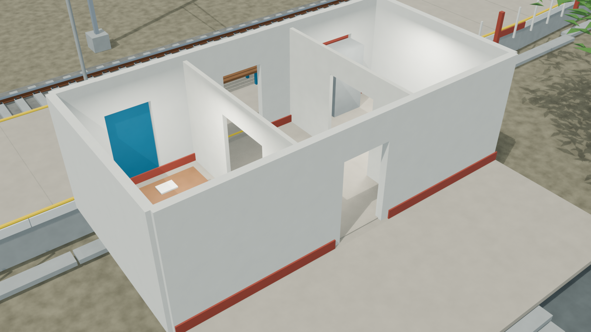
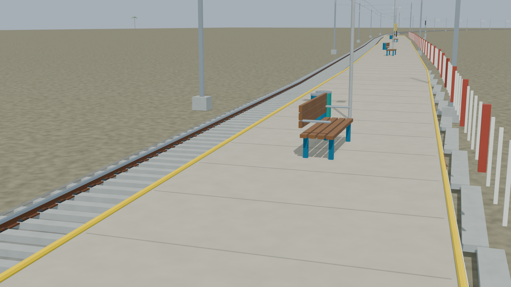

# KZTW station gallery

Passed the full independent station gate, including transformed-export body paths and all five preview lineages. Procedural Blender materials remain authoritative in the packed source.

Actual-model previews with accepted image hashes. Hidden interiors and unsurveyed details are reconstructions; read [sources and limitations](README.md). [Opening the model](README.md).

## Full station network

## Station architecture

## Platform and tracks

## Furnished interior

## Track and platform detail

Authoritative model Blender SHA256: `424cf312e59b232f29e75ada4158fa39a4e1d37325da67d6ae4e1466fc3bc9bc`. Review the per-frame provenance records for any retained earlier views and their exact source hashes.
