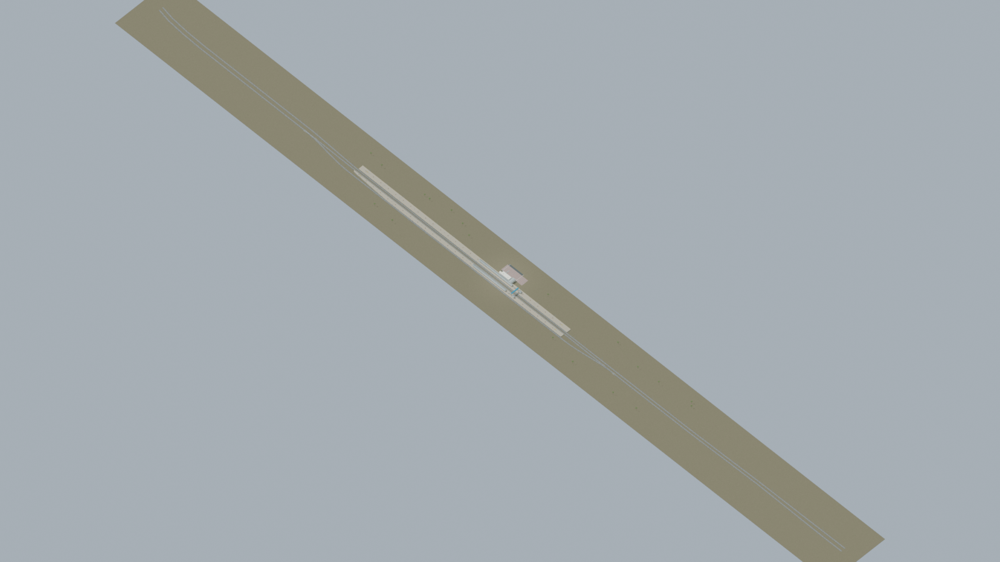
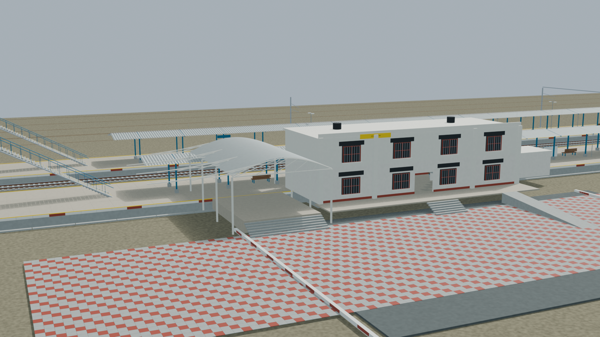
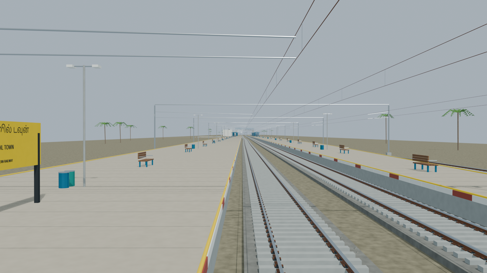
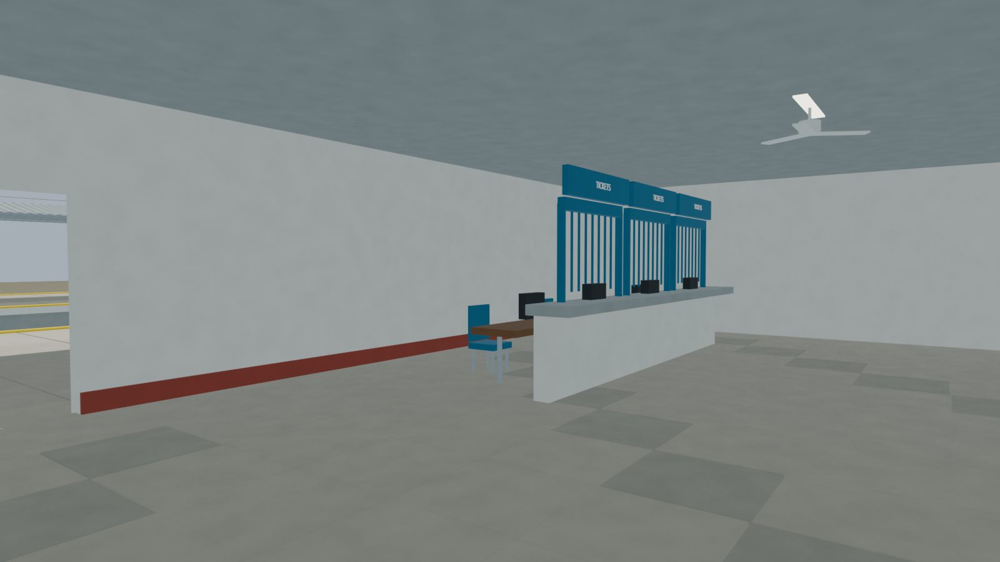
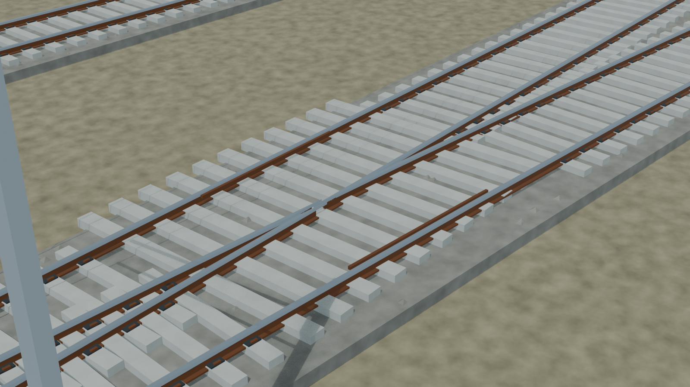

# NJT station gallery

Independently accepted with disclosed limits for reviewed publication: the frozen native source, five exact preview hashes, geometry/circulation, resources and corrected portable authored RGB. [Current acceptance report](../../qa/reports/NJT.json) SHA256: `e98e8f4310b16fdb781fed830a48b549caaf246a8eb4fa72bd8e530578fe85c4`. Frozen builder manifest SHA256: `153acb60ebe5030a68e870891e3706c49e5f980d3b0b5038baf2f40dcbf243f9`.

Two modeled bodies provide three reported platform positions: a southern side platform and northern island. The third road and its connectors are satellite-guided reconstruction where OSM is absent. Canopy/bridge ordering uses image-picked satellite positions, with reconstructed dimensions and placement; the bridge descends toward negative local X. The upper rear wall is closed and no unsupported balcony is invented. Old construction tags do not prove current non-operation. Rail-network local XY bounds in metres: [-1100.0, -42.34911930801162, 1100.0, -3.8311535184650003]. The 3 clipped source rail-way pieces are not a certified physical-road count. Metric scene scale is 1.0; nominal gauge is 1.676 m. No trains or other rolling stock are included.

The original packed Blend, geometry, rendered images and source recipes are retained unchanged. This first full frozen package already includes the corrected portable source-authored RGB; no separate colour addendum is needed. `exchange/SOURCE_PALETTE.json` and `exchange/COLOUR_PRESERVATION.json` record RGB provenance. Procedural Blender shading is approximated by portable base colours and is not baked. Per-frame current or retained-scene provenance remains explicit in `RENDER_PROVENANCE.json`. Source scripts are documentary construction/repair recipes, not a tested standalone rebuild; the packed Blend is authoritative.

Visual reconstruction, not a survey, operational inventory, engineering or accessibility certification. Hidden interiors, precise dimensions and sanitary links are reconstructed unless separately evidenced. Small raised tactile/threshold surfaces up to 60 mm occur at some sampled contacts; geometric checks are not real railway-operation certification. No native Transport Fever 3 runtime compatibility is claimed.

Open `NJT_station_v01.blend` in Blender for the complete editable native source. Unzip `exchange/NJT_portable_GLTF.zip` and import `NJT_station_v01.glb` as glTF 2.0. The archive and contained GLB were checked against their accepted exact hashes. No original geometry or model detail was removed for transport.

Actual-model previews with accepted image hashes. Hidden interiors and unsurveyed details are reconstructions; read [sources and limitations](README.md). [Opening the model](README.md).

## Full station network

## Station architecture

## Platform and tracks

## Furnished interior

## Physical pointwork

Authoritative model Blender SHA256: `8b62f545a193ac5eae81ce4366531655ac565e72887ac2e663287fa26c6c6290`. Review the per-frame provenance records for any retained earlier views and their exact source hashes.
