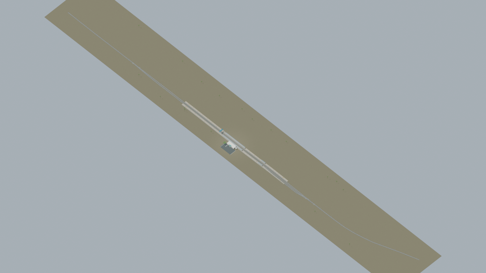
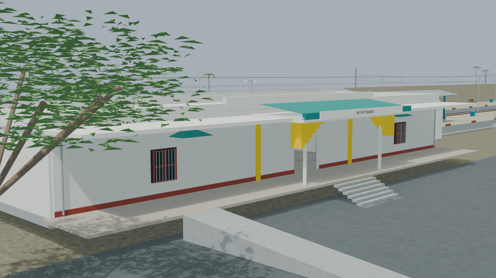
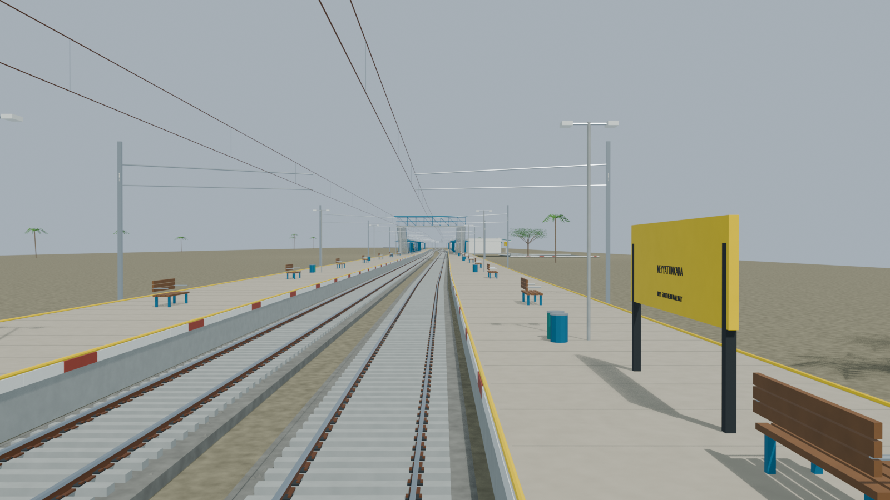
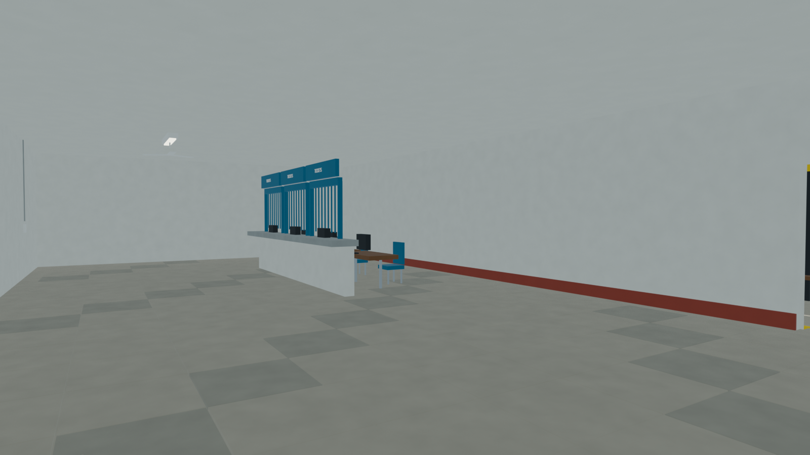
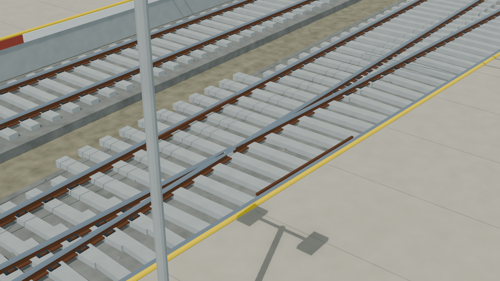

# NYY station gallery

Independently accepted final source-backed model with five reviewed views, exact packed-source/export provenance and checked public, stair, ramp and sanitary approach routes. Hidden interiors, dimensions and operating/service details remain disclosed reconstructions rather than surveyed facts. Current and retained image lineage is explicit.

Actual-model previews with accepted image hashes. Hidden interiors and unsurveyed details are reconstructions; read [sources and limitations](README.md). [Opening the model](README.md).

## Full station network

## Station architecture

## Platform and tracks

## Furnished interior

## Physical pointwork

Authoritative model Blender SHA256: `2ab1b315037e5ee35d83502fb2cad993b586bf6fc65907aabb91123f50cd34d2`. Review the per-frame provenance records for any retained earlier views and their exact source hashes.
