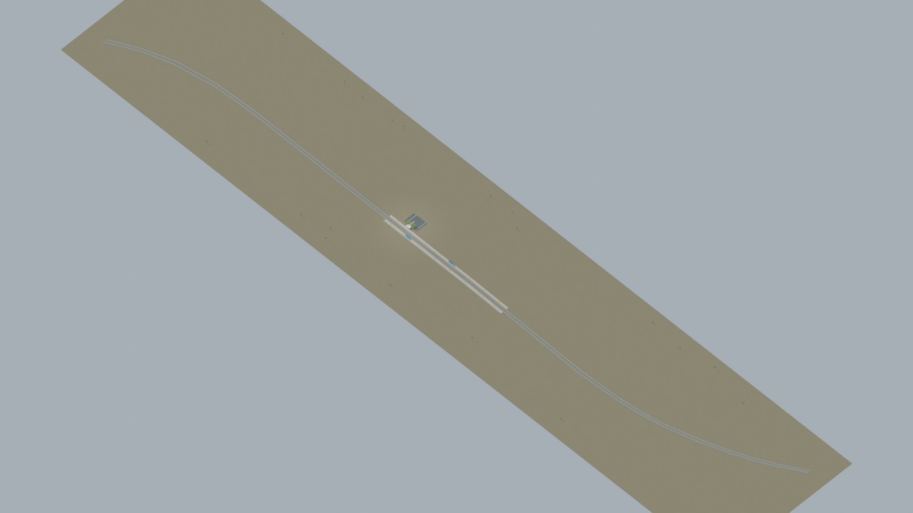
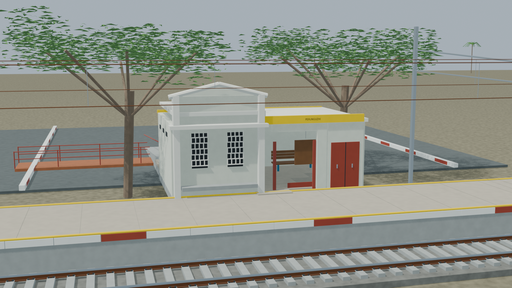
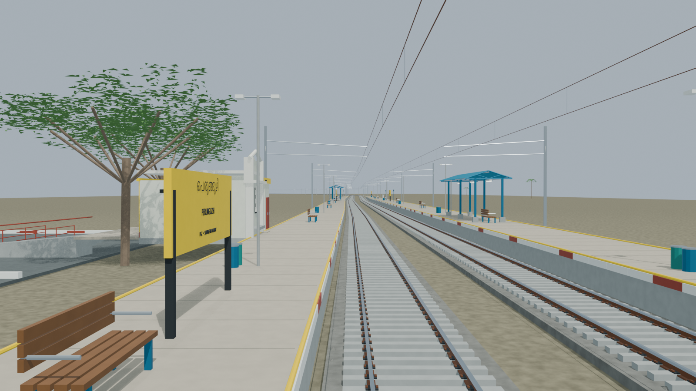
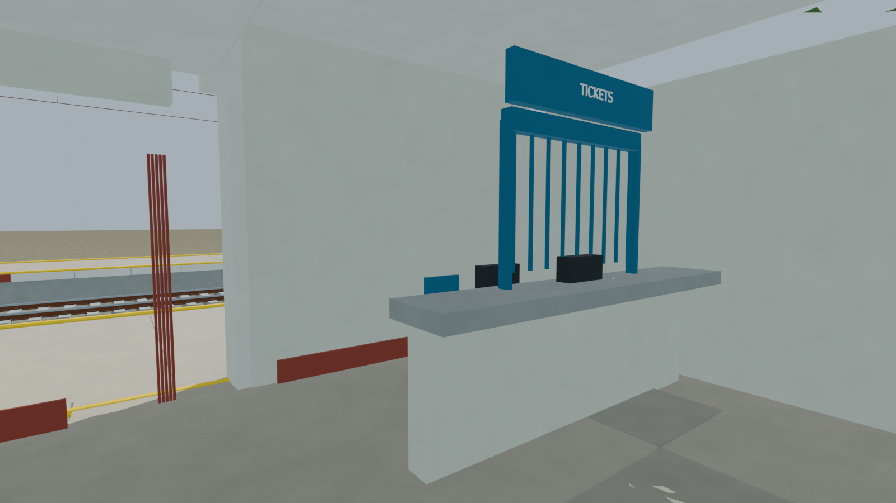
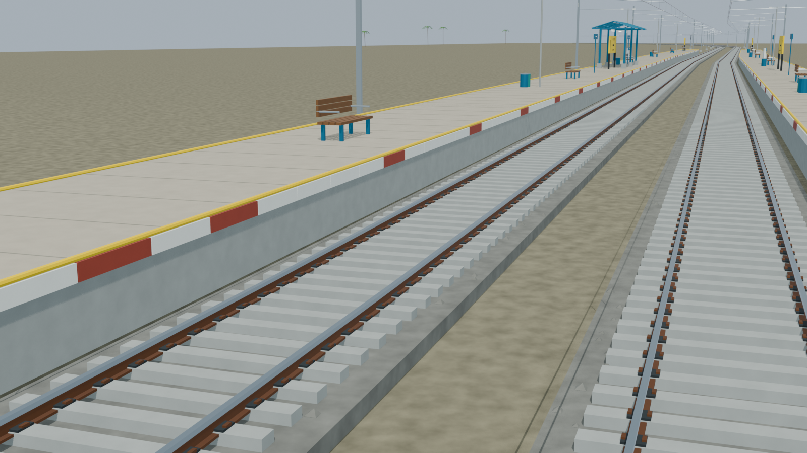

# PGZ station gallery

Passed independent station review, including final sloping-ramp and resource checks. All five accepted model views preserve exact source provenance. Reconstruction limits remain disclosed.

Actual-model previews with accepted image hashes. Hidden interiors and unsurveyed details are reconstructions; read [sources and limitations](README.md). [Opening the model](README.md).

## Full station network

## Station architecture

## Platform and tracks

## Furnished interior

## Track and platform detail

Authoritative model Blender SHA256: `a2dc85b3b6b7a32593886b6c5fffe3ad9f0277734d5b770af9016a1b2cf6e166`. Review the per-frame provenance records for any retained earlier views and their exact source hashes.
