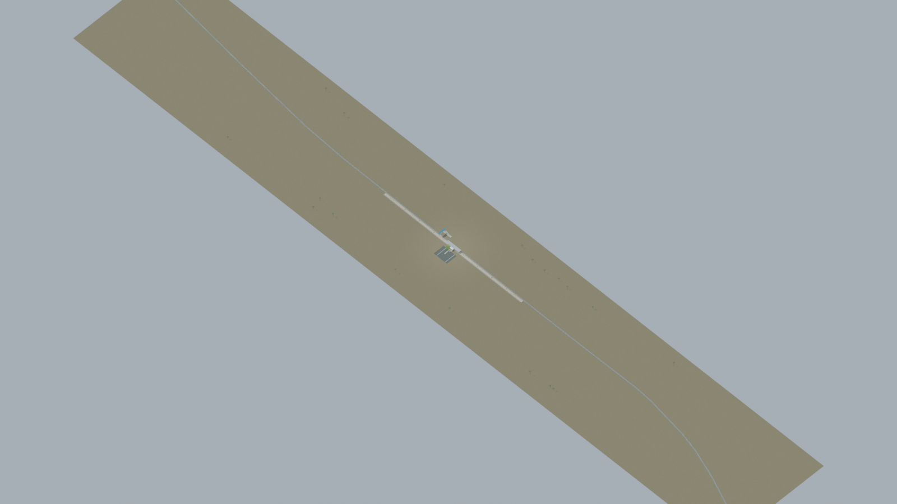
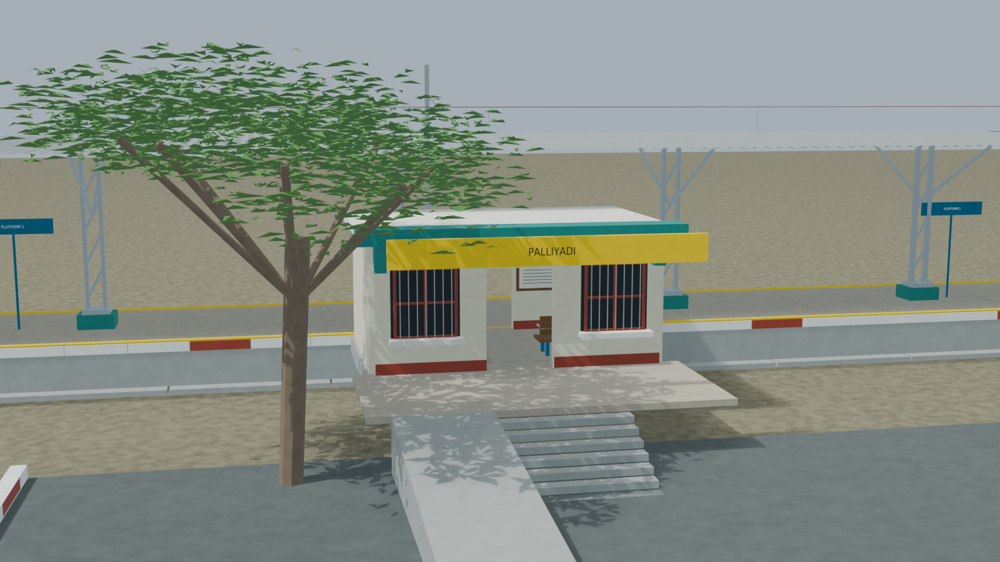
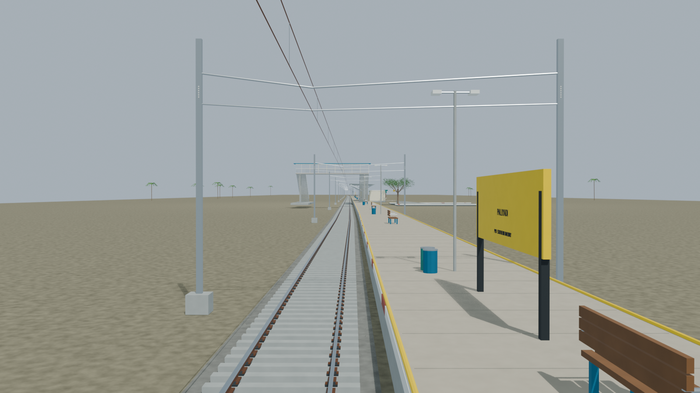
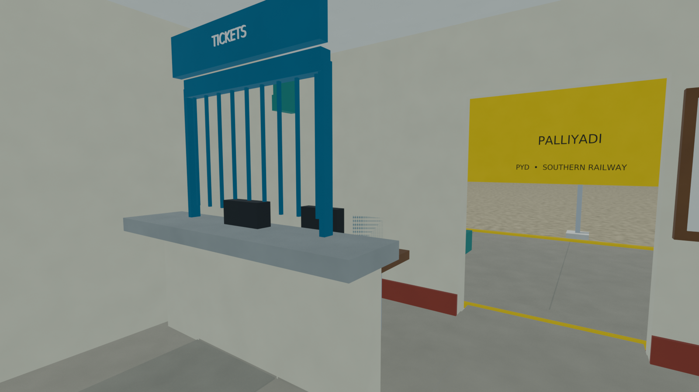
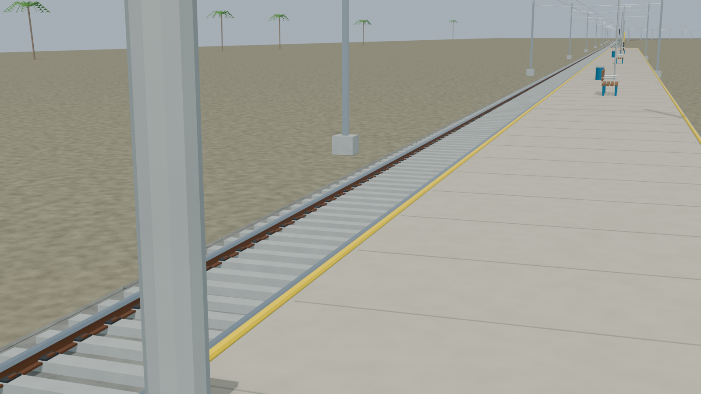

# PYD station gallery

Passed the full independent station gate, including equal repaired stair rises, transformed-export body paths and all five accepted preview lineages. Reconstruction limits remain explicit.

Actual-model previews with accepted image hashes. Hidden interiors and unsurveyed details are reconstructions; read [sources and limitations](README.md). [Opening the model](README.md).

## Full station network

## Station architecture

## Platform and tracks

## Furnished interior

## Track and platform detail

Authoritative model Blender SHA256: `9647b02f731c055609fb1c9a0ea950395f7c7535ea85bd0085a294aa0d5d28b6`. Review the per-frame provenance records for any retained earlier views and their exact source hashes.
