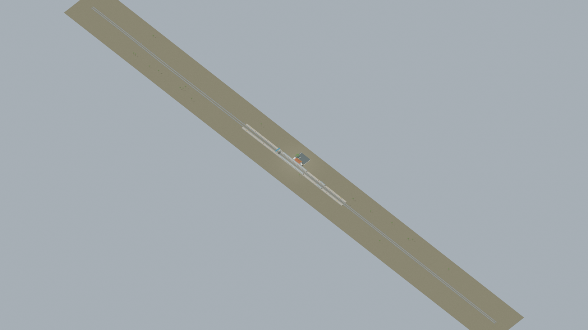
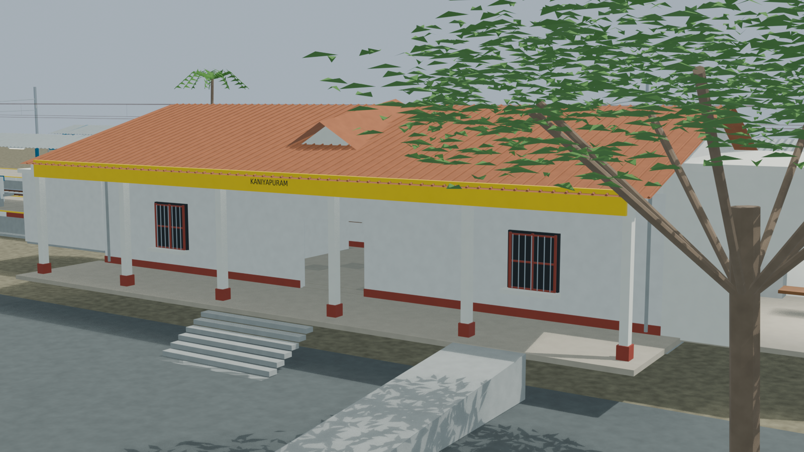
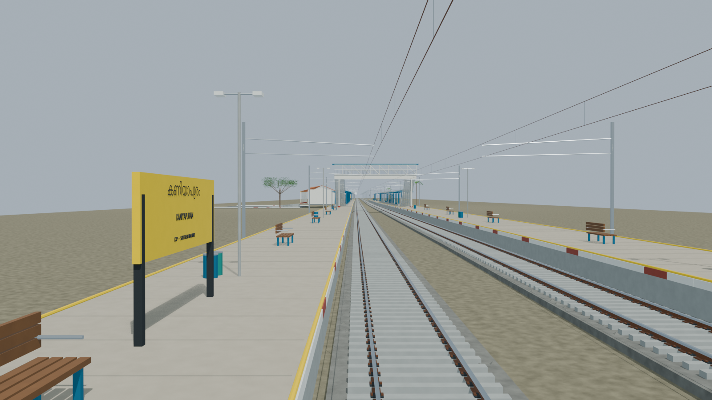
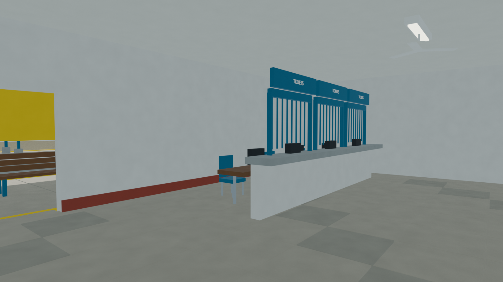
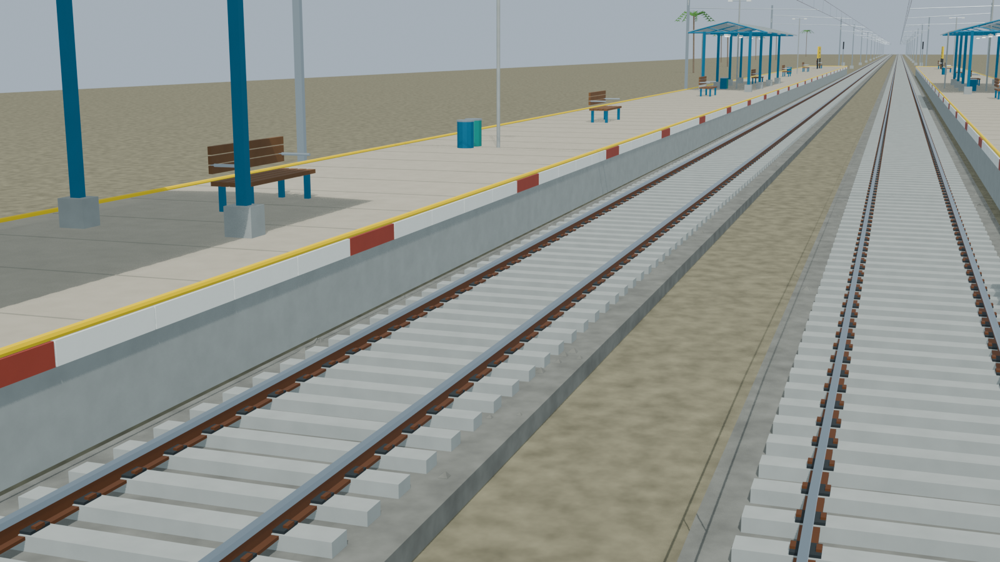

# KXP station gallery

Corrected revision02 supersedes the preserved original checkpoint. Independently accepted final source-backed model with five reviewed views, verified source-bound portable export, and checked public, stair and sanitary approach routes. Hidden details and unsurveyed dimensions remain disclosed reconstructions; retained image lineage is explicit.

Actual-model previews with accepted image hashes. Hidden interiors and unsurveyed details are reconstructions; read [sources and limitations](README.md). [Opening the model](README.md).

## Full station network

## Station architecture

## Platform and tracks

## Furnished interior

## Track and platform detail

Authoritative model Blender SHA256: `5297c53f227a3a958a5305c775cf9279e631871f3e9a6829cd19326cd1ef0d65`. Review the per-frame provenance records for any retained earlier views and their exact source hashes.
