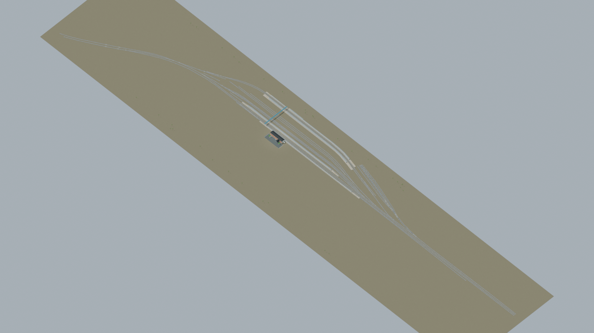
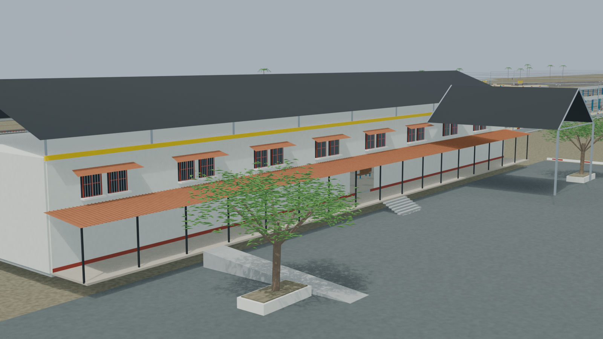
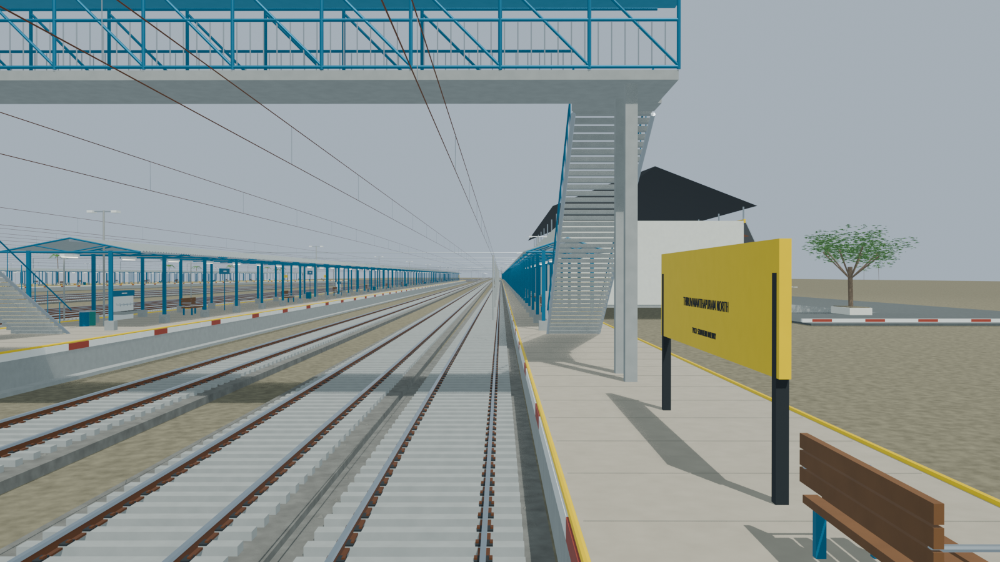
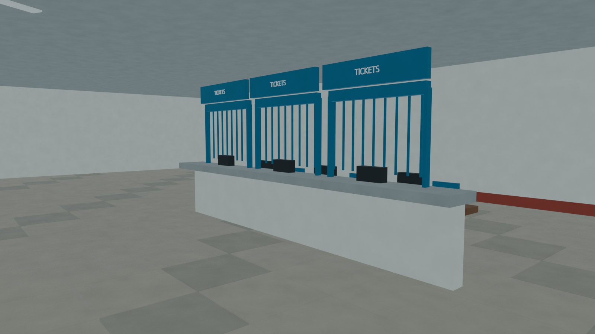
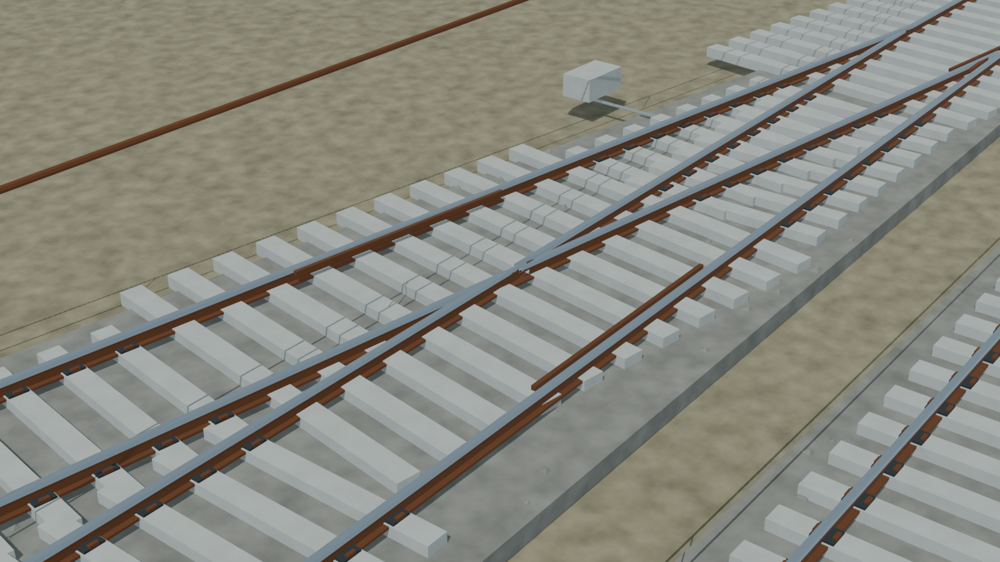

**Current portable model:** [Use the colour-corrected export revision](../portable_colour_revision_02/TVCN/README.md). The immutable original builder export record is superseded as described in [the selection note](CURRENT_PORTABLE_EXPORT.md).

# TVCN station gallery

Independently accepted native source, five reviewed views and geometric checks. The current portable model is the separately audited colour-corrected revision; the original builder export archive is a preserved historical checkpoint. Visual reconstruction, not survey or operational certification. Hidden interior details and measured-looking dimensions remain reconstructed unless specifically evidenced. Targeted floor/body paths are not exhaustive pairwise collision certification. Solid portable base colors approximate Blender procedural materials; procedural texture/bump is not baked. Four modelled bodies versus six reported positions; unresolved adjacent rail on eastern island remains absent, rather than being invented as verified current track. Image-picked main-entry coordinates are approximate.

Actual-model previews with accepted image hashes. Hidden interiors and unsurveyed details are reconstructions; read [sources and limitations](README.md). [Opening the model](README.md).

## Full station network

## Station architecture

## Platform and tracks

## Furnished interior

## Physical pointwork

Authoritative model Blender SHA256: `3e9fbbb51d981c30ac2dc32fd68cb2a33e603e3b7cb20662106e30110af8ba2f`. Review the per-frame provenance records for any retained earlier views and their exact source hashes.
