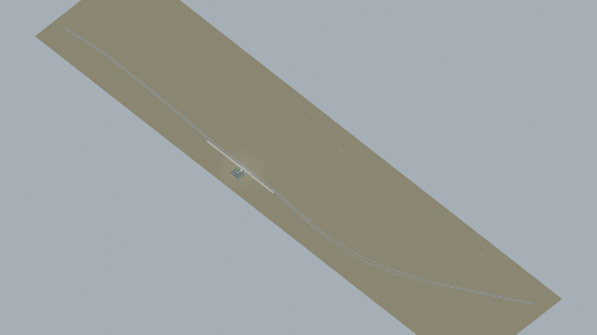
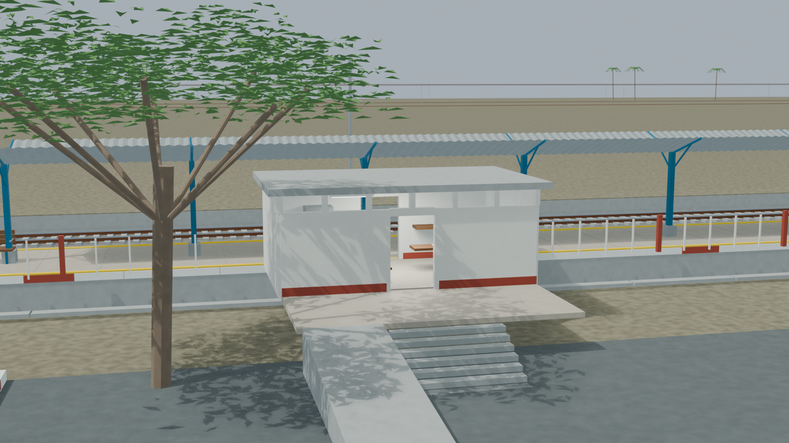
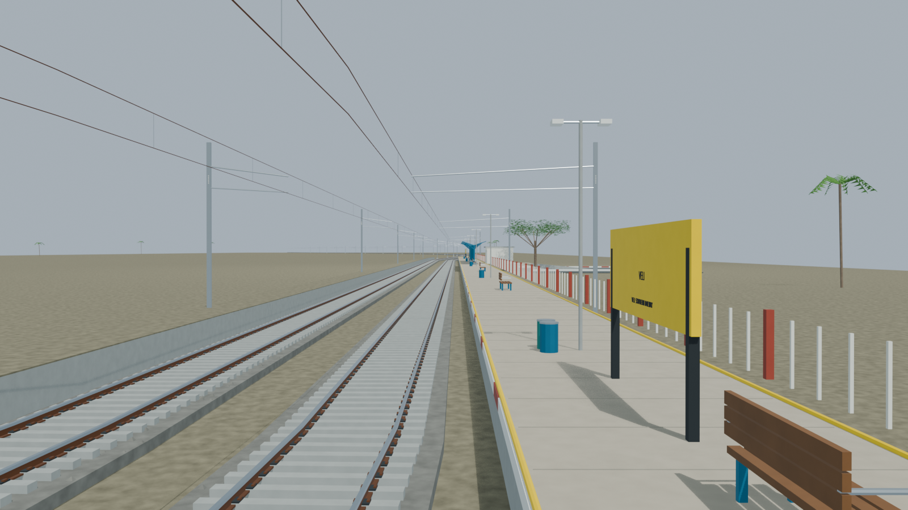
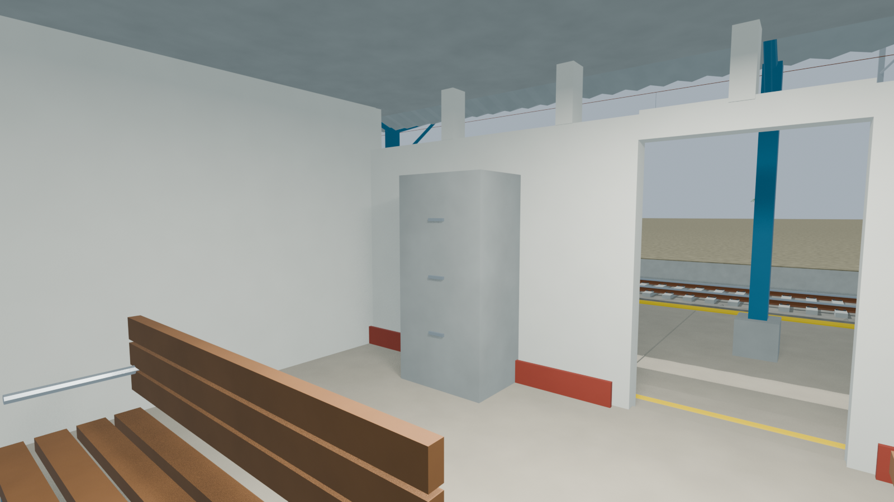
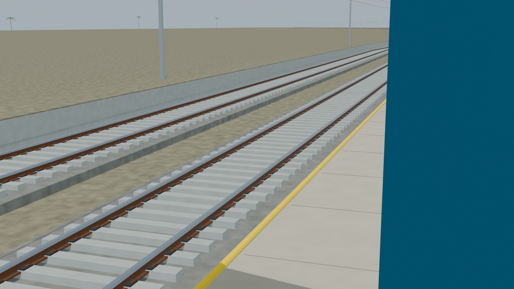

# VELI station gallery

Passed independent station review with five accepted views. The established passenger platform and uncertain opposite raised strip remain separate; the strip is not counted as a confirmed operational platform.

Actual-model previews with accepted image hashes. Hidden interiors and unsurveyed details are reconstructions; read [sources and limitations](README.md). [Opening the model](README.md).

## Full station network

## Station architecture

## Platform and tracks

## Furnished interior

## Track and platform detail

Authoritative model Blender SHA256: `d365bd29aa20a919efa105b19036a53b5e57ba0369808d811ef17de1c30a5296`. Review the per-frame provenance records for any retained earlier views and their exact source hashes.
