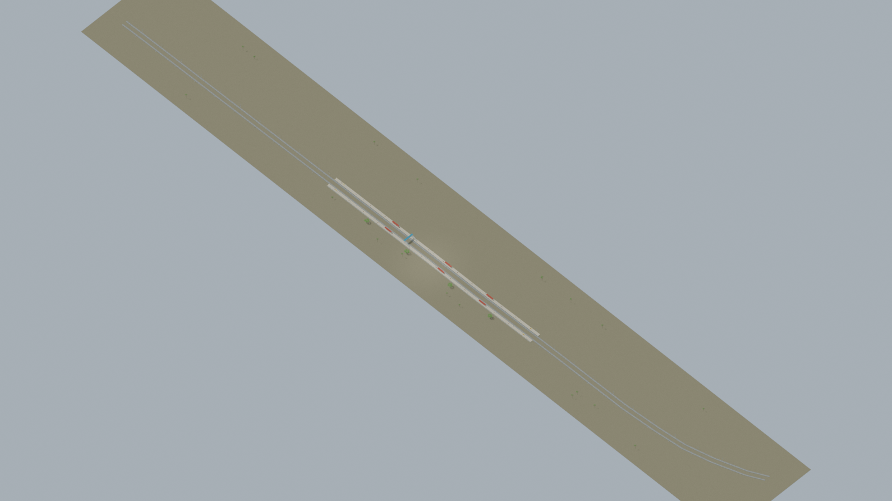
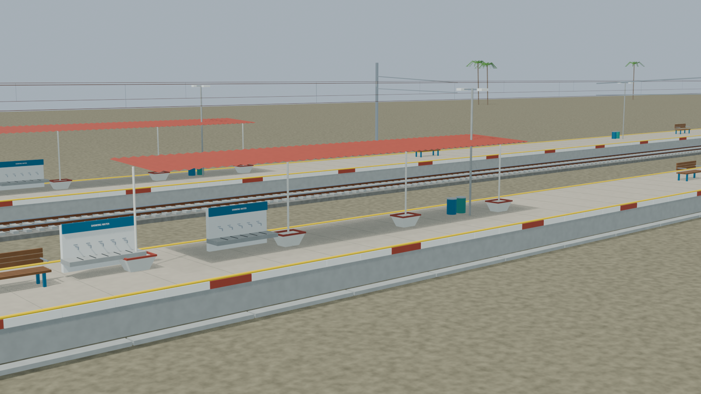
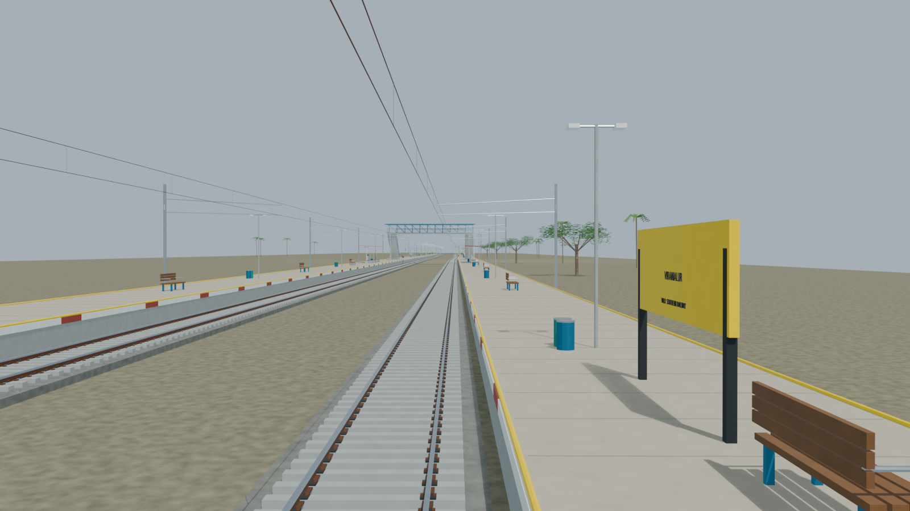
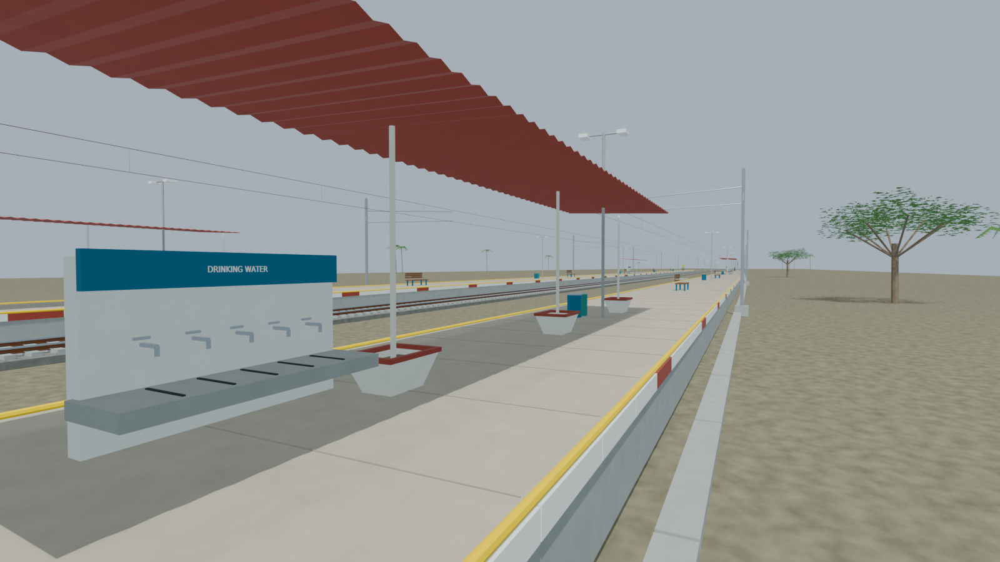
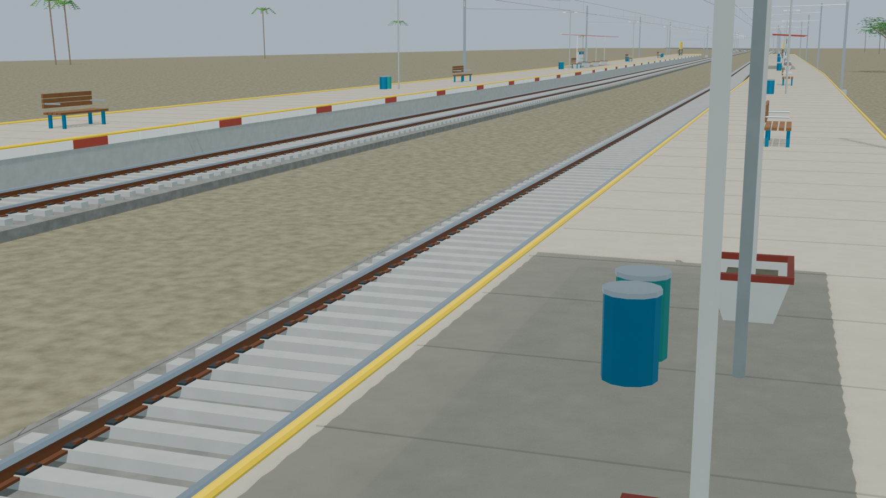

# VRLR station gallery

Independently accepted source-backed model with five reviewed views and a verified portable export. IRI reports one platform; imagery shows two built bodies, with the extra body’s operating status unverified. The model uses photographed open shelters without an invented enclosed station building. Reconstructed dimensions and hidden details remain explicitly disclosed.

Actual-model previews with accepted image hashes. Hidden interiors and unsurveyed details are reconstructions; read [sources and limitations](README.md). [Opening the model](README.md).

## Full station network

## Open shelter architecture

## Platform and tracks

## Open waiting shelter detail

## Track and platform detail

Authoritative model Blender SHA256: `fcab771a81fa64490fc65c921426928b2fa25ab284efdbf144de6ead00a13cc5`. Review the per-frame provenance records for any retained earlier views and their exact source hashes.
