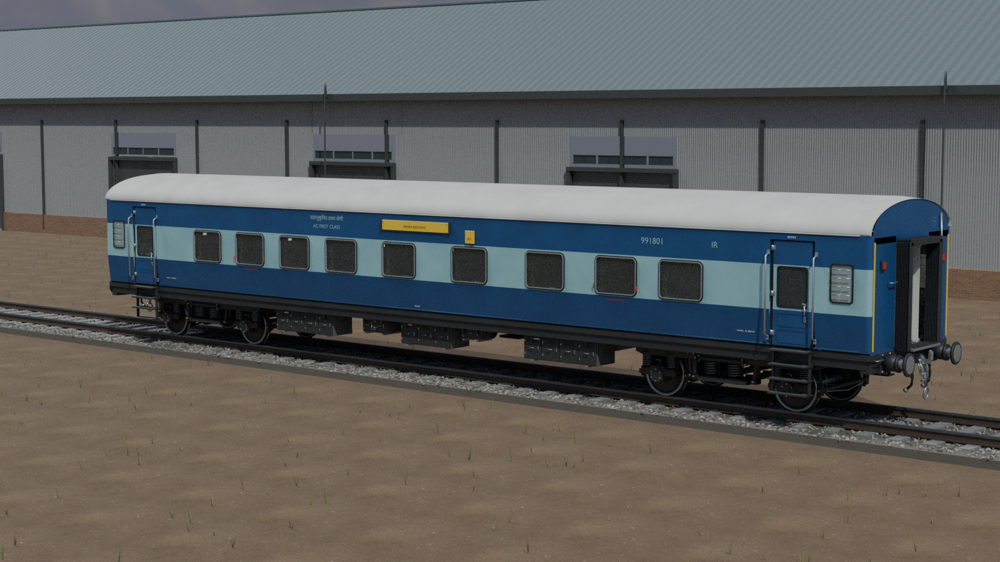

# ICF detail v02 — actual-model final gallery

Completed and verified high-sample views: **1/24**. Gallery production is in progress; missing views are intentionally not linked.
Every image below is rendered from its linked current Blender master. These are original 3D assets, not generated illustrations or photographs of a different coach. Source and image SHA-256, renderer/dependency hashes, camera and cutaway scope are in the adjacent JSON sidecar.

Rendering: Blender Cycles CPU, 512 maximum samples, 2% adaptive threshold, minimum 64 samples, no denoising. Hero images are 1600 × 900; interiors and inspection details are 1600 × 1040.

Prototype: representative conventional blue self-generating ICF stock, with screw coupling and side buffers. [Evidence and interpretation](FIDELITY.md). Geometry is authoring quality; native game conversion, animated character fit, WAP7 linkage and runtime performance are unvalidated.

## 1A
[Blender master](1A/ICF_1A_master.blend) · [FBX](1A/ICF_1A.fbx) · [Class manifest](1A/manifest.json)

### Outdoor exterior

[Image provenance and exact cutaway disclosure](1A/renders/hero_final.json)

## 2A
[Blender master](2A/ICF_2A_master.blend) · [FBX](2A/ICF_2A.fbx) · [Class manifest](2A/manifest.json)

## 3A
[Blender master](3A/ICF_3A_master.blend) · [FBX](3A/ICF_3A.fbx) · [Class manifest](3A/manifest.json)

## 2S
[Blender master](2S/ICF_2S_master.blend) · [FBX](2S/ICF_2S.fbx) · [Class manifest](2S/manifest.json)

## CC
[Blender master](CC/ICF_CC_master.blend) · [FBX](CC/ICF_CC.fbx) · [Class manifest](CC/manifest.json)

## SL
[Blender master](SL/ICF_SL_master.blend) · [FBX](SL/ICF_SL.fbx) · [Class manifest](SL/manifest.json)

## GS
[Blender master](GS/ICF_GS_master.blend) · [FBX](GS/ICF_GS.fbx) · [Class manifest](GS/manifest.json)

