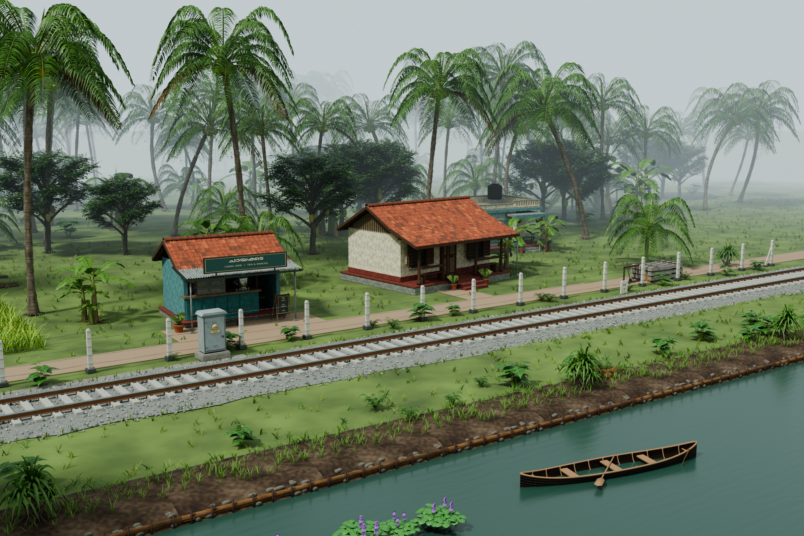

# Kerala Trackside Collection

Original Kerala-inspired reusable scenery for Blender and portable GLB workflows.

**52 reusable entries: 44 designs + 8 lower-detail alternatives.** Five packed native libraries, standalone GLB exports, original source/maps, visual catalogs and previews, two editable example scenes, and an optional dusk lighting preset.

[Gallery](GALLERY.md) · [52-entry catalog](CATALOG.md) · [Visual PDF](catalog/Kerala_Trackside_Catalog.pdf) · [Downloads](DOWNLOADS.md) · [Machine-readable asset index](ASSET_INDEX.json)



## Start here

1. Open the gallery or the 11-page visual catalog to choose assets.
2. Follow [Downloads](DOWNLOADS.md). Save the downloader and archive manifest, then use `python download_collection.py --native` to retrieve the five Blender library packs. Most archives are stored as lossless parts; the downloader verifies and restores each complete ZIP automatically.
3. Extract each completed ZIP, keeping its outer folder. Open the BLEND in its `library/` folder with Blender 4.3 or newer.
4. To use Blender's Asset Browser, register the extracted `library/` folder under Preferences → File Paths → Asset Libraries. Use the original named collections rather than gallery exhibit instances when metric scale matters.

## Restore everything from a repository copy

After cloning the repository or extracting GitHub's Download ZIP, run this single command from the repository root:

```sh
python kerala_trackside_collection/download_collection.py --all --offline
```

It restores all 24 original ZIPs and verifies their SHA-256 hashes automatically. You can also avoid downloading the rest of this repository: save only the [downloader](download_collection.py?raw=true) and [archive manifest](ARCHIVES.json?raw=true) together, then run `python download_collection.py --all`.

## Included

| Pack | Contents |
| --- | --- |
| 01 Architecture | 10 homes, shops, workshop and compound/rural details |
| 02 Plants and landscape | 25 entries, including 8 palm/tree LOD alternatives, homestead planting, paddy, canal banks, coir and canoe |
| 03 Railside | 14 lineside cabinets, troughs, signage, fences, crossing and service details |
| 05 Utilities | 3 utility pole, transformer and roadside-light assets |
| 04 Showcase | Packed canal-side scene; three final views; complete visual and offline galleries |
| 06 Road crossing | Second packed example scene and annotated open/closed crossing views |
| 07 Dusk | Optional editable lighting preset and dusk preview |

The native libraries retain editable components and original-resolution packed maps. GLB companions provide individual self-contained models. Source companions contain original maps, portable generators, documented dependencies and commands, research references and font notices.

The GLB groups are independent ZIP packs. Publication parts belong only to their named ZIP and must be joined into that complete archive before extraction.

## Scenes and placement

Native units are metres with Z up; GLB uses Y up. Read the included category instructions for fronts, pivots, articulated parts, repeat spacing and burial depths.

The canal showcase is self-contained. It uses locally appended asset collections and editable instances, with approximately 11.52 million evaluated triangles. Use Solid shading or hide vegetation for lighter navigation. Its generic presentation maps use a compact 512px preset; reusable libraries retain their original maps. The road-crossing scene and dusk preset include their own instructions.

The showcase gallery includes an offline `catalog/index.html`. For that gallery's local model links, extract the requested native/GLB packs beside it with their original outer folders. Additional closeups are in the detail gallery pack.

## Provenance and limits

These are original reference-inspired fictional Kerala scenery assets. Dimensions are approximate scenic measurements. The scenes are not surveyed reconstructions, railway designs or electrical installation guidance. Route labels are fictional. Third-party research photographs are not redistributed. Preserve the included attribution and font notices.

This is a Blender/GLB asset collection, not a ready-to-install game mod. The assets have been checked in Blender and their GLB exports inspected, but have not been tested in a game runtime. No trains or station buildings are included.

## Validation and integrity

The exact approved delivery files are preserved. Native libraries were opened and append-tested; packed dependencies and geometry/material consistency were checked. All 24 ZIPs and their payload checksums passed final QA. Publication parts were locally reassembled and matched the original complete ZIP hashes.

- [QA summary](QA_SUMMARY.json)
- [Complete archive SHA-256 checksums](ARCHIVE_SHA256SUMS.txt)
- [Archive/part manifest](ARCHIVES.json)
- [Publication manifest](PUBLICATION_MANIFEST.json)
- [All published file checksums](SHA256SUMS.txt)

Only this `kerala_trackside_collection/` directory is added by this publication; the existing station collection and other projects are preserved.
