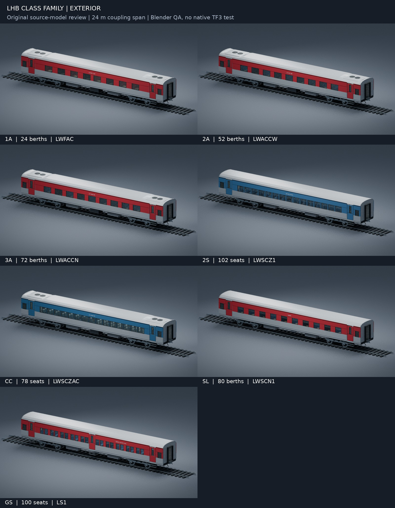

# LHB coach family v0.1

## Current TF3 integration — pack v1.0

All seven family masters are included in **pack v1.0 (TF3 revision 14)**. The installed revision 13 has identical vehicle content; v1.0 installation follows the running play test. LHB game capacities for 1A/2A/3A/2S/CC/SL/GS are 14/32/44/62/48/48/62; all use 2000 / 200 km/h. The stable lhb_3a ID now uses the new 3A master. Each class appears once in Indian Railways. Normal fares and automatic costs are retained. Native resources, four LODs, glass, exact source seated-root transforms, side-on icons and introduction-year filtering pass automated checks. The new coaches await in-game boarding, passenger anatomy and curve checks. See [current installation, integration and remaining checks](../TF3-INSTALL.md).

## Original source handoff

The following describes the original authoring files and source-only validation. Native conversion status is recorded above and in the linked installation guide.

Seven **new, full-length, original visual source models**, prepared against repository revision `baf66cb5c267125ce2c6e82bf03c0fc6986bf786`. The source files remain separate from native TF3 resources. Their subsequent v1.0 integration replaces the old game 3A model under its stable ID; the earlier source prototype is retained for reference.



[All seven layout cutaways](renders/LHB_family_layout_cutaway_contact_sheet.jpg) · [Interior views](renders/LHB_family_interior_contact_sheet.jpg) · [Bogie detail](renders/LHB_FIAT_bogie_detail.png) · [Isolated paired CBC detail](renders/LHB_CBC_paired_detail.png)

## Class-specific construction

| File prefix | Representative stock | Physical accommodation | Daytime seated roots | Sleeping-reference empties |
|---|---|---:|---:|---:|
| LHB_1A | LWFAC, four cabins + four coupés | 24 berths | 24 | 24 |
| LHB_2A | LWACCW, wider-bay 52-berth type | 52 berths | 52 | 52 |
| LHB_3A | LWACCN, nine three-tier bays | 72 berths | 72 | 72 |
| LHB_2S | LWSCZ1, 102-seat non-AC chair-car representative | 102 seats | 102 | 0 |
| LHB_CC | LWSCZAC, 78-seat AC chair car | 78 seats | 78 | 0 |
| LHB_SL | LWSCN1, ten three-tier sleeper bays | 80 berths | 80 | 80 |
| LHB_GS | LS1/legacy 100-seat, three-entry-per-side GS pattern | 100 seats | 100 | 0 |

This is a selection of documented coach patterns, not an assertion that a service-class label always specifies a different shell. In particular **2S is a reserved second-sitting service designation**. The selected 102-seat chair car is distinct from the selected 100-seat centre-entry GS layout; other 2S/GS services can use shared or different stock. The GS code is a representative family label; the inspected older manual also lists LS4 and the current timetable uses LS. These aliases are not presented as identical drawing revisions.

1A has solid compartment partitions, partial-open sliding doors, four larger four-berth cabins, four smaller two-berth coupés, maroon upholstery, stairs and three labelled WC compartments plus a linen cupboard. 2A has lower/upper beds, gathered bay-privacy curtains and a partial end bay. 3A and SL have folded middle berths and three-person transverse daytime benches. SL has open barred windows, raised shutters and ceiling fans. CC has 2+3 reclining chairs, headrests, seat-back trays, racks, sealed windows and AC packages. 2S has tighter 3+3 upright seats, fans and barred windows. GS has four-person transverse benches, longitudinal side benches, luggage racks rather than sleeping berths, and centre entrances.

The models also include separate wheelsets/discs, FIAT-inspired bogie components, battery boxes, differing AC/non-AC electrical equipment, vestibule bellows, entry steps, handrails and simplified CBC heads.

## Opening and rebuilding

- `models/LHB_<class>.blend`: editable master with removable roof collection, interior, closed-volume glass, hierarchy and presentation lighting
- `models/LHB_<class>.fbx`: asset-only export with glass alpha fallback
- `models/LHB_<class>_manifest.json`: physical seating/layout and coordinates, **game capacity unassigned**
- `models/LHB_<class>_markers.json`: complete seated-root coordinates/yaws and separately typed sleeping references for conversion review
- `qa/`: source/fresh-FBX validation, actual mesh bounds, coupling frames, marker counts and proxy checks
- `renders/`: exteriors, review cutaways, in-model interior views and contact sheets

From this directory with Blender 4.3.2:

```sh
blender -b -t 2 --python build_lhb_family.py
blender -b -t 2 --python validate_lhb_family.py
blender -b -t 2 --python render_lhb_family.py
blender -b -t 2 --python render_details.py
python package_lhb_family.py
```

Append `-- 1A 2A` etc to the builder/render command to select variants. The scripts overwrite their own outputs. Back up hand edits first. CPU rendering uses two threads and no OpenImageDenoise. All geometry and solid materials are procedural; there are no external textures or redistributed photographs. Masters use lossless native Blender compression; the reopened full asset-structure/material signatures are recorded in `qa/native_compression_verification.json`.

## Coordinates and conversion contract

Metres; X longitudinal/forward, Y lateral, Z up; railhead Z=0. Root is an identity EMPTY at the origin. `BODY_PIVOT` has zero transform. Root-parented bogie pivots are X=±7.450 m; four child axle pivots are at local X=±1.280 m and world Z=0.4575 m. Each wheelset rotates about local Y. Door frame, glazing and handle belong to the associated `DOOR_*_PIVOT`; no door animation is supplied.

`COUPLING_FRONT`=(12,0,1.105), local +X outward; `COUPLING_REAR`=(-12,0,1.105), local +X outward toward world −X. Spacing span is **24.000 m**. The CBC head projects beyond that mating plane, so render bounds must be read separately from `qa/*_validation.json`. The heads use the same complementary eight-point contact outline as the ICF CBC retrofit family; straight paired plan-area overlap is checked as zero. This remains a shared visual alignment contract, not certified hardware or a curve/articulation rig.

All `PAX_*` EMPTY markers are seated **character-root** locations, +X-facing with appropriate 0/π yaw, parented to the identity `BODY_PIVOT`. Cushion top Z=1.840 m; marker Z=1.357 m, subtracting the 0.483 m stock-pose hip offset documented in repository revision 11. Lower benches carry multiple lateral roots: 1A two; 2A two; 3A/SL three; GS four. Side benches have two lengthwise-facing roots. **No PAX marker is placed on an upper or middle berth.** `BERTH_*` EMPTY markers record physical sleeping places independently; never feed these to a seated passenger provider. Mesh names that begin BERTH are geometry, so filter by EMPTY type as well as prefix.

The matching physical/daytime totals are deliberate bench layouts, not game-balance settings. The native converter configures payload scaling, cargo compartments, materials, four LODs, bounds and metadata, preserving the family speed/year overrides separately from prototype measurements. The current gameplay settings are in `../tools/coach_families.py`; doors and couplers remain static.

## Glazing

Every pane is a thin closed solid in a true wall/door opening. Source Blender uses Principled Transmission Weight=.96, IOR=1.45, Alpha=1. FBX is exported with Transmission=0 and Alpha=.22 as a portable fallback and freshly imported to verify that value. Native v1.0 uses separate transparent materials; full in-game transparency sorting remains part of the pending play test.

## Verification limits

These are detailed visual development models, not exact manufacturer CAD. Body, bogie, axle and coupling dimensions and class capacities are research-backed; furniture thicknesses, precise pitches, window rhythm on chair cars, equipment placement, bay fittings and livery are representative approximations. The old manual's 54-berth 2A summary is not used: its separate wider-bay layout and revised RDSO table support the selected 52-berth type. Likewise non-AC 78-berth SG and 106-seat chair variants are outside this package.

Static torso/head clearance proxies are checked; complete passenger meshes, limbs, different character variants and animation have not been checked in TF3. The 0.483 m root offset is inherited from a documented stock skeleton test, not newly measured against game files here. Couplings do not articulate; roof/doors/berths are static. Roof and upper layers are hidden only in clearly named review cutaways; normal interiors are rendered in the intact model. Labels are generic English reference markings, not a specific vehicle's lettering. Exact bilingual signage, detailed textures/weathering, further geometry optimization and runtime testing remain. Exporter registration and native LOD/material generation are complete.
