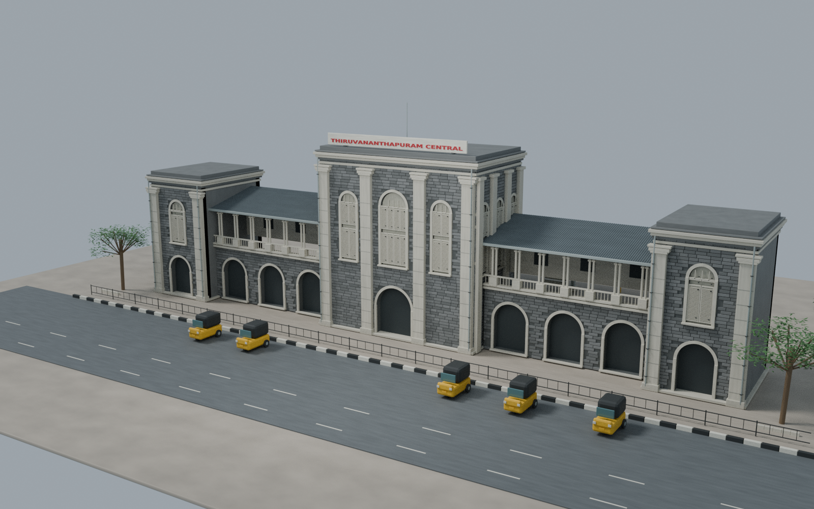
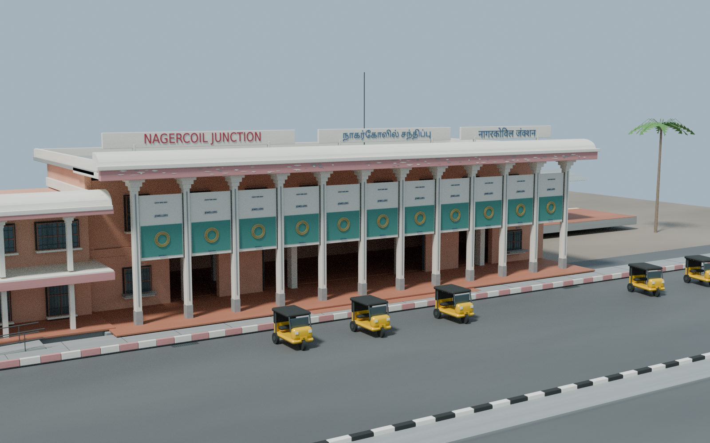
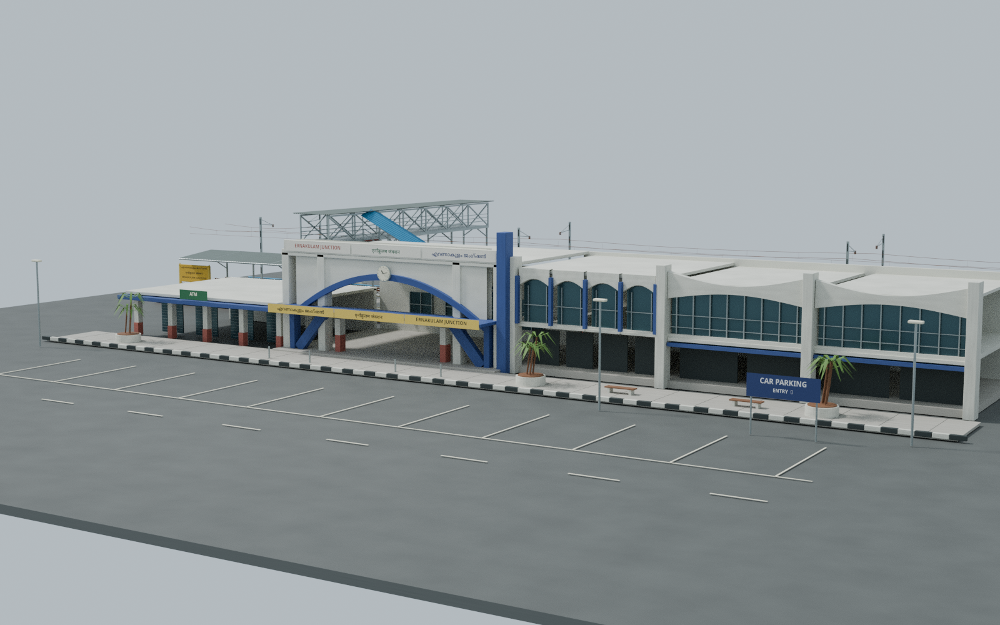

# South Indian station architectural studies

Three editable, metre-scale Blender station studies, reconstructed from dated photographs. These are historical architecture and modular scene assets, not measured surveys, current-day reconstructions or operational station layouts.

## TVC — Thiruvananthapuram Central, November 2022 heritage entrance

[Source, provenance and limitations](tvc/README.md) · [Blender master](tvc/TVC_heritage_2022_v1.blend) · [Front elevation](tvc/renders/elevation.png) · [Heritage detail](tvc/renders/heritage_detail.png) · [Canopy detail](tvc/renders/canopy_detail.png)

The dark dressed-stone central pavilion, three upper arched front windows, pale pilasters/cornices, shutter detail and red roof lettering follow the 2022 photographs. Short gallery/end-pavilion modules and a detached canopy study are contextual arrangements. Broader 2010 evidence informs return details; complete wings, hidden rooms and the full track yard are not surveyed. The editable Blender master is the supplied TVC asset; isolate its named architectural collections when exporting. No separate TVC GLB is supplied.

## NCJ — Nagercoil Junction, 2010 entrance

[Source, provenance and limitations](ncj/README.md) · [Blender master](ncj/NCJ_2010_station.blend) · [Architecture-only GLB](ncj/exports/NCJ_2010_architecture.glb) · [Whole-scene GLB](ncj/exports/NCJ_2010_station.glb) · [Front elevation](ncj/renders/02_FRONT_ELEVATION.png) · [Entrance detail](ncj/renders/03_ENTRANCE_DETAIL.png) · [Platform context](ncj/renders/04_PLATFORM_CONTEXT.png)

The portico, entrance columns/corbels, layered facade, rooftop signs and lower left wing follow January/October 2010 evidence. Advertisements are unbranded placeholders. Rear/hidden surfaces are simplified, and the platform, streets and vegetation are demonstration context. The architecture-only GLB excludes that context; the whole-scene GLB includes it.

## ERS — Ernakulam Junction, 2017 west frontage

[Source, provenance and limitations](ers/README.md) · [Blender master](ers/ERS_2017_station.blend) · [Whole-scene GLB](ers/exports/ERS_2017_station.glb) · [Front elevation](ers/renders/02_Front_elevation.png) · [Platform and footbridge](ers/renders/03_Platform_and_footbridge.png) · [Entrance detail](ers/renders/04_Entrance_detail.png)

The white/blue clock portal, trilingual signs, low left wing and screened right gallery with curved headers follow 2017 evidence. Paired platform photographs inform the canopy, lattice footbridge, blue stair hood and catering stall. Their arrangement is shortened demonstration context, not an authenticated full station plan.

## Use and limits

- Blender masters are the authoritative editable scenes. GLB exchange files retain geometry and supported base materials; procedural shader detail may differ. Whole-scene files include contextual scenery unless explicitly labelled architecture-only.
- Dimensions are photo-inferred or game-adjusted, with assumptions recorded in each folder. Track/platform context is not clearance, engineering or safety evidence.
- Preview images are actual Blender renders of the supplied geometry. Each folder documents final source/render checks and any remaining limitations.
- No Transport Fever 3 native station conversion, collision/LOD work, pathfinding, passenger interaction or runtime tests are claimed. Existing vehicles and the downloadable pack are unchanged.
- Reference photographs are linked in the provenance notes, not reused as facade textures. Final station packages omit raw research photographs. Third-party photo/font notices apply only to their identified works; no new open-source licence is granted for generated assets. Reference attribution is not a legal clearance opinion.

The three eras deliberately differ. They should not be represented as a synchronized present-day railway network.
