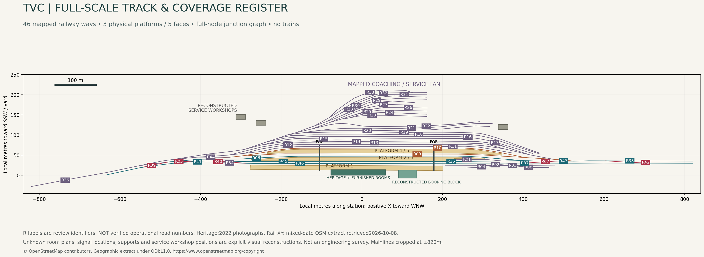
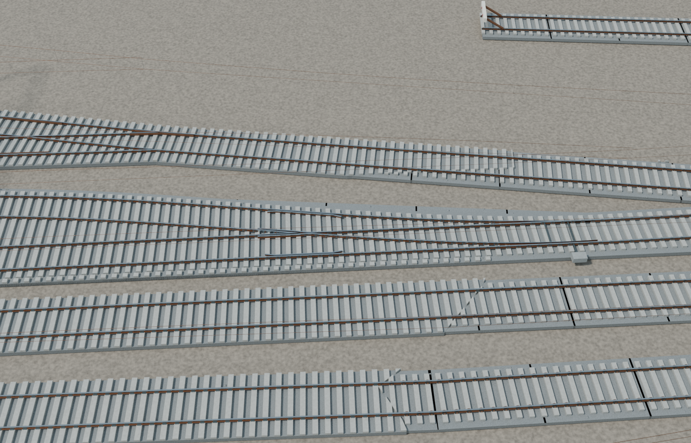
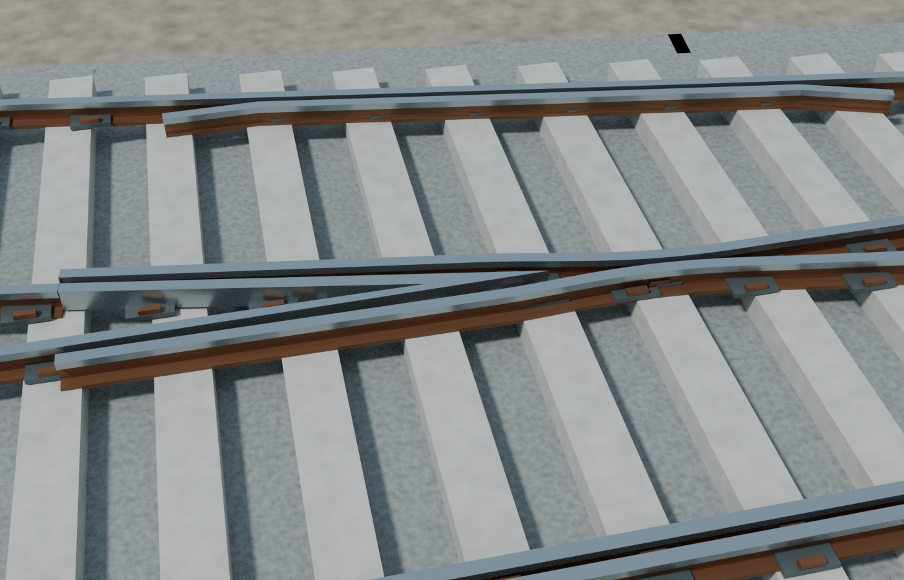
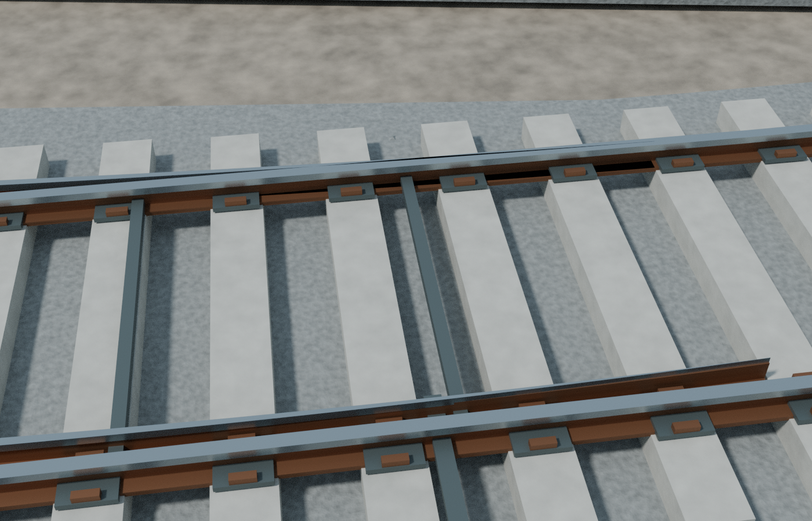
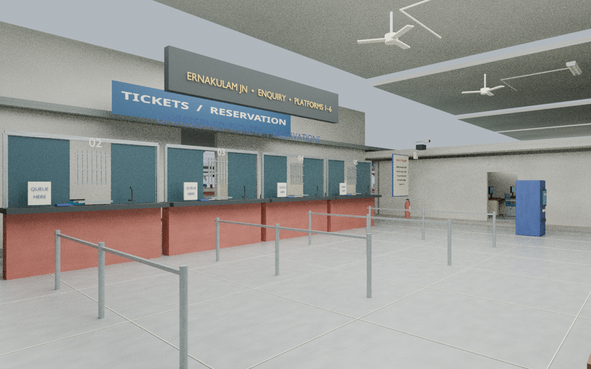
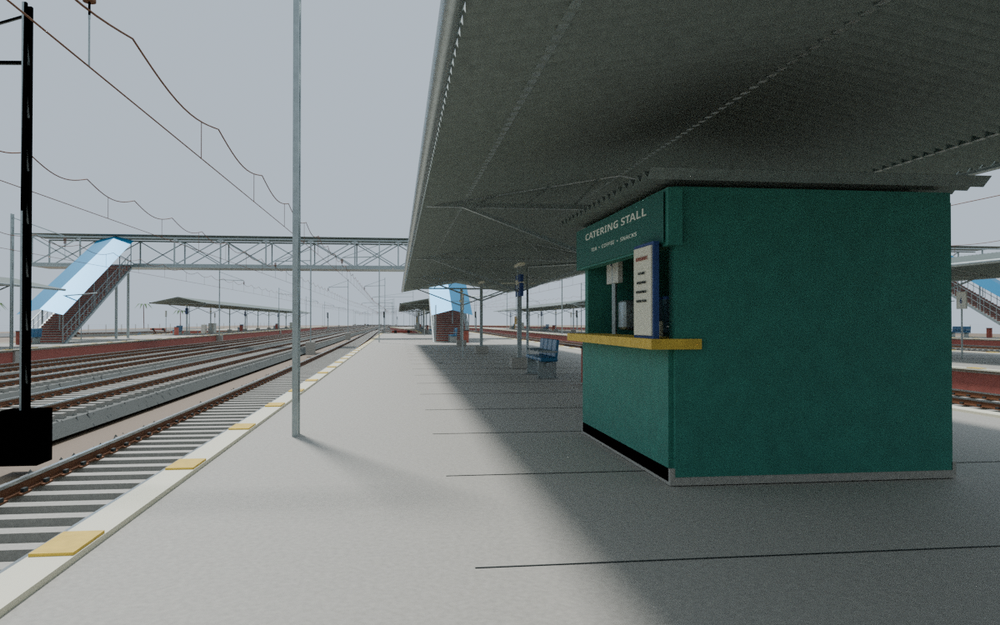
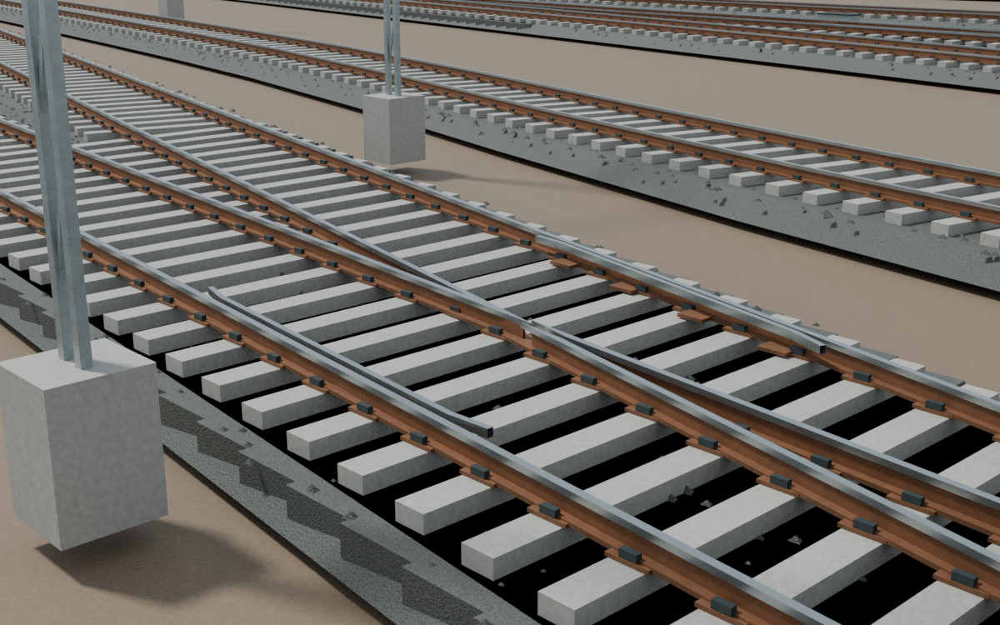

# Station rebuild review gallery · WIP

Selected reviewed previews of the richer interiors and full station-yard work. Click an image to open it at full size. No trains or rolling stock.

**These are progress images, not a final release.** Each caption distinguishes what was reviewed and what still needs correction. Architecture and map evidence use mixed dates; hidden interiors and engineering details are visual reconstructions, not surveyed as-built assets. [Source scope](../README.md) · [Image hashes and provenance](IMAGE_MANIFEST.json).

## TVC · reconstructed booking hall

Accepted interior preview;192-sample Cycles render without denoising, so some grain remains. The source scene predates later yard/ballast corrections; the booking room is unchanged.

## TVC · full mapped yard coverage

Schematic coverage plan, not a Blender beauty render.46 mapped route segments are not46 distinct tracks. Review labels are not railway operational numbers.

## NCJ · reconstructed ticket hall

Detailed unchanged ticket-hall interior. Distant platform/OHE background predates the final engineering corrections; this is an earlier interior proof.

## NCJ · physical turnout

Accepted physical-pointwork proof from the globally corrected scene; generic reconstruction, not operational engineering certification.

## NCJ · frog detail

Accepted close-up of physical crossing and flangeway geometry.

## NCJ · switch toe

Accepted close-up of the switch geometry. Final broader station gallery/export still being completed.

## ERS · reconstructed ticket hall

Accepted earlier interior proof. The exact historical source binary hash was not captured; current yard corrections are not represented by this image.

## ERS · platform concourse

Accepted interim platform view. Source-scene SHA256 is in its review sidecar; final packed-scene validation/export remain pending.

## ERS · physical turnout and frog

Accepted rail-head/flangeway geometry. Ballast coplanarity/inward-strip-normal artifacts remain visible in this interim image; corrected source is awaiting bake. This is not a finished visual.

## ERS · full mapped yard coverage

Labelled schematic coverage plan, not a final Blender yard render. Current-map geometry is distinct from the2017 architectural reference date.

## Revisions and rights

[TVC booking source hash](tvc_booking_hall_provenance.json) · [NCJ render revisions](ncj_render_provenance.json) · [ERS ticket hall](ers_ticket_hall_review.json) · [ERS platform](ers_platform_concourse_review.json) · [ERS turnout](ers_turnout_frog_review.json).

Yard plans use OpenStreetMap-derived data: © OpenStreetMap contributors, [copyright and ODbL information](https://www.openstreetmap.org/copyright). No new licence is granted for generated assets. Source notices remain applicable.
