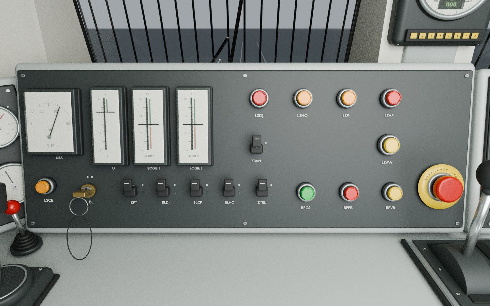
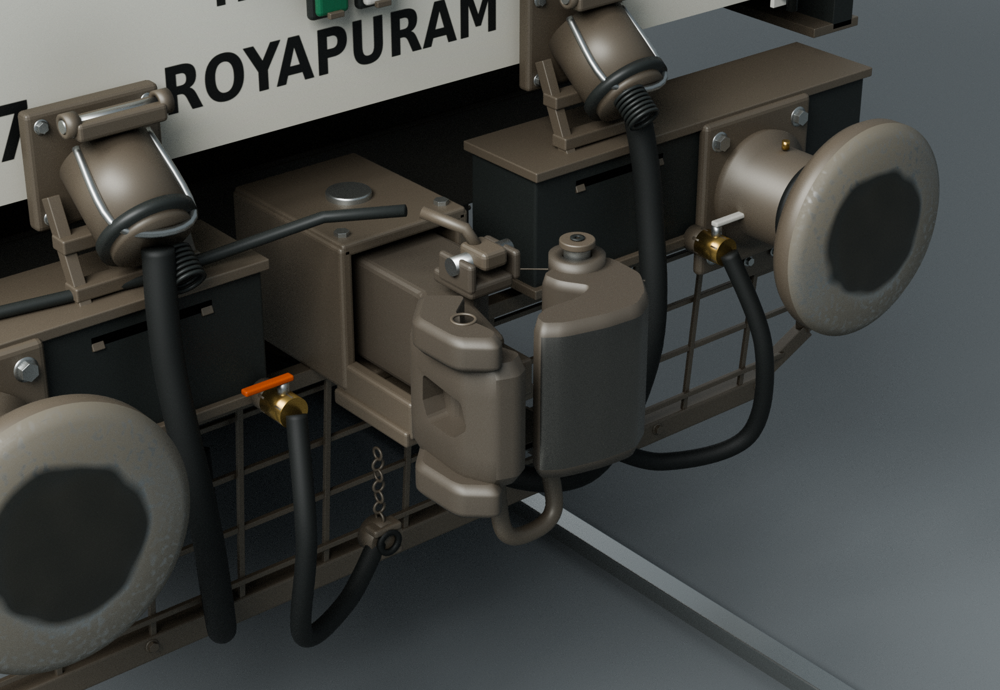
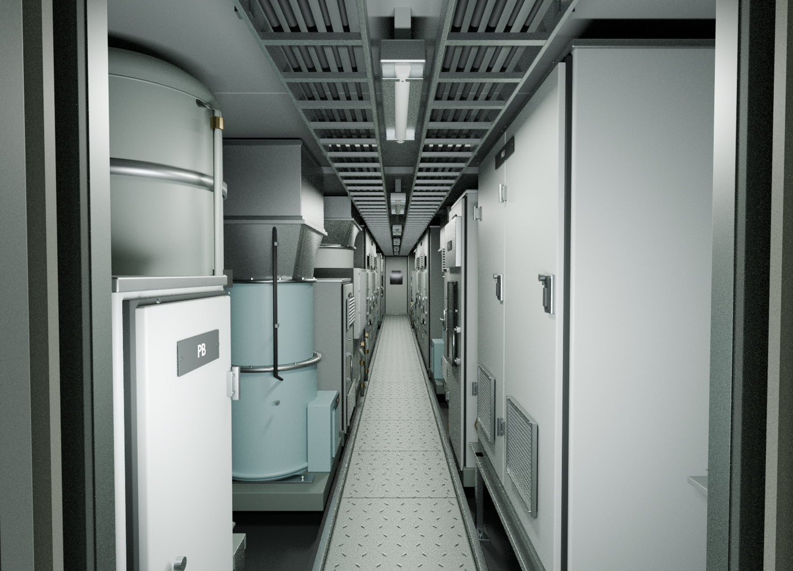
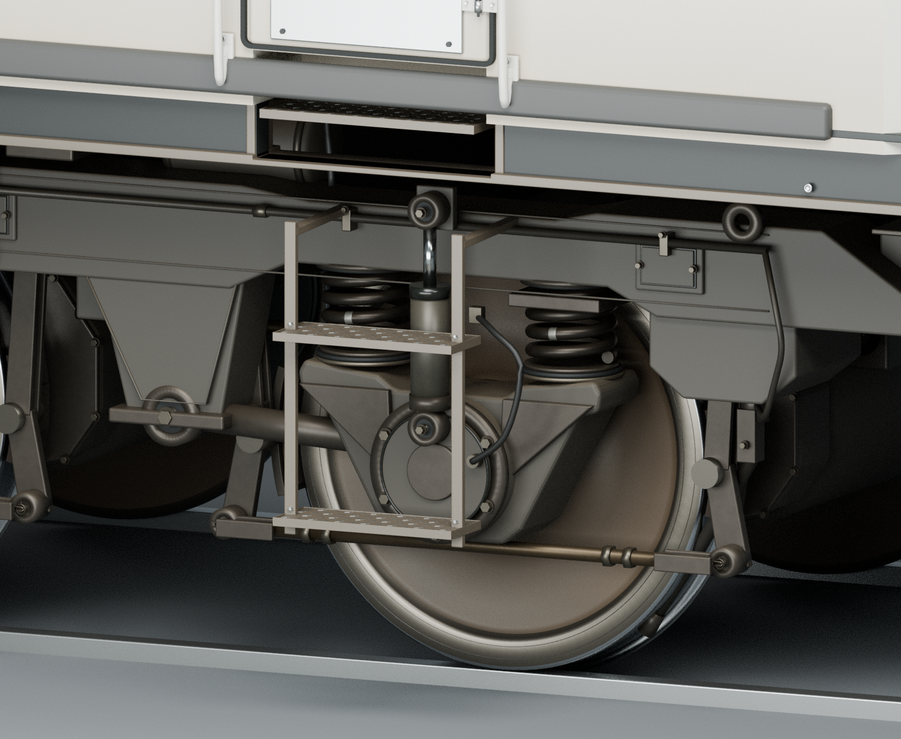
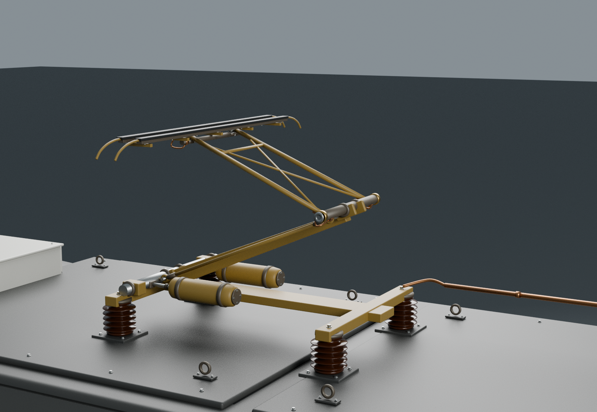
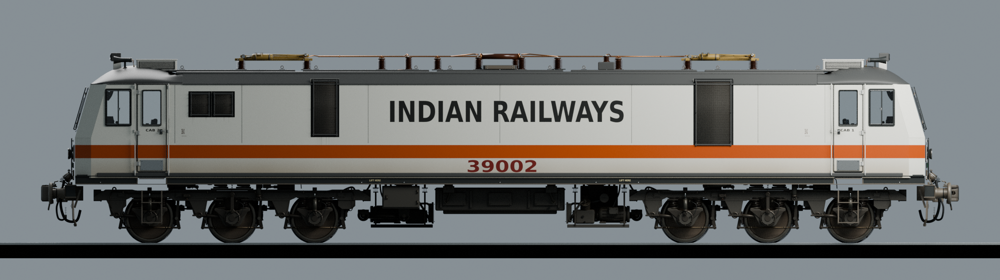

# WAP-7 39002 detailed source v0.2

Editable, photo-led Blender source for a conventional white/orange Royapuram WAP-7. This revision rebuilds the exterior hardware, running gear, both driving cabs and the machinery compartment. The images are rendered from the supplied model with Cycles.

**Source-only release:** this folder is a high-detail authoring model. It has not been converted, optimized or tested as a Transport Fever 3 runtime vehicle. The existing native game pack is unchanged.

## Open the model

Open [WAP7_detail_v02.blend](WAP7_detail_v02.blend) in Blender 4.3.2 or a compatible newer version. Keep the complete `textures/` directory next to it. The compact master is 10,368,238 bytes and uses 40 external relative image dependencies. Image pixels retain their original quality.

The separate `environment/` files are needed to reproduce the outdoor setting. They are credited CC0 sky/ground assets, used on actual scene geometry. The vehicle does not use a photographic backplate or generated replacement image.

- [Build, inspect and render](docs/BUILD_AND_RENDER.md)
- [Visual review and limitations](VISUAL_QA.md)
- [Reference and artwork provenance](REFERENCES.md)
- [File checksums](SHA256SUMS.txt)

## What changed

- Restored the nominal 3.152 m main body skin, with accessory projections measured separately. Cab frames, door fittings and exterior placement follow the corrected width
- Rebuilt windscreens, EPDM seals, guards, wipers, washer jets, optical lamp assemblies, horns, HOG receptacles, hoses, operating hardware and two-tread entry stairs
- Added a shaped H-type-form coupler casting, separate knuckle/contact surfaces, realistic buffer-face wear and a fabricated underframe with suspension clearances
- Reworked the pantograph collector hardware, insulator sheds, springs, links, flexible braids and distinct roof electrical routes while retaining independent level-head controls
- Detailed both bogies, six wheel/axle assemblies, axleboxes, suspension and brakes; rebuilt the underfloor transformer, two compressors and battery boxes
- Rebuilt both cabs with shaped desks, original instrument artwork, controls, chairs, pedals, fans, window furniture and poseable rear doors
- Added the documented machinery-room equipment sequence, vertical reservoirs, cabinets, cooling/ventilation assemblies, service piping and a traversable modelled central aisle
- Applied restrained paint microfinish, feature-directed grime, lower-side dust, locally rubbed metal and distinct glass, rubber, grease and exposed-metal responses

Fine hardware, wheel profiles, vendor details and unseen equipment are representative reconstructions. The source notes distinguish observed evidence from interpretation; this is not a measured as-built survey of locomotive 39002.

## Close-up gallery

### Cab instruments and interior

[Full cab overview](previews/cab/overview_A.png) · [Cab details and fit](docs/CAB_IMPLEMENTATION.md) · [Cab references](docs/CAB_REFERENCE_NOTES.md)

### Coupler and front connections

[Exterior construction and references](docs/EXTERIOR_REFERENCE_NOTES.md)

### Machinery compartment

[Machinery-compartment cutaway / isolated inspection](previews/machinery_gallery/machinery_cutaway.png) · [Machinery layout, references and limits](docs/MACHINERY_REFERENCE_NOTES.md)

The through-door view opens the existing rear cab door for inspection. The machinery-compartment cutaway is an isolated inspection that temporarily hides nominated exterior/roof/lining geometry for clarity; it does not depict a missing or transparent body shell in the saved model.

### Running gear

[Underfloor equipment](previews/details/underfloor.png) · [Running-gear references and checks](docs/RUNNING_GEAR_REFERENCE_NOTES.md)

### Pantograph and roof equipment

[Roof and dimensional evidence](docs/EXTERIOR_REFERENCE_NOTES.md)

### Uncropped technical side view

The side image uses a 22.4 m orthographic frame with both pantographs folded. [Framing verification](qa/side_view_framing_validation.json) records the complete visible model bounds inside the frame.

## Dimensions and control interfaces

Measurements below come from the evaluated delivered source, in metres. They are model checks rather than manufacturing tolerances.

| Quantity | Value | Meaning |
|---|---:|---|
| Main body skin width | 3.152000 m | WAP-7-specific nominal body-width reference |
| Complete visible accessory width | 3.317727 m | Maximum at the four projecting door handles |
| Visible length over closed coupler meshes | 20.562000 m | Exterior geometry span |
| Folded contact-strip height above rail | 4.254758 m | Rail datum Z = 0 |
| Coupling-anchor separation | 20.400000 m | Preserved attachment datums, separate from visible coupler length |
| Bogie wheelbase | 3.700000 m | Each bogie's preserved axle-datum spacing |
| Total axle longitudinal span | 15.700000 m | Outermost axle datums |

The functional root, coupling, bogie, axle and pantograph frames are preserved. The documented frame corrections are the restored transverse `BODY` scale and associated cab-frame refits. Each pantograph retains its independent extension control. Both cab rear doors can be posed using the documented hinge controls.

## Source verification

The delivered master SHA256 is `25aa1f264f7dbab9f25e9e2fe27ff2f2e9d6b8ab513133d374717fcff0e24930`.

- [Independent final geometry/rig summary](qa/reference_audit/FINAL_VALIDATION_SUMMARY.md): 24 baseline interface objects checked, no unexpected control changes, finite geometry, and eleven sampled poses per pantograph with level, coplanar visible contact faces
- [Fresh-directory portability](qa/portability_validation.json): the copied master opens with all 40 relative image dependencies present and loaded
- [Exact material, image and font comparison](qa/delivery_material_font_comparison.json): 110 materials, one world, 40 image byte/color-space/alpha records, 230 live text objects and their built-in font preserved against the authoring snapshot
- [Lossless preview metadata cleanup](qa/preview_metadata_cleanup.json): original compressed image data and decoded pixels remain identical; raw-render and published-file hashes are both retained
- [Delivery manifest](delivery_manifest.json): unchanged visible-geometry/assignment fingerprint, unchanged control empties and exact external dependency hashes
- [Documentation-only source validation](qa/publication_source_validation.json): comment-only packaging changes preserve executable syntax; original executed-source hashes remain in the build/test records

The model contains 12,331 render-visible geometric objects and 2,885,744 evaluated triangles under the independent audit's scope. These counts describe a detailed source asset and are not an optimization or realism score. Converting it for a game requires separate LOD, material, texture and performance work.

QA covers the stated model properties. It does not certify railway mechanics, complete swept collisions, production dimensions or operational coupling. The rebuilt CBC casting needs a fresh mating/curve-clearance check before integration with the ICF/LHB game assets. No in-game validation is claimed.

## Package layout

- `WAP7_detail_v02.blend`: compact editable source master
- `components/`: deterministic modelling and material modules
- `scripts/`: build, texture generation, delivery packaging, rendering and focused validation
- `textures/`: original vehicle artwork and surface maps, with relative dependencies
- `environment/`: separately credited CC0 outdoor lighting and ground material
- `previews/`: geometry-grounded gallery and view-specific provenance
- `docs/`: component explanations, evidence and reproduction instructions
- `qa/`: scoped source checks and measured results

Earlier versions remain available in [v0.1](../wap7_photoreal_v01/README.md). The [repository overview](../README.md) describes the separate native TF3 pack.
